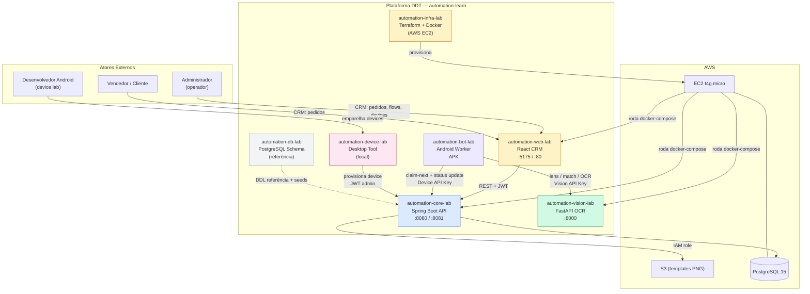
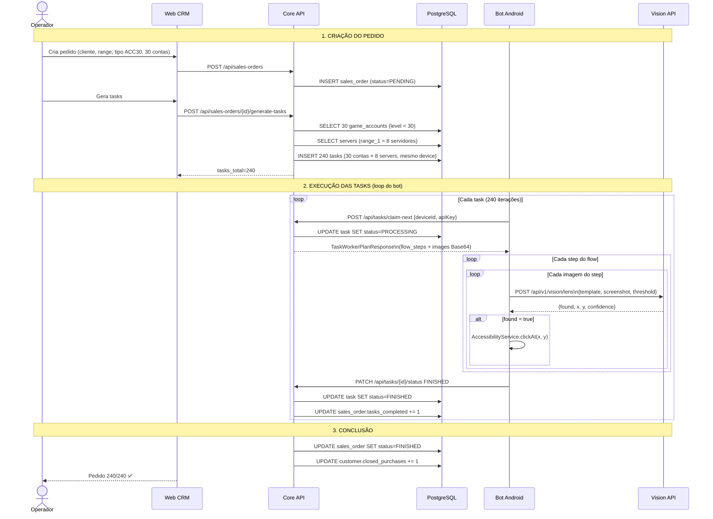
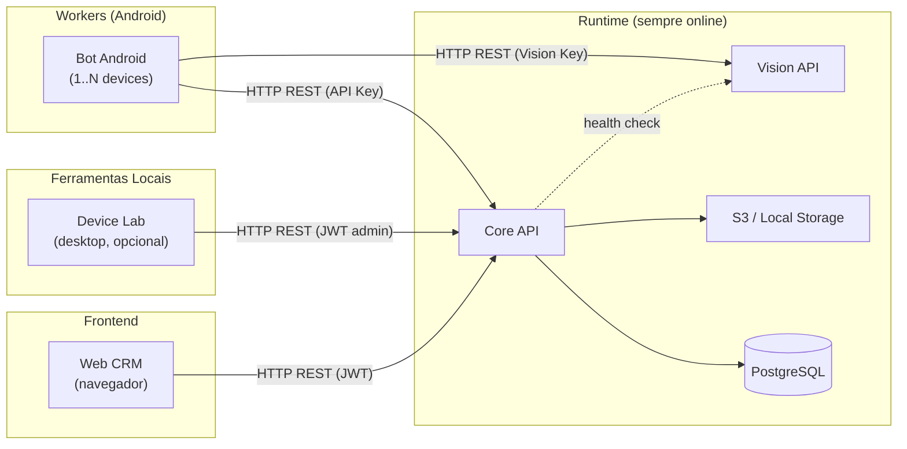
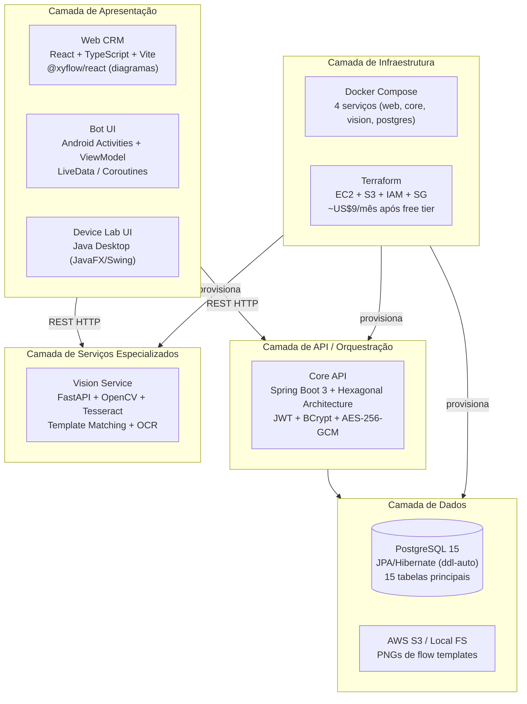
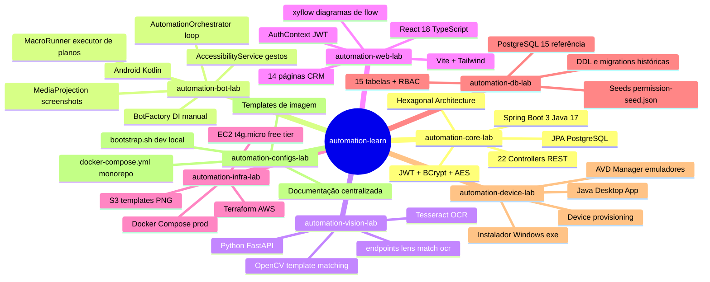
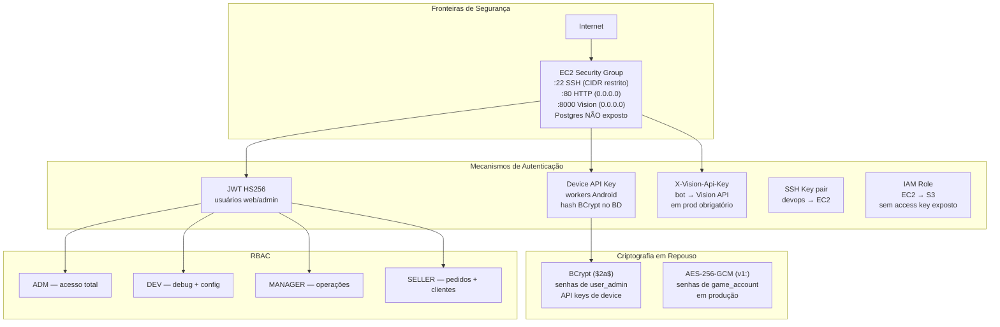
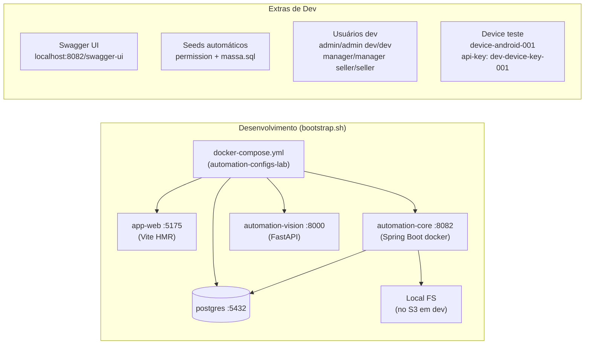
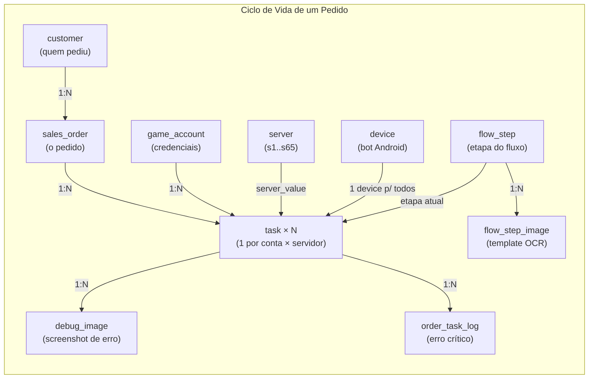

# [ERROR] COMPILATION ERROR : 

[INFO] -------------------------------------------------------------

[ERROR] /Users/experiment/Developer/git/automation-learn/automation-core-lab/src/main/java/com/automation/core/application/service/[WorkerFlowSyncService.java](http://WorkerFlowSyncService.java):[128,32] normalizeKey(java.lang.String) is not public in [com.automation.core.adapter.out.storage](http://com.automation.core.adapter.out.storage).S3PresignService; cannot be accessed from outside package

[INFO] 1 error

[INFO] -------------------------------------------------------------

[INFO] ------------------------------------------------------------------------

[INFO] BUILD FAILURE

[INFO] ------------------------------------------------------------------------

[INFO] Total time:  3.167 s

[INFO] Finished at: 2026-06-20T19:07:55-03:00

[INFO] ------------------------------------------------------------------------

[ERROR] Failed to execute goal org.apache.maven.plugins:maven-compiler-plugin:3.11.0:compile (default-compile) on project automation-core-ddt: Compilation failure

[ERROR] /Users/experiment/Developer/git/automation-learn/automation-core-lab/src/main/java/com/automation/core/application/service/[WorkerFlowSyncService.java](http://WorkerFlowSyncService.java):[128,32] normalizeKey(java.lang.String) is not public in [com.automation.core.adapter.out.storage](http://com.automation.core.adapter.out.storage).S3PresignService; cannot be accessed from outside package

[ERROR] 

[ERROR] -> [Help 1]

[ERROR] 

[ERROR] To see the full stack trace of the errors, re-run Maven with the -e switch.

[ERROR] Re-run Maven using the -X switch to enable full debug logging.

[ERROR] 

[ERROR] For more information about the errors and possible solutions, please read the following articles:

[ERROR] [Help 1] [http://cwiki.apache.org/confluence/display/MAVEN/MojoFailureException](http://cwiki.apache.org/confluence/display/MAVEN/MojoFailureException)

[deploy] mvn package falhou.

[deploy] Use JDK 17 ou 21 — nao JDK 25: export JAVA_HOME=$(/usr/libexec/java_home -v 21)Plataforma DDT — Arquitetura do Ecossistema

Visão arquitetural completa do monorepo **automation-learn**: uma plataforma de automação de game bots que orquestra pedidos de clientes, delega tarefas a dispositivos Android, executa automação de UI com visão computacional e oferece um painel web de administração.

---

## Visão Macro — Social Graph do Ecossistema




---

## Fluxo Principal de Ponta a Ponta




---

## Dependências Entre Sistemas




---

## Arquitetura por Camadas




---

## Mapa de Repositórios




---

## Segurança — Visão Consolidada




---

## Tecnologias por Repositório


| Repo                    | Linguagem    | Framework           | Deploy                   |
| ----------------------- | ------------ | ------------------- | ------------------------ |
| `automation-core-lab`   | Java 17      | Spring Boot 3 + JPA | Docker EC2 / local       |
| `automation-bot-lab`    | Kotlin       | Android SDK 26+     | APK (sideload/emulador)  |
| `automation-vision-lab` | Python 3.10+ | FastAPI + OpenCV    | Docker EC2 / local       |
| `automation-web-lab`    | TypeScript   | React 18 + Vite     | Docker Nginx EC2 / local |
| `automation-infra-lab`  | HCL          | Terraform           | AWS CLI                  |
| `automation-db-lab`     | SQL          | PostgreSQL 15       | gerenciado pelo Core     |
| `automation-device-lab` | Java 17      | JavaFX/Swing        | Executável (.exe / .dmg) |


---

## Ambiente de Desenvolvimento Local




### Comandos de início rápido

```bash
# Stack completa (recomendado)
./automation-configs-lab/bootstrap.sh

# Core no host (porta 8081, perfil local)
cd automation-core-lab && SPRING_PROFILES_ACTIVE=local mvn spring-boot:run

# Web em dev (proxy Vite → Core)
cd automation-web-lab && npm install && npm run dev

# Vision apenas
cd automation-vision-lab && docker compose up -d --build vision
```


| Serviço    | URL                                                                                        |
| ---------- | ------------------------------------------------------------------------------------------ |
| Web CRM    | [http://localhost:5175](http://localhost:5175)                                             |
| Core API   | [http://localhost:8082/api](http://localhost:8082/api)                                     |
| Swagger    | [http://localhost:8082/swagger-ui/index.html](http://localhost:8082/swagger-ui/index.html) |
| Vision OCR | [http://localhost:8000](http://localhost:8000)                                             |


---

## Relacionamento de Dados — Chave de Leitura




---

## Documentação por Repositório


| Repo                           | Documento                                                                                                                                         |
| ------------------------------ | ------------------------------------------------------------------------------------------------------------------------------------------------- |
| `automation-core-lab/docs/`    | [ARCHITECTURE.md](automation-core-lab/docs/ARCHITECTURE.md)                                                                                       |
| `automation-bot-lab/docs/`     | [ARCHITECTURE.md](automation-bot-lab/docs/ARCHITECTURE.md)                                                                                        |
| `automation-vision-lab/docs/`  | [ARCHITECTURE.md](automation-vision-lab/docs/ARCHITECTURE.md)                                                                                     |
| `automation-web-lab/docs/`     | [ARCHITECTURE.md](automation-web-lab/docs/ARCHITECTURE.md)                                                                                        |
| `automation-infra-lab/docs/`   | [ARCHITECTURE.md](automation-infra-lab/docs/ARCHITECTURE.md)                                                                                      |
| `automation-db-lab/docs/`      | [ARCHITECTURE.md](automation-db-lab/docs/ARCHITECTURE.md)                                                                                         |
| `automation-device-lab/docs/`  | [ARCHITECTURE.md](automation-device-lab/docs/ARCHITECTURE.md)                                                                                     |
| `automation-configs-lab/docs/` | [REPOSITORIES-OVERVIEW.md](automation-configs-lab/docs/REPOSITORIES-OVERVIEW.md) · [TECH-STORIES.md](automation-configs-lab/docs/TECH-STORIES.md) |
| **Legados**                    | [LEGACY.md](LEGACY.md)                                                                                                                            |


