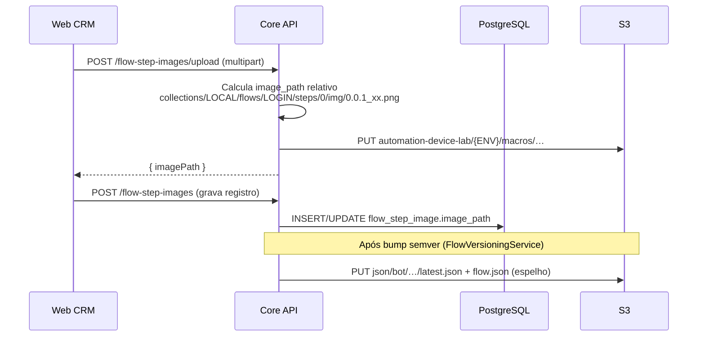
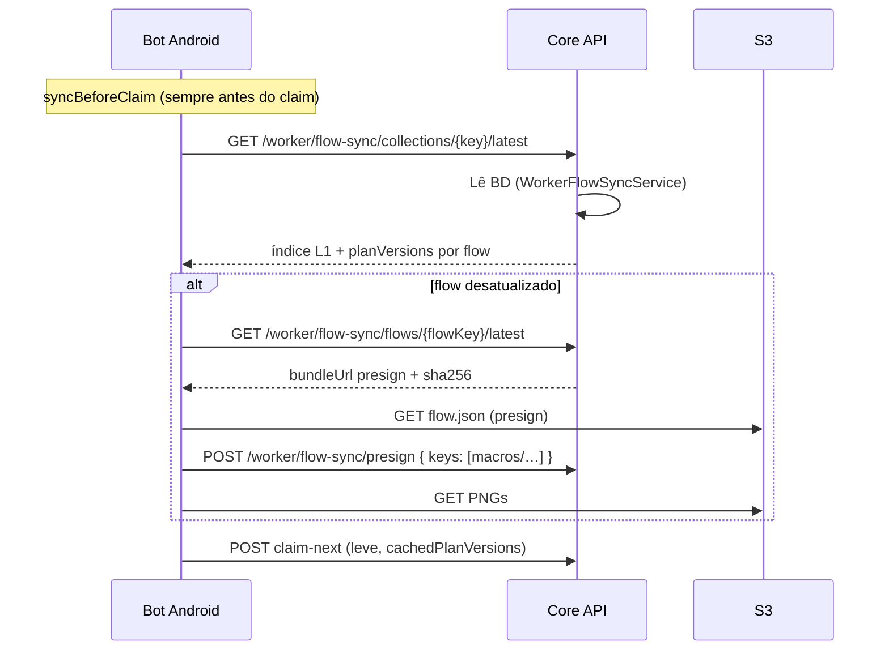

# Flow sync, storage S3 e fonte da verdade (BD)

Documento **transversal** do ecossistema: como flows, PNGs e manifests worker circulam entre PostgreSQL, Core, S3 e Bot.

**Última atualização:** 2026-06-20

---

## Resumo executivo

| Camada | Papel |
|--------|--------|
| **PostgreSQL** | Fonte da verdade — grafo L1–L4, semver, `image_path` relativo, transições GOTO |
| **Core API** | Monta contrato worker a partir do BD; presign de PNGs; espelha JSON no S3 após bump de versão |
| **S3** | Blobs (PNG + espelho JSON worker) particionados por **app** e **deploy env** |
| **Bot** | Sync via Core (`WORKER_FLOW_SYNC_VIA_CORE=true`); PNGs por presign; claim leve |
| **Web** | Edição no BD via REST; upload grava PNG + `image_path` |

O S3 **não** é fonte do grafo. Export manual (`export-flow-manifest-s3.sh`) é complementar ao espelho automático do Core.

---

## Dois conceitos de “LOCAL”

| Termo | Exemplo | Significado |
|-------|---------|-------------|
| **Collection key** | `LOCAL` | Nome do **catálogo** de macros no BD (`collection.collection_key`) |
| **Deploy env** | `LOCAL`, `HMG`, `PROD` | **Ambiente de deploy** — prefixo no bucket S3 |

Um bot em **PROD** pode consumir a collection **`LOCAL`**. São eixos independentes.

---

## Layout S3 (atual)

Bucket único; raiz por aplicação e ambiente:

```text
s3://{BUCKET}/
  automation-device-lab/
    LOCAL/                          ← dev Mac / docker local (S3 opcional)
      macros/
        collections/{collectionKey}/flows/{flowKey}/steps/{n}/img/{file}.png
      json/bot/
        collections/{collectionKey}/latest.json
        collections/{collectionKey}/flows/{flowKey}/latest.json
        collections/{collectionKey}/flows/{flowKey}/releases/{planVersion}/flow.json
    HMG/
      macros/ …
      json/bot/ …
    PROD/
      macros/ …
      json/bot/ …
```

**Exemplo completo (PNG):**

```text
automation-device-lab/PROD/macros/collections/LOCAL/flows/LOGIN/steps/0/img/0.0.1_xx.png
```

**Exemplo (manifest):**

```text
automation-device-lab/PROD/json/bot/collections/LOCAL/latest.json
```

Implementação: `S3StorageLayout`, `StorageProperties.S3` no Core.

---

## Variáveis de ambiente (Core)

| Variável | Segmento | Default local | Default prod (EC2) |
|----------|----------|---------------|---------------------|
| `APP_STORAGE_S3_APP_ROOT` | Raiz da app | `automation-device-lab` | `automation-device-lab` |
| `APP_STORAGE_S3_DEPLOY_ENV` | Ambiente | `LOCAL` (perfil local/docker) | `PROD` |
| `APP_STORAGE_S3_PREFIX` | Segmento macros | `macros` | `macros` |
| `APP_STORAGE_S3_MANIFEST_PREFIX` | Segmento JSON bot | `json/bot` | `json/bot` |
| `APP_STORAGE_MODE` | — | `local` | `s3` |

Perfis Spring (`application.yml`): `local`→LOCAL, `dev`→HMG, `prod`→PROD.

Onde definir: [infra/docs/env-images-s3.md](infra/docs/env-images-s3.md), [core/APPLICATION-CONFIG.md](core/APPLICATION-CONFIG.md).

---

## Fluxo: salvar imagem (Web → Core → S3 → BD)



`image_path` no BD é **sempre relativo** (sem `automation-device-lab/PROD/macros`). O Core compõe a chave S3 completa na hora do upload/presign.

---

## Fluxo: bot sync antes do claim



Prod: `WORKER_FLOW_SYNC_VIA_CORE=true` — bucket privado; sem URL pública de manifest.

Detalhe bot: [bot/guia-sync-manifests-s3.md](bot/guia-sync-manifests-s3.md).

---

## Scripts operacionais

| Script | Uso |
|--------|-----|
| `automation-configs-lab/vision-lab/scripts/sync-metadata-images-to-s3.sh` | Sobe árvore `metadata/collections/LOCAL/` → S3 macros |
| `automation-configs-lab/infra-lab/scripts/republish-worker-mirror.sh` | Reconcile BD → S3 via Core API |
| `automation-configs-lab/infra-lab/scripts/migrate-s3-legacy-prefix.sh` | Migra prefixos legados no bucket |
| `automation-configs-lab/infra-lab/scripts/promote-catalog-to-prod.sh` | Sync PNG + republish PROD |

Variáveis úteis nos scripts:

```bash
S3_APP_ROOT=automation-device-lab
S3_DEPLOY_ENV=PROD   # ou LOCAL, HMG
```

---

## Paths legados (não usar)

| Era | Path | Status |
|-----|------|--------|
| Antigo | `img/flows/flows/local/…` | ❌ substituído |
| Intermediário | `macros/collections/LOCAL/…` (sem env) | ❌ substituído |
| **Atual** | `automation-device-lab/{ENV}/macros/collections/…` | ✅ |

---

## Documentação relacionada

| Sistema | Documento |
|---------|-----------|
| Core | [core/INDEX.md](core/INDEX.md) · [core/ARCHITECTURE.md](core/ARCHITECTURE.md) |
| Bot | [bot/INDEX.md](bot/INDEX.md) · [bot/guia-sync-manifests-s3.md](bot/guia-sync-manifests-s3.md) |
| BD / contrato | [db/docs/INDEX.md](db/docs/INDEX.md) |
| Infra / S3 | [infra/INDEX.md](infra/INDEX.md) · [infra/docs/env-images-s3.md](infra/docs/env-images-s3.md) |
| Web (editor flows) | [web/DIAGRAMA-FLOW-TECNICO.md](web/DIAGRAMA-FLOW-TECNICO.md) |
