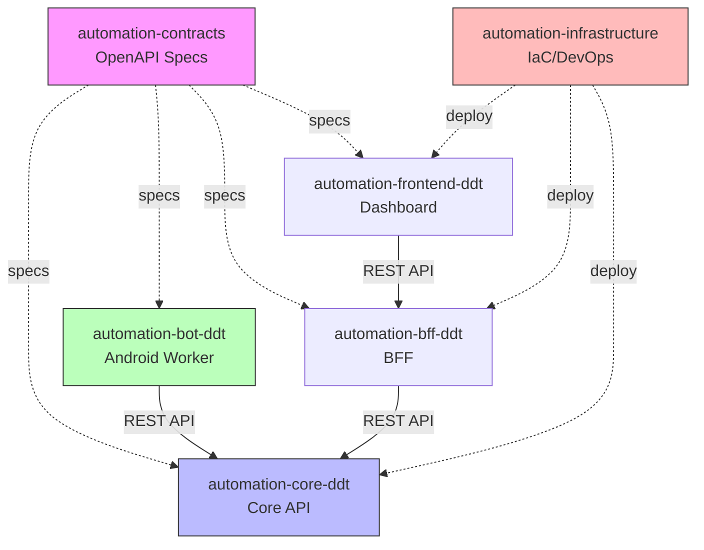

# 📦 Plataforma DDT - Visão Completa de Repositórios

Este documento detalha **todos os repositórios** da Plataforma DDT, suas responsabilidades, estrutura interna, tecnologias e interações.

---

## 📊 Visão Geral da Arquitetura Multi-Repo

```
Organization: automation-ddt (monorepo automation-learn)

📁 automation-core-ddt          [Backend - Core Logic, JPA/PostgreSQL]
📁 automation-bot-ddt           [Android - Worker App, Kotlin]
📁 automation-vision-ocr        [OCR / Vision]
📁 automation-bff-ddt            [Backend - API Gateway]
📁 automation-frontend-ddt       [Web - Dashboard]
📁 automation-contracts         [Specs - Contratos API]
📁 automation-infrastructure    [DevOps - IaC]

📁 scripts/massas/              [Dados iniciais JSON - carga via Core API]
📁 backup/bot/                  [Backups do Bot: v3, v4, v5]
```

**Documentação:** [README.md](README.md) · [TECH-STORIES.md](TECH-STORIES.md) · [db/docs/CORE-DATABASE-TABLES.md](db/docs/CORE-DATABASE-TABLES.md) · [scripts/massas/README.MD](scripts/massas/README.MD)

---

## 🗺️ Mapa de Dependências



---

## 1️⃣ automation-core-ddt

### **Descrição:**
Backend principal da plataforma. API REST responsável por toda a lógica de negócio, orquestração de tasks, gerenciamento de contas/devices/servidores e persistência em PostgreSQL.

### **Status:** ✅ Existe (repositório atual)

### **Tecnologias:**
- **Linguagem:** Java 17
- **Framework:** Spring Boot 3.x
- **Database:** PostgreSQL 15
- **ORM:** JPA / Hibernate (Spring Data JPA)
- **Build:** Maven
- **Deploy:** Docker (AWS ECS/EC2) ou Railway/Render (free tier)

### **Estrutura do Repositório:**

```
automation-core-ddt/
│
├── src/main/java/com/automation/core/
│   ├── adapter/
│   │   ├── in/web/                    # Controllers REST + DTOs
│   │   │   ├── RangeServerController.java
│   │   │   ├── ServerController.java
│   │   │   ├── GameAccountController.java
│   │   │   ├── GameDetailsAccountController.java
│   │   │   ├── CustomerController.java
│   │   │   ├── DeviceController.java
│   │   │   ├── UserAdminController.java
│   │   │   ├── FlowStepController.java, FlowStepImageController.java
│   │   │   ├── PermissionController.java
│   │   │   └── dto/                   # CreateRequest DTOs
│   │   │
│   │   └── out/persistence/
│   │       ├── entity/                # Entidades JPA
│   │       │   ├── RangeServerEntity.java
│   │       │   ├── ServerEntity.java
│   │       │   ├── GameAccountEntity.java
│   │       │   ├── GameDetailsAccountEntity.java
│   │       │   ├── CustomerEntity.java
│   │       │   ├── DeviceEntity.java
│   │       │   ├── UserEntity.java, PermissionEntity.java
│   │       │   ├── FlowStepEntity.java, FlowStepImageEntity.java
│   │       │   ├── SalesOrderEntity.java, TaskEntity.java
│   │       │   └── OrderTaskLogEntity.java, DebugImageEntity.java
│   │       └── inter/                 # Spring Data JPA Repositories
│   │           ├── RangeServerJpaRepository.java
│   │           ├── ServerJpaRepository.java
│   │           ├── GameAccountJpaRepository.java
│   │           ├── GameDetailsAccountJpaRepository.java
│   │           └── ...
│   │
│   ├── domain/                        # Ports + modelos de domínio
│   │   ├── model/ (Device, etc.)
│   │   └── port/out/
│   │
│   └── application/                  # Services, util
│       ├── service/
│       └── util/
│   │   │
│   │   └── resources/
│   │       ├── application.yml
│   │       ├── application-dev.yml       🆕
│   │       ├── application-prod.yml      🆕
│   │       │
│   │       └── database/
│   │           ├── create-database.sql
│   │           ├── init.sql
│   │           ├── schema-only.sql
│   │           ├── migrations/           🆕
│   │           └── test-data/
│   │
│   └── test/
│       └── java/com/automation/
│           ├── application/
│           ├── domain/
│           └── infrastructure/
│
├── target/                              # Build output
├── pom.xml
├── Dockerfile                           🆕
├── docker-compose.yml                   🆕
├── .dockerignore                        🆕
├── .gitignore
│
├── .github/
│   └── workflows/
│       ├── ci.yml                       🆕
│       ├── cd-dev.yml                   🆕
│       └── cd-prod.yml                  🆕
│
├── README.md
├── CHANGELOG.md                         🆕
├── CONTRIBUTING.md                      🆕
└── LICENSE
```

### **Responsabilidades:**

#### **1. APIs REST (CRUD + batch):**
- `GET/POST/PUT/DELETE /api/permissions`, `/api/range-servers`, `/api/servers`
- `GET/POST/PUT/DELETE /api/customers`, `/api/game-accounts`, `/api/game-details-accounts`
- `GET/POST/PUT/DELETE /api/devices`, `/api/users`, `/api/flow-steps`, `/api/flow-step-images`
- `POST /api/*/batch` para inserção em lote (ex.: massas)
- Swagger: `/swagger-ui.html`, `/api-docs`

#### **2. Lógica de negócio:**
- **range_server** com `description` (segmentos); **server** 1–65 vinculado a range.
- **game_account**: login único (UQ); **game_details_account**: 1:N por conta, UNIQUE(account, server).
- Validações de conflito (409) para login duplicado e (account, server) duplicado.
- Persistência JPA/Hibernate; transações e integridade referencial.

#### **3. Documentação e dados iniciais:**
- Schema e ER: [db/docs/CORE-DATABASE-TABLES.md](db/docs/CORE-DATABASE-TABLES.md)
- Massas (ordem de carga): [scripts/massas/README.MD](scripts/massas/README.MD) — permission → range_server → server → customer → game_account → game_details_account → …

### **Endpoints principais:**

```yaml
# CRUD + batch (exemplos)
GET    /api/range-servers
POST   /api/range-servers
POST   /api/range-servers/batch

GET    /api/servers
POST   /api/servers/batch

GET    /api/game-accounts
POST   /api/game-accounts
POST   /api/game-accounts/batch

GET    /api/game-details-accounts
POST   /api/game-details-accounts
POST   /api/game-details-accounts/batch

GET    /api/devices
GET    /api/customers
# ... demais recursos
```

### **Variáveis de Ambiente:**

```bash
# Database
DB_HOST=localhost
DB_PORT=5432
DB_NAME=automation_db
DB_USER=postgres
DB_PASSWORD=password

# Redis (fila de tasks)
REDIS_HOST=localhost
REDIS_PORT=6379

# Security
WORKER_API_KEY=secret-key-here
JWT_SECRET=jwt-secret-here

# AWS (produção)
AWS_REGION=us-east-1
S3_BUCKET=automation-screenshots
```

---

## 2️⃣ automation-bff-ddt

### **Descrição:**
Backend For Frontend (BFF). API Gateway que serve como fachada entre o Frontend e o Core, agregando chamadas, simplificando integrações e gerenciando autenticação de usuários.

### **Status:** 🆕 A criar

### **Tecnologias:**
- **Linguagem:** Node.js (TypeScript) ou Java/Spring Boot
- **Framework:** Express.js ou NestJS (se Node) / Spring Boot (se Java)
- **Auth:** JWT, OAuth2
- **Cache:** Redis
- **Build:** npm/yarn ou Maven
- **Deploy:** Docker (AWS Lambda/ECS)

### **Estrutura do Repositório:**

```
automation-bff-ddt/
│
├── src/
│   ├── controllers/              # Endpoints HTTP
│   │   ├── order.controller.ts
│   │   ├── task.controller.ts
│   │   ├── account.controller.ts
│   │   ├── device.controller.ts
│   │   ├── worker.controller.ts
│   │   └── auth.controller.ts
│   │
│   ├── services/                 # Lógica de negócio BFF
│   │   ├── order.service.ts
│   │   ├── task.service.ts
│   │   ├── aggregation.service.ts
│   │   └── auth.service.ts
│   │
│   ├── clients/                  # Clientes HTTP para Core
│   │   └── core-api.client.ts
│   │
│   ├── middleware/               # Middlewares
│   │   ├── auth.middleware.ts
│   │   ├── rate-limit.middleware.ts
│   │   └── error-handler.middleware.ts
│   │
│   ├── models/                   # DTOs e Types
│   │   ├── order.model.ts
│   │   ├── task.model.ts
│   │   └── user.model.ts
│   │
│   ├── utils/
│   │   ├── logger.ts
│   │   └── validator.ts
│   │
│   ├── config/
│   │   ├── database.config.ts
│   │   ├── redis.config.ts
│   │   └── core-api.config.ts
│   │
│   ├── app.ts                    # App principal
│   └── server.ts                 # Entry point
│
├── tests/
│   ├── unit/
│   └── integration/
│
├── package.json
├── tsconfig.json
├── Dockerfile
├── docker-compose.yml
├── .env.example
├── .gitignore
│
├── .github/
│   └── workflows/
│       ├── ci.yml
│       └── cd.yml
│
├── README.md
└── LICENSE
```

### **Responsabilidades:**

#### **1. API Gateway para Frontend:**
- Endpoint único para o frontend consumir
- Versionamento de API (v1, v2)
- Documentação Swagger/OpenAPI

#### **2. Agregação de Dados:**
- Combinar múltiplas chamadas ao Core em uma só
- Reduzir número de requests do frontend
- Transformar dados para formato otimizado para UI

#### **3. Autenticação e Autorização:**
- Login de usuários (JWT)
- Validação de tokens
- Controle de acesso (RBAC)
- Refresh tokens

#### **4. Rate Limiting:**
- Proteção contra abuso
- Quotas por usuário
- Throttling

#### **5. Cache:**
- Cache de respostas frequentes
- Invalidação inteligente
- Reduzir carga no Core

### **Endpoints Principais:**

```yaml
# Autenticação
POST   /api/v1/auth/login
POST   /api/v1/auth/register
POST   /api/v1/auth/refresh
POST   /api/v1/auth/logout

# Orders (agregados)
GET    /api/v1/orders               # Lista com tasks incluídas
POST   /api/v1/orders
GET    /api/v1/orders/{id}          # Order + Tasks + Status
DELETE /api/v1/orders/{id}

# Dashboard (agregações especiais)
GET    /api/v1/dashboard/summary    # Resumo geral
GET    /api/v1/dashboard/workers    # Status de todos workers
GET    /api/v1/dashboard/stats      # Estatísticas

# Workers
GET    /api/v1/workers              # Lista workers ativos
GET    /api/v1/workers/{id}         # Detalhes de um worker

# Accounts
GET    /api/v1/accounts
POST   /api/v1/accounts
PUT    /api/v1/accounts/{id}
DELETE /api/v1/accounts/{id}
```

### **Variáveis de Ambiente:**

```bash
# Server
PORT=3000
NODE_ENV=production

# Core API
CORE_API_URL=http://localhost:8080
CORE_API_TIMEOUT=30000

# Database (usuários)
DB_HOST=localhost
DB_PORT=5432
DB_NAME=bff_users_db

# Redis
REDIS_HOST=localhost
REDIS_PORT=6379

# JWT
JWT_SECRET=secret-key
JWT_EXPIRES_IN=1h
JWT_REFRESH_EXPIRES_IN=7d

# Rate Limiting
RATE_LIMIT_WINDOW=15m
RATE_LIMIT_MAX_REQUESTS=100
```

---

## 3️⃣ automation-worker-android

### **Descrição:**
Aplicativo Android que roda como Worker em devices físicos ou emuladores. Executa automações via UIAutomator2, processa OCR localmente e se comunica com o Core API para buscar tasks e enviar resultados.

### **Status:** 🆕 A criar

### **Tecnologias:**
- **Linguagem:** Kotlin
- **SDK:** Android SDK 26+ (Target 34)
- **UI Automation:** UIAutomator2
- **OCR:** Tesseract4Android ou Google ML Kit
- **HTTP:** Retrofit + OkHttp
- **Async:** Coroutines + Flow
- **DI:** Hilt ou Koin
- **Build:** Gradle

### **Estrutura do Repositório:**

```
automation-worker-android/
│
├── app/
│   ├── src/
│   │   ├── main/
│   │   │   ├── java/com/automation/worker/
│   │   │   │   │
│   │   │   │   ├── WorkerApplication.kt          # Application class
│   │   │   │   │
│   │   │   │   ├── api/                          # 📡 Comunicação Core
│   │   │   │   │   ├── CoreApiClient.kt
│   │   │   │   │   ├── CoreApiService.kt
│   │   │   │   │   ├── AuthInterceptor.kt
│   │   │   │   │   ├── LoggingInterceptor.kt
│   │   │   │   │   │
│   │   │   │   │   └── models/
│   │   │   │   │       ├── TaskDTO.kt
│   │   │   │   │       ├── AccountDTO.kt
│   │   │   │   │       ├── TaskResultDTO.kt
│   │   │   │   │       ├── DeviceStatusDTO.kt
│   │   │   │   │       └── WorkerConfigDTO.kt
│   │   │   │   │
│   │   │   │   ├── automation/                   # 🤖 Engine de Automação
│   │   │   │   │   ├── BotEngine.kt              # Core do bot
│   │   │   │   │   ├── GameController.kt         # Controle do jogo
│   │   │   │   │   ├── ScreenReader.kt           # Leitura de tela
│   │   │   │   │   ├── GestureController.kt      # Gestos (tap, swipe)
│   │   │   │   │   ├── ElementFinder.kt          # Busca elementos UI
│   │   │   │   │   └── ScreenshotCapture.kt      # Captura de tela
│   │   │   │   │
│   │   │   │   ├── ocr/                          # 👁️ Processamento OCR
│   │   │   │   │   ├── OCREngine.kt              # Interface
│   │   │   │   │   ├── TesseractEngine.kt        # Implementação Tesseract
│   │   │   │   │   ├── MLKitEngine.kt            # Implementação ML Kit
│   │   │   │   │   ├── ImagePreprocessor.kt      # Filtros/melhorias
│   │   │   │   │   │
│   │   │   │   │   └── models/
│   │   │   │   │       └── OCRResult.kt
│   │   │   │   │
│   │   │   │   ├── tasks/                        # 📋 Executores de Tasks
│   │   │   │   │   ├── TaskExecutor.kt           # Interface
│   │   │   │   │   ├── TaskFactory.kt            # Factory pattern
│   │   │   │   │   ├── BaseTask.kt               # Classe base
│   │   │   │   │   │
│   │   │   │   │   └── implementations/
│   │   │   │   │       ├── LoginTask.kt
│   │   │   │   │       ├── DailyQuestTask.kt
│   │   │   │   │       ├── LevelUpTask.kt
│   │   │   │   │       ├── CollectResourcesTask.kt
│   │   │   │   │       └── CustomTask.kt
│   │   │   │   │
│   │   │   │   ├── service/                      # ⚙️ Background Services
│   │   │   │   │   ├── WorkerForegroundService.kt  # Service principal
│   │   │   │   │   ├── HeartbeatService.kt         # Heartbeat ao Core
│   │   │   │   │   └── NotificationManager.kt      # Notificações
│   │   │   │   │
│   │   │   │   ├── ui/                           # 🎨 Interface
│   │   │   │   │   ├── MainActivity.kt
│   │   │   │   │   │
│   │   │   │   │   ├── config/
│   │   │   │   │   │   ├── ConfigActivity.kt
│   │   │   │   │   │   └── ConfigViewModel.kt
│   │   │   │   │   │
│   │   │   │   │   ├── status/
│   │   │   │   │   │   ├── StatusFragment.kt
│   │   │   │   │   │   └── StatusViewModel.kt
│   │   │   │   │   │
│   │   │   │   │   └── logs/
│   │   │   │   │       ├── LogsFragment.kt
│   │   │   │   │       └── LogsViewModel.kt
│   │   │   │   │
│   │   │   │   ├── data/                         # 💾 Camada de Dados
│   │   │   │   │   ├── local/
│   │   │   │   │   │   ├── AppDatabase.kt
│   │   │   │   │   │   ├── LogDao.kt
│   │   │   │   │   │   └── ConfigDao.kt
│   │   │   │   │   │
│   │   │   │   │   └── repository/
│   │   │   │   │       ├── TaskRepository.kt
│   │   │   │   │       ├── ConfigRepository.kt
│   │   │   │   │       └── LogRepository.kt
│   │   │   │   │
│   │   │   │   ├── di/                           # 💉 Dependency Injection
│   │   │   │   │   ├── AppModule.kt
│   │   │   │   │   ├── NetworkModule.kt
│   │   │   │   │   └── DatabaseModule.kt
│   │   │   │   │
│   │   │   │   └── utils/                        # 🛠️ Utilitários
│   │   │   │       ├── Logger.kt
│   │   │   │       ├── PermissionManager.kt
│   │   │   │       ├── DeviceInfo.kt
│   │   │   │       ├── NetworkUtils.kt
│   │   │   │       └── Constants.kt
│   │   │   │
│   │   │   ├── res/
│   │   │   │   ├── layout/
│   │   │   │   │   ├── activity_main.xml
│   │   │   │   │   ├── fragment_status.xml
│   │   │   │   │   └── fragment_logs.xml
│   │   │   │   │
│   │   │   │   ├── values/
│   │   │   │   │   ├── strings.xml
│   │   │   │   │   ├── colors.xml
│   │   │   │   │   └── themes.xml
│   │   │   │   │
│   │   │   │   ├── drawable/
│   │   │   │   └── mipmap/
│   │   │   │
│   │   │   └── AndroidManifest.xml
│   │   │
│   │   ├── test/                                  # Unit tests
│   │   │   └── java/com/automation/worker/
│   │   │
│   │   └── androidTest/                           # Instrumented tests
│   │       └── java/com/automation/worker/
│   │
│   ├── build.gradle
│   └── proguard-rules.pro
│
├── build.gradle                                   # Root build
├── settings.gradle
├── gradle.properties
├── gradlew
├── gradlew.bat
├── .gitignore
│
├── .github/
│   └── workflows/
│       ├── ci.yml                                 # Build & Test
│       ├── release-debug.yml                      # Debug APK
│       └── release-production.yml                 # Signed APK
│
├── docs/
│   ├── SETUP.md                                   # Setup do projeto
│   ├── AUTOMATION.md                              # Como criar tasks
│   └── TROUBLESHOOTING.md
│
├── README.md
├── CHANGELOG.md
├── CONTRIBUTING.md
└── LICENSE
```

### **Responsabilidades:**

#### **1. Worker Loop:**
- Polling para buscar tasks (GET /api/v1/worker/tasks/available)
- Executar tasks recebidas
- Enviar resultados (PUT /api/v1/worker/tasks/{id}/result)
- Reportar status via heartbeat (POST /api/v1/worker/devices/heartbeat)

#### **2. Automação com UIAutomator2:**
- Abrir apps (launch, force-stop)
- Encontrar elementos (por texto, ID, classe)
- Interagir (click, input, swipe, scroll)
- Capturar screenshots
- Detectar mudanças de tela

#### **3. OCR Local:**
- Processar screenshots com Tesseract ou ML Kit
- Extrair texto de regiões específicas
- Preprocessamento de imagens (contrast, binarização)
- Cache de resultados OCR

#### **4. Gerenciamento de Tasks:**
- Factory pattern para criar tasks
- Executar tasks com retry
- Error handling e recovery
- Logs detalhados de execução

#### **5. Interface do Usuário:**
- Configuração (URL do Core, API Key)
- Status em tempo real (task atual, tempo online)
- Logs de execução
- Controle manual (start/stop)

### **Permissões Android:**

```xml
<!-- AndroidManifest.xml -->
<uses-permission android:name="android.permission.INTERNET" />
<uses-permission android:name="android.permission.FOREGROUND_SERVICE" />
<uses-permission android:name="android.permission.WRITE_EXTERNAL_STORAGE" />
<uses-permission android:name="android.permission.READ_EXTERNAL_STORAGE" />
<uses-permission android:name="android.permission.ACCESS_NETWORK_STATE" />
<uses-permission android:name="android.permission.WAKE_LOCK" />

<!-- Accessibility Service para automação avançada -->
<service
    android:name=".service.AutomationAccessibilityService"
    android:permission="android.permission.BIND_ACCESSIBILITY_SERVICE"
    android:exported="true">
    <intent-filter>
        <action android:name="android.accessibility.AccessibilityService" />
    </intent-filter>
</service>
```

### **Configurações (SharedPreferences / Room):**

```kotlin
data class WorkerConfig(
    val coreApiUrl: String,              // http://api.example.com
    val apiKey: String,                  // secret-key
    val deviceId: String,                // UUID do device
    val pollIntervalMs: Long = 10000,   // 10 segundos
    val heartbeatIntervalMs: Long = 30000, // 30 segundos
    val maxRetries: Int = 3,
    val enableOCR: Boolean = true,
    val ocrEngine: String = "mlkit",     // "mlkit" ou "tesseract"
    val gamePackage: String = "com.example.game",
    val autoStart: Boolean = false
)
```

### **Dependências Gradle:**

```gradle
dependencies {
    // Android Core
    implementation 'androidx.core:core-ktx:1.12.0'
    implementation 'androidx.appcompat:appcompat:1.6.1'
    implementation 'com.google.android.material:material:1.11.0'
    
    // UI Automation
    implementation 'androidx.test.uiautomator:uiautomator:2.2.0'
    androidTestImplementation 'androidx.test:core:1.5.0'
    
    // OCR - Tesseract
    implementation 'cz.adaptech.tesseract4android:tesseract4android:4.5.0'
    
    // OCR - ML Kit (alternativa)
    implementation 'com.google.mlkit:text-recognition:16.0.0'
    
    // Networking
    implementation 'com.squareup.retrofit2:retrofit:2.9.0'
    implementation 'com.squareup.retrofit2:converter-gson:2.9.0'
    implementation 'com.squareup.okhttp3:logging-interceptor:4.11.0'
    
    // Coroutines
    implementation 'org.jetbrains.kotlinx:kotlinx-coroutines-android:1.7.1'
    implementation 'org.jetbrains.kotlinx:kotlinx-coroutines-core:1.7.1'
    
    // Lifecycle
    implementation 'androidx.lifecycle:lifecycle-viewmodel-ktx:2.7.0'
    implementation 'androidx.lifecycle:lifecycle-runtime-ktx:2.7.0'
    
    // Room Database
    implementation 'androidx.room:room-runtime:2.6.1'
    implementation 'androidx.room:room-ktx:2.6.1'
    kapt 'androidx.room:room-compiler:2.6.1'
    
    // WorkManager
    implementation 'androidx.work:work-runtime-ktx:2.9.0'
    
    // Dependency Injection - Hilt
    implementation 'com.google.dagger:hilt-android:2.48'
    kapt 'com.google.dagger:hilt-compiler:2.48'
    
    // Logging
    implementation 'com.jakewharton.timber:timber:5.0.1'
}
```

---

## 4️⃣ automation-frontend-ddt

### **Descrição:**
Dashboard web para gerenciar a plataforma. Interface para criar orders, monitorar workers em tempo real, visualizar logs, gerenciar contas/devices e analisar estatísticas.

### **Status:** 🆕 A criar (futuro)

### **Tecnologias:**
- **Framework:** React 18 + TypeScript (ou Vue 3)
- **Build:** Vite
- **UI Library:** Material-UI ou Ant Design
- **State:** Redux Toolkit ou Zustand
- **HTTP:** Axios
- **WebSocket:** Socket.io-client (real-time updates)
- **Charts:** Chart.js ou Recharts
- **Deploy:** AWS S3 + CloudFront

### **Estrutura do Repositório:**

```
automation-frontend-ddt/
│
├── src/
│   ├── components/                    # Componentes reutilizáveis
│   │   ├── common/
│   │   │   ├── Button/
│   │   │   ├── Input/
│   │   │   ├── Card/
│   │   │   ├── Table/
│   │   │   └── Modal/
│   │   │
│   │   ├── layout/
│   │   │   ├── Header/
│   │   │   ├── Sidebar/
│   │   │   ├── Footer/
│   │   │   └── Layout.tsx
│   │   │
│   │   ├── orders/
│   │   │   ├── OrderList.tsx
│   │   │   ├── OrderDetail.tsx
│   │   │   ├── OrderForm.tsx
│   │   │   └── OrderCard.tsx
│   │   │
│   │   ├── workers/
│   │   │   ├── WorkerList.tsx
│   │   │   ├── WorkerCard.tsx
│   │   │   ├── WorkerStatus.tsx
│   │   │   └── WorkerMap.tsx
│   │   │
│   │   ├── tasks/
│   │   │   ├── TaskList.tsx
│   │   │   ├── TaskDetail.tsx
│   │   │   └── TaskTimeline.tsx
│   │   │
│   │   ├── accounts/
│   │   │   ├── AccountList.tsx
│   │   │   ├── AccountForm.tsx
│   │   │   └── AccountCard.tsx
│   │   │
│   │   └── dashboard/
│   │       ├── Summary.tsx
│   │       ├── StatsCard.tsx
│   │       ├── RealtimeChart.tsx
│   │       └── ActivityFeed.tsx
│   │
│   ├── pages/                         # Páginas
│   │   ├── Dashboard/
│   │   │   └── DashboardPage.tsx
│   │   ├── Orders/
│   │   │   ├── OrdersPage.tsx
│   │   │   └── OrderDetailPage.tsx
│   │   ├── Workers/
│   │   │   ├── WorkersPage.tsx
│   │   │   └── WorkerDetailPage.tsx
│   │   ├── Accounts/
│   │   │   └── AccountsPage.tsx
│   │   ├── Settings/
│   │   │   └── SettingsPage.tsx
│   │   ├── Login/
│   │   │   └── LoginPage.tsx
│   │   └── NotFound/
│   │       └── NotFoundPage.tsx
│   │
│   ├── services/                      # API Services
│   │   ├── api.ts                     # Axios instance
│   │   ├── order.service.ts
│   │   ├── worker.service.ts
│   │   ├── task.service.ts
│   │   ├── account.service.ts
│   │   ├── auth.service.ts
│   │   └── websocket.service.ts
│   │
│   ├── store/                         # Estado global
│   │   ├── index.ts
│   │   ├── slices/
│   │   │   ├── auth.slice.ts
│   │   │   ├── orders.slice.ts
│   │   │   ├── workers.slice.ts
│   │   │   └── ui.slice.ts
│   │   └── hooks.ts
│   │
│   ├── hooks/                         # Custom hooks
│   │   ├── useAuth.ts
│   │   ├── useWebSocket.ts
│   │   ├── usePolling.ts
│   │   └── useDebounce.ts
│   │
│   ├── types/                         # TypeScript types
│   │   ├── order.types.ts
│   │   ├── worker.types.ts
│   │   ├── task.types.ts
│   │   └── api.types.ts
│   │
│   ├── utils/                         # Utilitários
│   │   ├── format.ts
│   │   ├── validation.ts
│   │   ├── constants.ts
│   │   └── helpers.ts
│   │
│   ├── styles/                        # Estilos globais
│   │   ├── global.css
│   │   ├── variables.css
│   │   └── theme.ts
│   │
│   ├── routes/                        # Configuração de rotas
│   │   ├── index.tsx
│   │   ├── PrivateRoute.tsx
│   │   └── routes.ts
│   │
│   ├── App.tsx
│   ├── main.tsx
│   └── vite-env.d.ts
│
├── public/
│   ├── index.html
│   ├── favicon.ico
│   └── assets/
│
├── tests/
│   ├── unit/
│   └── e2e/
│
├── package.json
├── tsconfig.json
├── vite.config.ts
├── .env.example
├── .gitignore
│
├── .github/
│   └── workflows/
│       ├── ci.yml
│       └── deploy-s3.yml
│
├── README.md
└── LICENSE
```

### **Responsabilidades:**

#### **1. Dashboard Principal:**
- Resumo geral (orders, tasks, workers)
- Estatísticas em tempo real
- Gráficos de performance
- Activity feed

#### **2. Gerenciamento de Orders:**
- Criar novas orders
- Listar orders (com filtros)
- Ver detalhes de order + tasks
- Cancelar/pausar orders

#### **3. Monitoramento de Workers:**
- Lista de workers ativos
- Status em tempo real (online/offline)
- Localização geográfica (mapa)
- Histórico de execução
- Logs de cada worker

#### **4. Gerenciamento de Contas:**
- CRUD de accounts
- Status de uso (livre/em uso)
- Histórico de uso por conta
- Filtros por servidor/level

#### **5. Gerenciamento de Devices:**
- Lista de devices registrados
- Status de cada device
- Performance metrics
- Remover/banir devices

#### **6. Autenticação:**
- Login/Logout
- Gerenciamento de perfil
- Controle de acesso (admin/user)

### **Variáveis de Ambiente:**

```bash
# .env
VITE_API_URL=http://localhost:3000/api/v1
VITE_WS_URL=ws://localhost:3000
VITE_ENV=development
```

### **Dependências (package.json):**

```json
{
  "dependencies": {
    "react": "^18.2.0",
    "react-dom": "^18.2.0",
    "react-router-dom": "^6.21.0",
    "@reduxjs/toolkit": "^2.0.1",
    "react-redux": "^9.0.4",
    "axios": "^1.6.5",
    "socket.io-client": "^4.6.0",
    "@mui/material": "^5.15.3",
    "@mui/icons-material": "^5.15.3",
    "chart.js": "^4.4.1",
    "react-chartjs-2": "^5.2.0",
    "date-fns": "^3.0.6",
    "react-hot-toast": "^2.4.1"
  },
  "devDependencies": {
    "@types/react": "^18.2.48",
    "@types/react-dom": "^18.2.18",
    "@vitejs/plugin-react": "^4.2.1",
    "typescript": "^5.3.3",
    "vite": "^5.0.11"
  }
}
```

---

## 5️⃣ automation-contracts

### **Descrição:**
Repositório centralizado com especificações OpenAPI, definições de DTOs, Protobuf schemas e contratos compartilhados entre todos os serviços. Serve como "source of truth" da API.

### **Status:** 🆕 A criar

### **Tecnologias:**
- **Specs:** OpenAPI 3.0
- **Code Gen:** openapi-generator, swagger-codegen
- **Validation:** Spectral (lint OpenAPI)
- **Docs:** Redoc, Swagger UI

### **Estrutura do Repositório:**

```
automation-contracts/
│
├── openapi/                           # Especificações OpenAPI
│   ├── core-api.yaml                  # Core API spec
│   ├── worker-api.yaml                # Worker ↔ Core spec
│   ├── bff-api.yaml                   # BFF ↔ Frontend spec
│   └── common.yaml                    # Schemas compartilhados
│
├── generated/                         # Código gerado (gitignored)
│   ├── java/                          # DTOs Java
│   ├── kotlin/                        # DTOs Kotlin
│   ├── typescript/                    # Types TypeScript
│   └── docs/                          # Documentação HTML
│
├── proto/                             # Protobuf (futuro gRPC)
│   └── automation.proto
│
├── schemas/                           # JSON Schemas
│   ├── order.schema.json
│   ├── task.schema.json
│   └── account.schema.json
│
├── scripts/                           # Scripts de geração
│   ├── generate-java.sh
│   ├── generate-kotlin.sh
│   ├── generate-typescript.sh
│   ├── generate-docs.sh
│   └── validate-specs.sh
│
├── docs/                              # Documentação
│   ├── API_GUIDE.md
│   ├── VERSIONING.md
│   └── CHANGELOG.md
│
├── .spectral.yaml                     # Linting rules
├── .github/
│   └── workflows/
│       ├── validate.yml               # Valida specs
│       └── generate-clients.yml       # Gera código
│
├── README.md
└── LICENSE
```

### **Responsabilidades:**

#### **1. Especificações OpenAPI:**
- Definir todos os endpoints
- Schemas de request/response
- Validações e constraints
- Exemplos de uso

#### **2. Geração de Código:**
- DTOs Java para Core/BFF
- DTOs Kotlin para Worker
- Types TypeScript para Frontend
- Clients HTTP automatizados

#### **3. Versionamento:**
- Controle de versões de API
- Breaking changes tracking
- Backward compatibility

#### **4. Documentação:**
- Docs interativos (Swagger UI)
- Guias de uso
- Changelog de alterações

### **Exemplo: worker-api.yaml**

```yaml
openapi: 3.0.3
info:
  title: Automation Worker API
  version: 1.0.0
  description: API para comunicação entre Workers e Core

servers:
  - url: http://localhost:8080/api/v1/worker
    description: Development
  - url: https://api.automation.com/api/v1/worker
    description: Production

paths:
  /tasks/available:
    get:
      summary: Worker busca próxima task disponível
      operationId: getAvailableTask
      parameters:
        - name: deviceId
          in: query
          required: true
          schema:
            type: string
            format: uuid
      security:
        - ApiKeyAuth: []
      responses:
        '200':
          description: Task disponível
          content:
            application/json:
              schema:
                $ref: '#/components/schemas/TaskDTO'
        '204':
          description: Nenhuma task disponível
        '401':
          description: Não autorizado

  /tasks/{taskId}/result:
    put:
      summary: Worker envia resultado da task
      operationId: submitTaskResult
      parameters:
        - name: taskId
          in: path
          required: true
          schema:
            type: integer
            format: int64
      requestBody:
        required: true
        content:
          application/json:
            schema:
              $ref: '#/components/schemas/TaskResultDTO'
      security:
        - ApiKeyAuth: []
      responses:
        '200':
          description: Resultado aceito
        '404':
          description: Task não encontrada

components:
  schemas:
    TaskDTO:
      type: object
      properties:
        id:
          type: integer
          format: int64
        type:
          type: string
          enum: [LOGIN, DAILY_QUEST, LEVEL_UP, COLLECT_RESOURCES]
        priority:
          type: integer
        parameters:
          type: object
          additionalProperties: true
        createdAt:
          type: string
          format: date-time
      required:
        - id
        - type

    TaskResultDTO:
      type: object
      properties:
        status:
          type: string
          enum: [completed, failed, error]
        data:
          type: object
          additionalProperties: true
        error:
          type: string
        executionTimeMs:
          type: integer
        screenshot:
          type: string
          format: byte
      required:
        - status

  securitySchemes:
    ApiKeyAuth:
      type: apiKey
      in: header
      name: X-API-Key
```

### **Scripts de Geração:**

```bash
# scripts/generate-java.sh
#!/bin/bash

openapi-generator generate \
  -i openapi/worker-api.yaml \
  -g java \
  -o generated/java \
  --additional-properties=\
library=retrofit2,\
dateLibrary=java8,\
packageName=com.automation.api.client
```

```bash
# scripts/generate-kotlin.sh
#!/bin/bash

openapi-generator generate \
  -i openapi/worker-api.yaml \
  -g kotlin \
  -o generated/kotlin \
  --additional-properties=\
library=jvm-retrofit2,\
packageName=com.automation.worker.api.models
```

```bash
# scripts/generate-typescript.sh
#!/bin/bash

openapi-generator generate \
  -i openapi/bff-api.yaml \
  -g typescript-axios \
  -o generated/typescript
```

---

## 6️⃣ automation-infrastructure

### **Descrição:**
Infrastructure as Code (IaC). Contém scripts Terraform, configurações Docker, manifestos Kubernetes, pipelines CI/CD e tudo relacionado a deploy e infraestrutura.

### **Status:** 🆕 A criar (futuro)

### **Tecnologias:**
- **IaC:** Terraform
- **Containers:** Docker, Docker Compose
- **Orchestration:** Kubernetes (EKS)
- **CI/CD:** GitHub Actions
- **Cloud:** AWS (EC2, RDS, S3, CloudFront, ECS)

### **Estrutura do Repositório:**

```
automation-infrastructure/
│
├── terraform/                         # Infrastructure as Code
│   ├── modules/                       # Módulos reutilizáveis
│   │   ├── vpc/
│   │   │   ├── main.tf
│   │   │   ├── variables.tf
│   │   │   └── outputs.tf
│   │   │
│   │   ├── rds/
│   │   │   ├── main.tf
│   │   │   ├── variables.tf
│   │   │   └── outputs.tf
│   │   │
│   │   ├── ecs/
│   │   │   ├── main.tf
│   │   │   ├── variables.tf
│   │   │   └── outputs.tf
│   │   │
│   │   ├── s3/
│   │   └── cloudfront/
│   │
│   ├── environments/
│   │   ├── dev/
│   │   │   ├── main.tf
│   │   │   ├── variables.tf
│   │   │   ├── terraform.tfvars
│   │   │   └── backend.tf
│   │   │
│   │   ├── staging/
│   │   │   └── ...
│   │   │
│   │   └── prod/
│   │       └── ...
│   │
│   ├── global/
│   │   └── s3-backend/                # Terraform state backend
│   │
│   └── scripts/
│       ├── init.sh
│       ├── plan.sh
│       ├── apply.sh
│       └── destroy.sh
│
├── docker/                            # Docker configs
│   ├── core/
│   │   ├── Dockerfile
│   │   ├── Dockerfile.prod
│   │   └── .dockerignore
│   │
│   ├── bff/
│   │   ├── Dockerfile
│   │   └── .dockerignore
│   │
│   ├── docker-compose.yml             # Ambiente local completo
│   ├── docker-compose.dev.yml
│   └── docker-compose.prod.yml
│
├── kubernetes/                        # K8s manifests
│   ├── base/                          # Base configs
│   │   ├── namespace.yaml
│   │   ├── configmap.yaml
│   │   └── secrets.yaml
│   │
│   ├── core/
│   │   ├── deployment.yaml
│   │   ├── service.yaml
│   │   ├── ingress.yaml
│   │   └── hpa.yaml                   # Horizontal Pod Autoscaler
│   │
│   ├── bff/
│   │   └── ...
│   │
│   ├── postgres/
│   │   ├── statefulset.yaml
│   │   ├── service.yaml
│   │   └── pvc.yaml
│   │
│   └── redis/
│       └── ...
│
├── ansible/                           # Configuration management (opcional)
│   ├── playbooks/
│   ├── roles/
│   └── inventory/
│
├── scripts/                           # Utility scripts
│   ├── setup-dev.sh
│   ├── deploy-dev.sh
│   ├── deploy-prod.sh
│   ├── backup-db.sh
│   └── restore-db.sh
│
├── monitoring/                        # Observability
│   ├── prometheus/
│   │   └── prometheus.yml
│   ├── grafana/
│   │   └── dashboards/
│   └── alertmanager/
│       └── config.yml
│
├── docs/
│   ├── SETUP.md
│   ├── DEPLOYMENT.md
│   └── RUNBOOK.md
│
├── .github/
│   └── workflows/
│       ├── terraform-plan.yml
│       └── terraform-apply.yml
│
├── README.md
└── LICENSE
```

### **Responsabilidades:**

#### **1. Provisioning AWS:**
- VPC, Subnets, Security Groups
- RDS PostgreSQL (Core database)
- ElastiCache Redis (cache/queue)
- S3 (screenshots, backups)
- CloudFront (CDN para frontend)
- EC2/ECS (Core, BFF)
- Load Balancers

#### **2. Containerização:**
- Dockerfiles otimizados
- Docker Compose para dev local
- Multi-stage builds
- Image caching

#### **3. Orchestração:**
- Kubernetes manifests
- Deployments, Services, Ingress
- ConfigMaps e Secrets
- Autoscaling (HPA, VPA)

#### **4. CI/CD:**
- Pipelines de build e test
- Deploy automatizado
- Blue-Green deployment
- Rollback automatizado

#### **5. Monitoring:**
- Prometheus (métricas)
- Grafana (dashboards)
- AlertManager (alertas)
- Logs centralizados (CloudWatch ou ELK)

### **Exemplo: docker-compose.yml**

```yaml
version: '3.8'

services:
  postgres:
    image: postgres:15
    environment:
      POSTGRES_DB: automation_db
      POSTGRES_USER: postgres
      POSTGRES_PASSWORD: password
    ports:
      - "5432:5432"
    volumes:
      - postgres_data:/var/lib/postgresql/data
      - ./init-scripts:/docker-entrypoint-initdb.d

  redis:
    image: redis:7-alpine
    ports:
      - "6379:6379"

  core:
    build:
      context: ../automation-core-ddt
      dockerfile: Dockerfile
    environment:
      DB_HOST: postgres
      DB_PORT: 5432
      DB_NAME: automation_db
      DB_USER: postgres
      DB_PASSWORD: password
      REDIS_HOST: redis
      REDIS_PORT: 6379
    ports:
      - "8080:8080"
    depends_on:
      - postgres
      - redis

  bff:
    build:
      context: ../automation-bff-ddt
      dockerfile: Dockerfile
    environment:
      CORE_API_URL: http://core:8080
      REDIS_HOST: redis
      REDIS_PORT: 6379
    ports:
      - "3000:3000"
    depends_on:
      - core

  frontend:
    build:
      context: ../automation-frontend-ddt
      dockerfile: Dockerfile
    environment:
      VITE_API_URL: http://localhost:3000/api/v1
    ports:
      - "5173:80"
    depends_on:
      - bff

volumes:
  postgres_data:
```

### **Exemplo: Terraform (RDS)**

```hcl
# terraform/modules/rds/main.tf

resource "aws_db_instance" "automation_db" {
  identifier        = "automation-${var.environment}-db"
  engine            = "postgres"
  engine_version    = "15.4"
  instance_class    = var.instance_class
  allocated_storage = var.allocated_storage
  storage_encrypted = true

  db_name  = "automation_db"
  username = var.db_username
  password = var.db_password

  vpc_security_group_ids = [aws_security_group.db_sg.id]
  db_subnet_group_name   = aws_db_subnet_group.db_subnet.name

  backup_retention_period = var.backup_retention_period
  backup_window           = "03:00-04:00"
  maintenance_window      = "mon:04:00-mon:05:00"

  skip_final_snapshot = var.environment != "prod"
  
  tags = {
    Name        = "automation-${var.environment}-db"
    Environment = var.environment
    Terraform   = "true"
  }
}
```

---

## 📊 Resumo Comparativo de Repositórios

| Repositório | Linguagem | Framework | Deploy | Status | Prioridade |
|-------------|-----------|-----------|--------|--------|------------|
| automation-core-ddt | Java | Spring Boot + JPA | PostgreSQL | ✅ Existe | 🔴 Alta |
| automation-bot-ddt | Kotlin | Android SDK | APK (backup/bot v3–v5) | ✅ Existe | 🔴 Alta |
| automation-worker-android | Kotlin | Android SDK | APK | Alias/alternativa | 🟡 Média |
| automation-contracts | YAML | OpenAPI | N/A | 🆕 Criar | 🟡 Média |
| automation-bff-ddt | Node.js/Java | Express/Spring | AWS Lambda/ECS | 🆕 Criar | 🟢 Baixa |
| automation-frontend-ddt | TypeScript | React/Vue | S3+CloudFront | 🆕 Criar | 🟢 Baixa |
| automation-infrastructure | HCL | Terraform | AWS | 🆕 Criar | 🟡 Média |

---

## 🔄 Fluxo de Trabalho Entre Repositórios

### **Desenvolvimento:**
```
1. automation-contracts (definir API)
2. automation-core-ddt (implementar endpoints)
3. automation-worker-android (consumir API)
4. automation-frontend-ddt (UI para usuários)
5. automation-bff-ddt (se necessário)
```

### **Deploy:**
```
1. automation-infrastructure (criar infraestrutura AWS)
2. automation-core-ddt (deploy Core API)
3. automation-bff-ddt (deploy BFF)
4. automation-frontend-ddt (deploy frontend S3)
5. automation-worker-android (distribuir APK)
```

---

## 🎯 Ordem de Implementação Recomendada

### **Fase 1: MVP (2-4 semanas)**
1. ✅ automation-core-ddt - APIs REST (range_server, server, game_account, game_details_account, etc.) + batch; ver [CORE-DATABASE-TABLES.md](db/docs/CORE-DATABASE-TABLES.md) e [scripts/massas/README.MD](scripts/massas/README.MD)
2. ✅ automation-bot-ddt - App Android (backups em backup/bot/)
3. 🆕 automation-contracts - Definir specs OpenAPI (opcional)

### **Fase 2: Frontend (2-3 semanas)**
4. 🆕 automation-frontend-ddt - Dashboard básico
5. 🆕 automation-bff-ddt - Se necessário (pode ser pulado no MVP)

### **Fase 3: Produção (1-2 semanas)**
6. 🆕 automation-infrastructure - Terraform + Docker

---

## 📝 Próximos Passos

Agora que você tem a **visão completa de todos os repositórios**, podemos:

1. **Começar a implementar o Core** (expandir com endpoints Worker)
2. **Criar o projeto Worker Android** (estrutura completa)
3. **Definir contracts OpenAPI** (antes de implementar)
4. **Criar uma task de exemplo end-to-end** (protótipo rápido)

**O que você prefere fazer primeiro?** 🚀


