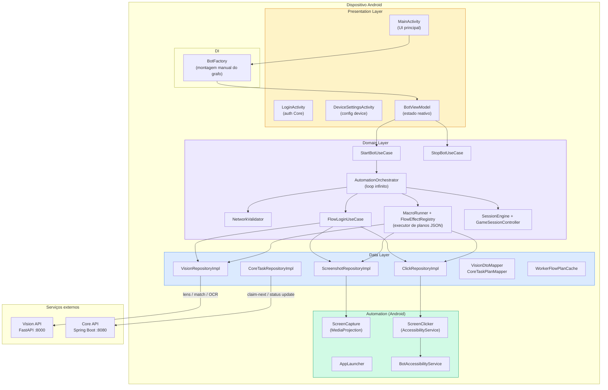
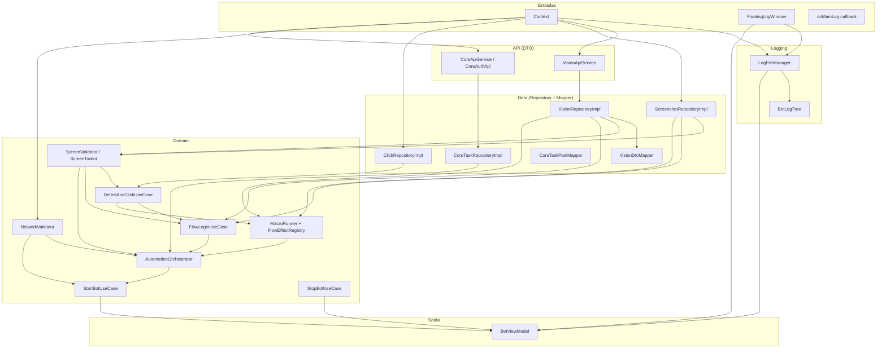
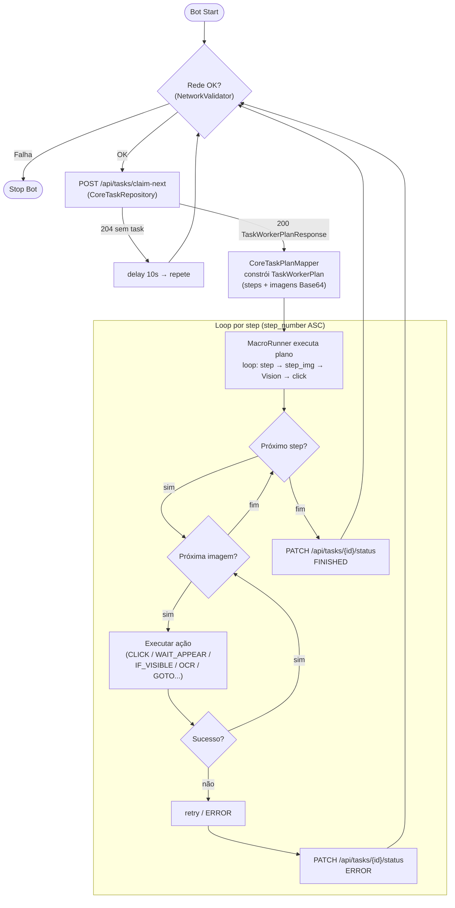
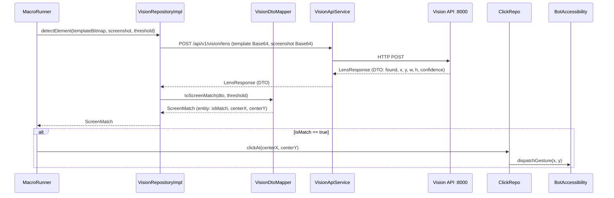
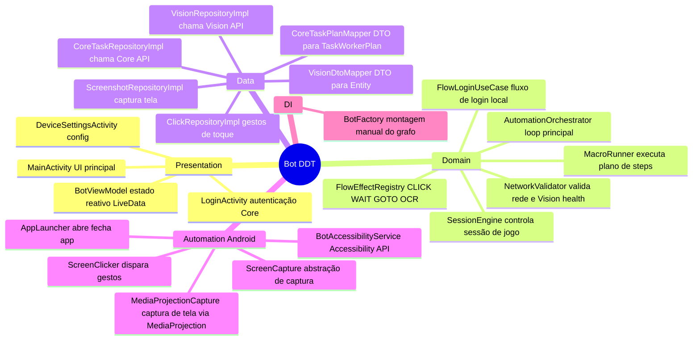
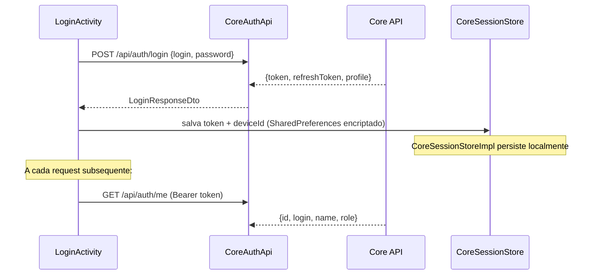

# automation-bot-lab — Arquitetura

App Android Kotlin que funciona como **worker** da plataforma DDT. Executa automação de UI no dispositivo (click, swipe, input), integra com Vision API para reconhecimento de tela, e se comunica com o Core API para buscar e reportar tasks.

---

## Visão Macro

---

## BotFactory — Grafo de Dependências

O `BotFactory` é o único ponto de montagem (composição raiz). Recebe `Context`, `FloatingLogWindow` e `onMainLog`, e retorna apenas `BotViewModel`.

---

## Orchestrator — Loop Infinito

---

## Integração Vision API

---

## Camadas e Responsabilidades

---

## Fluxo de Autenticação do Worker

---

## Permissões Android

| Permissão | Uso |
|-----------|-----|
| `INTERNET` | Comunicação com Core API e Vision API |
| `FOREGROUND_SERVICE` | Manter bot ativo em background |
| `MEDIA_PROJECTION` | Captura de tela (screenshots) |
| `ACCESSIBILITY_SERVICE` | Gestos de toque via `BotAccessibilityService` |
| `SYSTEM_ALERT_WINDOW` | Overlay de logs flutuante |
| `RECEIVE_BOOT_COMPLETED` | Auto-start opcional |

---

## Tecnologias

| Item | Tecnologia |
|------|-----------|
| Linguagem | Kotlin |
| SDK mínimo | Android 26 (Oreo) |
| HTTP | Retrofit 2 + OkHttp |
| Async | Kotlin Coroutines + Flow |
| DI | Manual (BotFactory) |
| Logging | Timber + LogFileManager |
| Build | Gradle (Kotlin DSL) |
| Testes | JUnit 4 + MockK |
