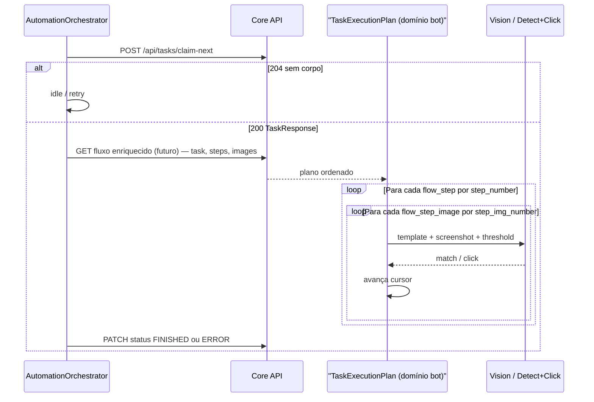
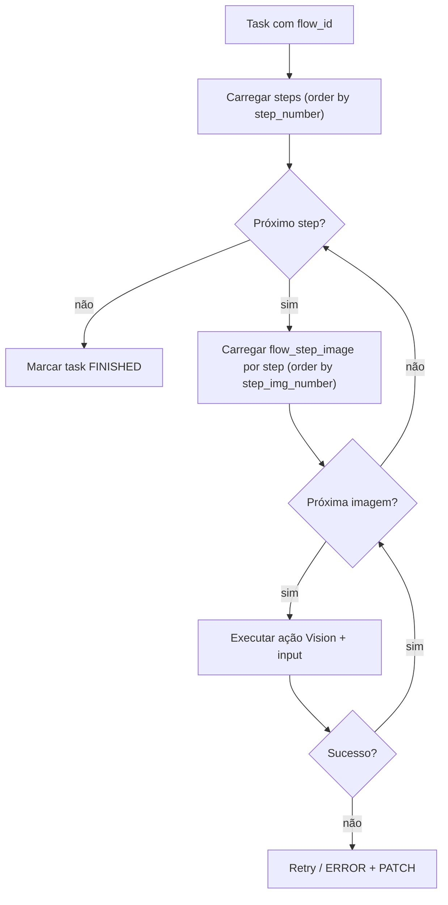

# Orquestrador (Bot) × Core: task, fluxo e `flow_step_image`

Documento de referência: **como o fluxo se encaixa no domínio do Core**, **diagramas** e **como evoluir o `AutomationOrchestrator`** no `automation-bot-ddt` sem acoplar regras de negócio ao lugar errado.

**Relacionado:** [ARCHITECTURE-FLOW.md](ARCHITECTURE-FLOW.md), [diagram-fluxo.md](diagram-fluxo.md), [WORKER-ACTIONS-WORKER-PLAN.md](WORKER-ACTIONS-WORKER-PLAN.md) (CLICK / WAIT_APPEAR / IF_VISIBLE no executor do plano). No Core: `TaskEntity`, `FlowStepJpaRepository`, `FlowStepImageJpaRepository`, `TaskController` (`/api/tasks/claim-next`).

---

## 1. Objetivo

- O **Core** define a **ordem canônica** da automação: `flow` → `flow_step` (por `step_number`) → `flow_step_image` (por `step_img_number` dentro de cada passo).
- O **Orchestrador no app** (`AutomationOrchestrator`) deve **consumir** essa ordem: para cada imagem da sequência, disparar captura + Vision + click (ou ação equivalente), avançar o cursor e, ao terminar, notificar o Core (`FINISHED` / `ERROR`).

Hoje o bot **não** chama o Core para task nem monta esse plano a partir do banco; o `FlowLoginUseCase` usa templates locais e passos fixos no código. Este doc descreve o **alvo** e os **passos de implementação**.

---

## 2. Modelo no Core (resumo)

| Conceito | Onde está | Ordenação |
|----------|-----------|-----------|
| Task | `TaskEntity`: `flow_id`, `server_value`, `status_task`, `device`, etc. | — |
| Passos do fluxo | `FlowStepEntity`, FK `flow_id` | `FlowStepJpaRepository.findByFlowIdOrderByStepNumberAscIdAsc` |
| Templates por passo | `FlowStepImageEntity`, FK `flow_step_id` | `FlowStepImageJpaRepository.findByFlowStepIdOrderByStepImgNumberAscIdAsc` |
| Unicidade por passo | `UNIQUE(flow_step_id, step_img_number)` | Garante ordem estável por número |

**Cursor de execução** (recomendado para retomada): par `(currentFlowStepId, currentStepImgNumber)` ou `currentFlowStepImageId`. A `TaskEntity` **ainda não** persiste isso; até existir coluna/API, o worker pode manter estado em memória (sem retomada após kill) ou persistir via endpoint futuro.

---

## 3. Diagrama — visão de sistema (Core ↔ Bot ↔ Vision)

**Nota:** o “GET fluxo enriquecido” **não existe ainda** como um único endpoint; hoje o worker precisaria de várias chamadas (`GET /api/tasks/{id}`, `GET` de steps/images por `flowId`) ou de um **novo** contrato agregado no Core (ver sec. 6).

---

## 4. Diagrama — plano de execução (duplo loop)

**Passo sem imagens:** definir política explícita (erro, skip, ou passo apenas lógico).

---

## 5. Contrato lógico mínimo para o orquestrador

O bot precisa, no mínimo, de:

1. **Identidade da task:** `id`, `flowId`, `serverValue`, credenciais de conta (canal seguro), `statusTask`.
2. **Lista ordenada de passos:** `flowStepId`, `stepNumber`, `name` (opcional).
3. **Por passo, lista ordenada de imagens:** `flowStepImageId`, `stepImgNumber`, **`templateImage`** (string **Base64** do template — mesmo estilo que o bot já envia à Vision; sem prefixo `data:image/...`), metadados (`coordinates`, `width`, `height`) se forem usados. Opcional: `imagePath` só como referência de depuração.

Opcional: parâmetros padrão para o bot usar ao chamar a Vision (ex.: threshold), **definidos pelo Core/BD** — não é resposta da Vision; só configura a chamada futura bot → Vision.

### 5.1 Nome do campo (combinado)

Usar **`templateImage`** (e não `templateBase64`) no JSON agregado do Core: deixa claro que é o conteúdo da imagem do template; o encoding continua sendo Base64 na string.

---

## 6. Lacunas atuais (Core + Bot)

| Lacuna | Impacto |
|--------|---------|
| ~~`TaskResponse` não traz steps nem images~~ | **Resolvido no Core:** `POST /api/tasks/claim-next` retorna `TaskWorkerPlanResponse` (task + flow → steps → `templateImage` Base64). **Consumidor previsto: app mobile (bot)** — não o `automation-app-web`. |
| ~~Sem endpoint agregado~~ | Mesmo endpoint acima (um round-trip no claim). |
| Sem persistência do cursor na task | Retomada frágil se o processo morrer |
| `AutomationOrchestrator` só usa `ScreenValidator` + `FlowLoginUseCase` | Fluxo ainda **não** dirigido por task do Core |

---

## 7. Como implementar no app Orchestrator (plano por camadas)

Alinhar ao padrão já descrito em [ARCHITECTURE-FLOW.md](ARCHITECTURE-FLOW.md): Orchestrator **só decide o ciclo**; use cases **executam**; repositórios **falam com Core / arquivos / Vision**.

### 7.1 Camada de dados (novo)

- **`ICoreTaskRepository`** (ou nome equivalente): `claimNext(deviceIdentifier)`, `getTaskExecutionPlan(taskId)` (ou métodos granulares até existir agregado), `updateTaskStatus(taskId, status)`.
- Implementação com Retrofit/Ktor/OkHttp conforme o projeto passar a usar; configurar base URL e auth em `app-{ENV}.properties` / `BuildConfig` (mesmo padrão da Vision).

### 7.2 Domínio — montagem do plano

- **`TaskExecutionPlan`**: lista imutável de `ExecutionStep` → cada um com lista ordenada de `ExecutionImage` (espelha `flow_step` + `flow_step_image`).
- **`BuildTaskExecutionPlanUseCase`**: recebe DTOs do Core e produz o plano; **sem** lógica de click.
- **`RunTaskFlowUseCase`** (ou `ExecuteCoreFlowUseCase`): recebe `TaskExecutionPlan` + dependências existentes (`DetectAndClickUseCase`, `IVisionRepository`, `IScreenshotRepository`, etc.); executa o duplo loop; em falha após retries, retorna erro para o Orchestrator chamar PATCH.

### 7.3 `AutomationOrchestrator` (evolução)

Esboço do ciclo futuro (pseudocódigo conceitual):

1. Validar rede (já existe: `NetworkValidator`).
2. **Opcional A:** se não há task ativa em memória → `claimNext`; se vazio, `delay` e volta ao passo 1.
3. **Opcional B:** manter compatibilidade com login “local” até migração completa — `when (screen)` pode coexistir com um ramo `when (hasActiveTask)` que prioriza execução dirigida pelo Core.
4. Chamar `RunTaskFlowUseCase.execute(plan)` até conclusão ou erro terminal.
5. Atualizar status no Core; limpar task ativa; `delay` curto; repetir.

Injetar no construtor do `AutomationOrchestrator` as novas dependências (repositório Core + use case de execução), mantendo `FlowLoginUseCase` até o fluxo Core cobrir 100% do login ou até haver composição “pré-passos locais + passos Core”.

### 7.4 `BotFactory`

- Instanciar cliente HTTP do Core, repositório, mappers DTO → `TaskExecutionPlan`, `RunTaskFlowUseCase`, e passar para `AutomationOrchestrator`.
- Testes: mocks do `ICoreTaskRepository` e do `RunTaskFlowUseCase` no `AutomationOrchestratorTest`, mais testes unitários do builder do plano (ordem `step_number` / `step_img_number`).

### 7.5 Vision e templates

- **Hoje:** templates locais em assets (`FlowLoginUseCase`).
- **Alvo:** imagem referenciada por `imagePath` do Core — download para cache local ou bytes em memória, depois mesma pipeline `DetectAndClickUseCase` / `IVisionRepository`.
- Se o Core passar **`templateImage`** (Base64) no contrato agregado, o mapper do bot repassa direto ao que a API Vision já aceita.

---

## 8. Checklist de entrega

- [ ] API Core: claim + (agregado ou conjunto de GETs) para steps/images ordenados.
- [ ] Opcional: PATCH progresso (cursor) ou apenas status final.
- [ ] Bot: `ICoreTaskRepository` + DTOs + mapper → `TaskExecutionPlan`.
- [ ] Bot: `RunTaskFlowUseCase` com duplo loop e política de retry alinhada a `FlowLoginUseCase`.
- [ ] Bot: `AutomationOrchestrator` integrado + `BotFactory`.
- [ ] Testes unitários do plano (ordem) e do orchestrator (mock claim vazio / sucesso).

---

## 9. Conclusão

O **plano é compatível** com o modelo atual do Core (`flow_step` + `flow_step_image` ordenados). Para **funcionar de ponta a ponta**, falta **expor o plano ao bot** (contrato HTTP) e **implementar** no `AutomationOrchestrator` o ramo “task do Core” usando um use case de execução que **varre** essa ordem. O código atual do orquestrador permanece válido como **fase de transição** (login por tela local) até o fluxo Core substituir ou compor esse comportamento.
