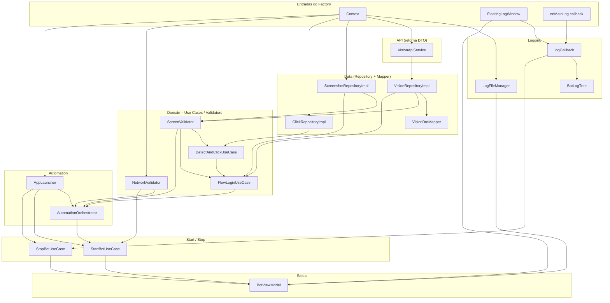

# Diagramas de fluxo – Bot DDT

**Arquivo único de referência** para os diagramas Mermaid do fluxo do bot. Mantenha este arquivo atualizado quando alterar BotFactory, Orchestrator, use cases ou repositórios.

- **Grafo do BotFactory:** dependências criadas pelo Factory (quem recebe quem).
- **Diagrama de sequência:** inicialização do app, start do bot e loop do Orchestrator (incluindo Vision DTO → Mapper → Entity).

---

## 1. Grafo do BotFactory

O grafo mostra **tudo o que o BotFactory instancia** e **quem depende de quem**. A seta A → B significa “BotFactory passa A como dependência de B”.

**Resumo:** BotFactory recebe `Context`, `FloatingLogWindow` e `onMainLog`. Cria a árvore (logging, VisionApiService, repositórios, validators, use cases, orchestrator, start/stop) e retorna apenas **BotViewModel**.

---

## 2. Diagrama de sequência – fluxo com DTO e Mapper

Reflete: BotFactory criando BotViewModel; Vision retornando DTO (LensResponse) e VisionDtoMapper → ScreenMatch (entity); Orchestrator com validateOrThrow → detectCurrentScreen → FlowLoginUseCase.execute() quando LOGIN_SCREEN; delay e repetição do loop.

```mermaid
sequenceDiagram
    autonumber
    participant MainActivity
    participant BotFactory
    participant BotViewModel
    participant StartBotUseCase
    participant StopBotUseCase
    participant NetworkValidator
    participant AppLauncher
    participant Orchestrator
    participant FlowLoginUseCase
    participant DetectAndClick
    participant ScreenValidator
    participant IScreenshotRepo
    participant ScreenshotRepoImpl
    participant ScreenCapture
    participant MediaProjectionCapture
    participant TemplateManager
    participant IVisionRepo
    participant VisionRepoImpl
    participant VisionDtoMapper
    participant VisionApiService
    participant IClickRepo
    participant ClickRepoImpl
    participant ScreenClicker
    participant BotAccessibilityService
    participant VisionAPI

    rect rgb(240, 240, 240)
        Note over MainActivity,VisionAPI: 🏗️ APP INITIALIZATION
        MainActivity->>BotFactory: createBotViewModel(context, floatingLog, onMainLog)
        BotFactory->>BotFactory: LogFileManager(context), BotLogTree(logCallback), Timber.plant(BotLogTree)
        BotFactory->>VisionApiService: new VisionApiService(BuildConfig.VISION_API_BASE_URL)
        BotFactory->>VisionRepoImpl: new VisionRepositoryImpl(visionApiService)
        BotFactory->>ScreenshotRepoImpl: new ScreenshotRepositoryImpl(context)
        Note right of ScreenshotRepoImpl: internamente: ScreenCapture + TemplateManager
        BotFactory->>ClickRepoImpl: new ClickRepositoryImpl(context)
        Note right of ClickRepoImpl: internamente: ScreenClicker
        BotFactory->>NetworkValidator: new NetworkValidator(context, visionBaseUrl/health)
        BotFactory->>ScreenValidator: new ScreenValidator(screenshotRepo, visionRepo, BuildConfig.VISION_LENS_THRESHOLD, BuildConfig.VISION_MATCH_THRESHOLD)
        BotFactory->>DetectAndClick: new DetectAndClickUseCase(screenValidator, clickRepo)
        BotFactory->>FlowLoginUseCase: new FlowLoginUseCase(detectAndClick, screenValidator, screenshotRepo, visionRepo, InputHelperAdapter)
        BotFactory->>AppLauncher: new AppLauncher(context)
        BotFactory->>Orchestrator: new AutomationOrchestrator(screenValidator, flowLoginUseCase, networkValidator)
        BotFactory->>StartBotUseCase: new StartBotUseCase(appLauncher, orchestrator, networkValidator)
        BotFactory->>StopBotUseCase: new StopBotUseCase(appLauncher, logCallback)
        BotFactory->>BotViewModel: new BotViewModel(startBotUseCase, stopBotUseCase, floatingLog, logFileManager)
        BotFactory-->>MainActivity: BotViewModel
    end

    rect rgb(200, 230, 255)
        Note over MainActivity,VisionAPI: 🚀 USER STARTS BOT
        MainActivity->>BotViewModel: start()
        BotViewModel->>StartBotUseCase: execute()
        StartBotUseCase->>NetworkValidator: validateOrThrow()
        NetworkValidator-->>StartBotUseCase: ✅ OK
        StartBotUseCase->>AppLauncher: isAppRunning(DDTANK_PACKAGE) / launch(DDTANK_PACKAGE)
        AppLauncher-->>StartBotUseCase: ✅
        StartBotUseCase->>Orchestrator: start() [loop infinito]
        Note over Orchestrator: ♾️ ORCHESTRATOR LOOP
    end

    loop ♾️ ORCHESTRATOR INFINITE LOOP
        rect rgb(255, 250, 200)
            Note over Orchestrator,NetworkValidator: 🔄 CICLO: validar rede
            Orchestrator->>NetworkValidator: validateOrThrow()
            alt ❌ NetworkException
                NetworkValidator-->>Orchestrator: throw NetworkException
                Orchestrator-->>StartBotUseCase: throw
                StartBotUseCase-->>BotViewModel: Result.failure(NetworkException)
                BotViewModel->>BotViewModel: stop() → StopBotUseCase
            else ✅ OK
                NetworkValidator-->>Orchestrator: OK
            end
        end

        rect rgb(230, 255, 230)
            Note over Orchestrator,VisionAPI: 🔍 Detectar tela atual
            Orchestrator->>ScreenValidator: detectCurrentScreen()
            ScreenValidator->>IScreenshotRepo: takeScreenshot()
            IScreenshotRepo->>ScreenshotRepoImpl: takeScreenshot()
            ScreenshotRepoImpl->>ScreenCapture: takeScreenshot()
            ScreenCapture->>MediaProjectionCapture: getInstance / capture
            MediaProjectionCapture-->>ScreenCapture: Bitmap
            ScreenCapture-->>ScreenshotRepoImpl: Bitmap
            ScreenshotRepoImpl-->>ScreenValidator: Bitmap
            ScreenValidator->>IScreenshotRepo: loadTemplate(path)
            ScreenshotRepoImpl->>TemplateManager: loadTemplateAsBitmap(BuildConfig.TEMPLATES_BASE_PATH + path)
            TemplateManager-->>ScreenshotRepoImpl: Bitmap
            ScreenshotRepoImpl-->>ScreenValidator: Bitmap
            alt template pequeno (lens)
                ScreenValidator->>IVisionRepo: detectElement(template, screenshot, lensThreshold)
                IVisionRepo->>VisionRepoImpl: detectElement()
                VisionRepoImpl->>VisionApiService: lens(..., threshold)
                VisionApiService->>VisionAPI: POST /api/v1/vision/lens
                VisionAPI-->>VisionApiService: LensResponse (DTO)
                VisionApiService-->>VisionRepoImpl: LensResponse (DTO)
                VisionRepoImpl->>VisionDtoMapper: toScreenMatch(dto, threshold)
                VisionDtoMapper-->>VisionRepoImpl: ScreenMatch (entity)
            else template grande (match)
                ScreenValidator->>IVisionRepo: compareScreens(..., matchThreshold)
                IVisionRepo->>VisionRepoImpl: compareScreens()
                VisionRepoImpl->>VisionApiService: match(..., threshold)
                VisionApiService->>VisionAPI: POST /api/v1/vision/match
                VisionAPI-->>VisionApiService: LensResponse (DTO)
                VisionApiService-->>VisionRepoImpl: LensResponse (DTO)
                VisionRepoImpl->>VisionDtoMapper: toScreenMatch(dto, threshold)
                VisionDtoMapper-->>VisionRepoImpl: ScreenMatch (entity)
            end
            VisionRepoImpl-->>ScreenValidator: ScreenMatch (entity)
            ScreenValidator-->>Orchestrator: GameScreen (LOGIN_SCREEN | UNKNOWN | …)
        end

        alt Orchestrator: tela == LOGIN_SCREEN
            rect rgb(200, 255, 200)
                Note over Orchestrator,VisionAPI: 🔐 executeLoginFlow()
                Orchestrator->>FlowLoginUseCase: execute()
                FlowLoginUseCase->>DetectAndClick: execute(LOGIN_SCREEN, …)
                Note over DetectAndClick,VisionAPI: Detect → validateScreenWithRetry (ScreenValidator + Screenshot + Vision lens/match)
                DetectAndClick->>ScreenValidator: validateScreenWithRetry(LOGIN_SCREEN)
                ScreenValidator->>IScreenshotRepo: takeScreenshot() / loadTemplate()
                IScreenshotRepo->>ScreenshotRepoImpl: (ScreenCapture + TemplateManager)
                ScreenshotRepoImpl-->>ScreenValidator: Bitmap screenshot + template
                ScreenValidator->>IVisionRepo: detectElement ou compareScreens (lensThreshold / matchThreshold)
                IVisionRepo->>VisionRepoImpl: VisionApiService → VisionAPI → LensResponse (DTO)
                VisionRepoImpl->>VisionDtoMapper: toScreenMatch(dto, threshold)
                VisionDtoMapper-->>VisionRepoImpl: ScreenMatch (entity)
                IVisionRepo-->>ScreenValidator: ScreenMatch (entity)
                ScreenValidator-->>DetectAndClick: ScreenMatch (isMatch, x, y, w, h)
                Note over DetectAndClick: centerX/Y → delay → click
                DetectAndClick->>IClickRepo: clickAt(centerX, centerY)
                IClickRepo->>ClickRepoImpl: clickAt()
                ClickRepoImpl->>ScreenClicker: clickAt(x, y)
                ScreenClicker->>BotAccessibilityService: dispatchGesture
                BotAccessibilityService-->>ScreenClicker: OK
                ClickRepoImpl-->>DetectAndClick: true
                Note over DetectAndClick: validar desaparecimento
                DetectAndClick->>ScreenValidator: validateScreen(LOGIN_SCREEN)
                ScreenValidator->>IVisionRepo: detectElement/compareScreens
                IVisionRepo-->>ScreenValidator: ScreenMatch
                ScreenValidator-->>DetectAndClick: isMatch (false = sumiu ✅)
                DetectAndClick-->>FlowLoginUseCase: Result.success / failure
                FlowLoginUseCase-->>Orchestrator: Result
            end
        else tela UNKNOWN ou outra
            Note over Orchestrator: delay 5s, próxima volta
        end

        rect rgb(255, 240, 220)
            Note over Orchestrator: 🏠 executeMainMenuFlow() [TODO]
        end
        rect rgb(240, 220, 255)
            Note over Orchestrator: ⚔️ executeBattleFlow() [TODO]
        end
        Note over Orchestrator: ⏱️ delay 2s → volta ao início do loop
    end
```

