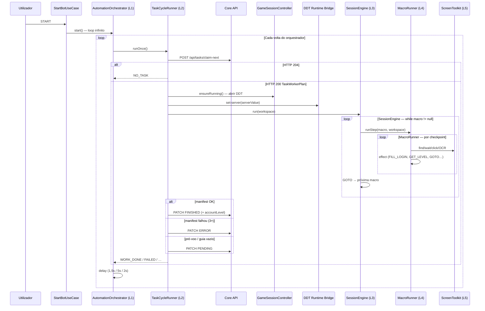

# Guia de execução de task — método do bot

Referência operacional de **como o bot executa uma task do Core**, do clique em START até o PATCH de status final. Descreve o pipeline em camadas (L1–L5), políticas de retry, transições de estado e pontos de depuração.

**Relacionado:** [arq-visao-geral-bot.md](arq-visao-geral-bot.md), [guia-orquestrador-task-core.md](guia-orquestrador-task-core.md), [ref-acoes-worker-manifest.md](ref-acoes-worker-manifest.md), [guia-login-servidor-mitm.md](guia-login-servidor-mitm.md), Core [TASK-WORKER-CLAIM.md](../core/TASK-WORKER-CLAIM.md).

**Última atualização:** 2026-06-20

---

## 1. Visão geral

O bot funciona como **worker Android**: puxa tasks da fila do Core, executa automação de UI no DDT e reporta o resultado.

```text
┌─────────────────────────────────────────────────────────────────────────┐
│ L1  AutomationOrchestrator     loop infinito (rede → task → pausa)       │
│ L2  TaskCycleRunner            claim → pré-voo → manifest → status      │
│ L3  SessionEngine              macros + transições GOTO                   │
│ L4  MacroRunner                checkpoints por macro (img#1, img#2, …)   │
│ L5  ScreenToolkit              screenshot, Vision, clique, OCR, login   │
└─────────────────────────────────────────────────────────────────────────┘
```

Cada camada tem **uma responsabilidade**. O orquestrador não conhece templates; o `MacroRunner` não chama o Core; o `TaskCycleRunner` não decide qual macro correr — isso fica no `SessionEngine` + manifest.

---

## 2. Diagrama — ciclo completo de uma task



---

## 3. Camadas e classes

| Camada | Classe | Ficheiro | Responsabilidade |
|--------|--------|----------|------------------|
| L1 | `AutomationOrchestrator` | `domain/orchestrator/` | Valida rede; chama `TaskCycleRunner.runOnce()`; pausa entre voltas |
| L2 | `TaskCycleRunner` | `domain/cycle/` | `claim-next`, pré-voo, retries, PATCH status |
| L3 | `SessionEngine` | `domain/session/` | Loop de macros; resolve `GOTO:<macroKey>` |
| L3 | `SessionPolicy` | `domain/session/` | Escolhe macro inicial (`flowKey` da task) |
| L4 | `MacroRunner` | `domain/macro/` | Percorre checkpoints (`stepImgNumber`) de uma macro |
| L4 | `FlowEffectRegistry` | `domain/macro/` | Efeitos pós-ação (`FILL_LOGIN`, `GET_LEVEL`, `GOTO:…`) |
| L5 | `ScreenToolkit` | `domain/screen/` | Primitivas Vision + A11y |
| — | `GameSessionController` | `domain/game/` | Abre/fecha DDT entre tentativas |
| — | `CoreTaskRepositoryImpl` | `data/repository/` | HTTP claim-next, merge do guia, PATCH status |

Montagem no `BotFactory`: repositório Core → `ScreenToolkit` → `FlowEffectRegistry` → `MacroRunner` → `SessionEngine` → `TaskCycleRunner` → `AutomationOrchestrator`.

---

## 4. Fases do `TaskCycleRunner` (L2)

Um ciclo (`runOnce()`) segue esta ordem fixa:

### 4.1 Pré-condições

| Verificação | Outcome se falhar | Log típico |
|-------------|-------------------|------------|
| `CORE_TASKS_ENABLED=false` | `SKIPPED` | `TaskCycle: CORE_TASKS desligado` |
| `DEVICE_IDENTIFIER` vazio | `SKIPPED` | `DEVICE_IDENTIFIER vazio` |
| MediaProjection não pronto | `WAITING_SCREENSHOT` | `à espera de MediaProjection` |

### 4.2 Claim-next

```http
POST /api/tasks/claim-next
{ "deviceIdentifier": "…", "deviceApiKey": "…" }
```

- **204** → `NO_TASK` (fila vazia; orquestrador espera 5 s).
- **200** → monta `TaskWorkspace` a partir de `TaskWorkerPlan` (task + credenciais + `serverValue` + guia `steps[]`).

O repositório pode **mesclar o guia** de fontes locais (`local_metadata`, `local_worker_flows`), S3 ou cache/API Core — ver `WORKER_FLOW_PLAN_SOURCE` em `application.properties`.

### 4.3 Guia vazio

Se `workspace.steps.isEmpty()`:

- PATCH **`PENDING`** (não `ERROR`) — task volta à fila.
- Motivo: plano incompleto ou sync falhou; não é falha de execução no jogo.

### 4.4 Pré-voo (até 3 tentativas)

Abre o DDT e configura o servidor **sem executar macros**:

1. `GameSessionController.ensureRunning()` — launch ou warm-up se já aberto.
2. `ddtRuntimeBridge.setTargetServer(serverValue)` — quando a task tem `serverValue` (ex. `S12`).

Falha após 3 tentativas → PATCH **`PENDING`** + `stopAfterTaskError()` (fecha DDT).

Ver [guia-login-servidor-mitm.md](guia-login-servidor-mitm.md) para o stack mitm + bridge.

### 4.5 Manifest (até 3 tentativas)

Executa `SessionEngine.run(workspace)` — o guia completo com transições `GOTO`.

- **Sucesso** → PATCH **`FINISHED`** (+ `accountLevel` se obtido).
- **Falha na tentativa N < 3** → reinicia DDT, repete pré-voo (1×) e tenta manifest de novo.
- **Falha na 3.ª tentativa** → PATCH **`ERROR`** + fecha DDT.

Constante: `TaskCycleRunner.MAX_TASK_ATTEMPTS = 3`.

### 4.6 Resumo de status da task

| Situação | Status final | DDT |
|----------|--------------|-----|
| Manifest concluído | `FINISHED` | mantém aberto |
| Manifest falhou 3× | `ERROR` | fecha |
| Pré-voo falhou / guia vazio | `PENDING` | fecha |
| PATCH falhou | `FAILED` (outcome interno) | task pode ficar `PROCESSING` |

---

## 5. SessionEngine e política de macros (L3)

O `SessionEngine` **não percorre o guia inteiro de uma vez**. Corre macros em loop:

1. `SessionPolicy.CatalogByTaskFlow` escolhe a **macro inicial** pelo `flowKey` da task (ex. `LOGIN`).
2. `MacroRunner.runStep(macro, workspace)` executa todos os checkpoints dessa macro.
3. Se um efeito `GOTO:LVL_0` (ou `GET_LEVEL` → `LVL_N`) foi disparado, salta para a macro destino.
4. Repete até não haver próxima macro (`branchToMacroKey == null`).

### GOTO com checkpoint parcial

| Efeito | Comportamento |
|--------|---------------|
| `GOTO:LVL_0` | Entra na macro `LVL_0` no primeiro checkpoint |
| `GOTO:LVL_0:2` | Entra na macro `LVL_0` a partir de `stepImgNumber=2` (ignora img#0 e img#1) |

Macro inexistente no guia → falha do manifest (`IllegalStateException`).

---

## 6. MacroRunner — checkpoints (L4)

Cada **macro** (`WorkerFlowStep`) tem uma lista de **checkpoints** (`WorkerStepImage`), ordenados por `stepImgNumber`.

Por checkpoint:

1. `timeskipMs` — pausa opcional (respeita pausa cooperativa do float).
2. Carrega PNG (`localAssetRelativePath`, `@sync:` ou assets).
3. Executa `workerAction`.
4. Executa `effect` opcional (via `FlowEffectRegistry`).

### 6.1 `workerAction` (Core + bot)

Valores validados no Core (`FlowStepWorkerActionWire`):

| Ação | Comportamento no `MacroRunner` |
|------|--------------------------------|
| **CLICK** | Screenshot → Vision → **tem de encontrar** → clica no centro |
| **WAIT_APPEAR** | Poll até 90× com 1 s de intervalo → **não clica**; timeout = falha |
| **IF_VISIBLE** | Se não encontrar → **skip** (continua); se encontrar → clica |

Valores extra **só no bot** (manifest local, não persistidos no Core):

| Ação | Comportamento |
|------|---------------|
| **LOGIN** | `WAIT_APPEAR` + `FILL_LOGIN` (credenciais A11y) |
| **LOGIN_IF_VISIBLE** | Como `IF_VISIBLE`, mas preenche login se a tela aparecer |

Qualquer outra string cai no ramo **CLICK** (comportamento default).

### 6.2 `effect` (manifest local)

| Efeito | O que faz |
|--------|-----------|
| `FILL_LOGIN` | Preenche user/senha da task + tap submit (A11y) |
| `GET_ROLE_GRADE` | Consulta level via mitm (`runtimeBridge.getRoleGrade`) |
| `GET_LEVEL` | OCR do HUD (fallback) → persiste level no Core |
| `GOTO:<macroKey>` | Salta para outra macro |
| `GOTO:<macroKey>:` | Salta para macro + checkpoint inicial |

`GET_ROLE_GRADE` / `GET_LEVEL` também fazem **branch automático** para macro `LVL_{level}` se existir no guia.

---

## 7. ScreenToolkit (L5)

Primitivas usadas pelo `MacroRunner` e, opcionalmente, por lógica inline no `SessionEngine`:

| Método | Uso |
|--------|-----|
| `captureScreen()` | MediaProjection → Bitmap |
| `loadTemplateAsset(path)` | PNG local, S3 cache ou assets |
| `findTemplate()` | Uma captura + Vision lens |
| `waitForTemplate()` | Poll (default 90× / 1 s) |
| `clickMatch()` | Clique no centro do match |
| `fillLoginAndTapSubmit()` | Login híbrido A11y |
| `ocrNumber(region)` | Level via Vision OCR |

Threshold Vision: `BuildConfig.VISION_LENS_THRESHOLD` (default 0,80).

---

## 8. Outcomes do orquestrador (L1)

`WorkerCycleOutcome` controla o intervalo até à próxima volta:

| Outcome | Pausa | Significado |
|---------|-------|-------------|
| `WORK_DONE` | 1,5 s | Task processada (ou devolvida PENDING/ERROR) |
| `NO_TASK` | 5 s | Fila vazia |
| `WAITING_SCREENSHOT` | 5 s | MediaProjection ainda não autorizado |
| `SKIPPED` | 5 s | Tasks desligadas ou device sem identifier |
| `FAILED` | 2 s | PATCH falhou ou erro interno grave |

`NetworkException` no loop → **para o bot** (propaga para `StartBotUseCase`).

---

## 9. Como executar (passo a passo)

### 9.1 Pré-requisitos

| Componente | Obrigatório | Notas |
|------------|-------------|-------|
| Core API | Sim | Task `PENDING` + device registado |
| Vision API | Sim | `:8000` — lens/match/OCR |
| MediaProjection | Sim | Concedido no START |
| Accessibility Service | Sim | Cliques e login A11y |
| DDT instalado | Sim | `com.road7.ddtankbr.gp` |
| Runtime bridge + mitm | Condicional | Quando `serverValue` ≠ servidor visível na UI |

### 9.2 Configuração mínima (`application.properties`)

```properties
local.CORE_TASKS_ENABLED=true
local.DEVICE_IDENTIFIER=device-android-001
local.DEVICE_API_KEY=dev-device-key-001
local.CORE_API_BASE_URL=http://10.0.2.2:8082/
local.WORKER_FLOW_PLAN_SOURCE=local_metadata
local.DDT_RUNTIME_BRIDGE_ENABLED=true
local.DDT_RUNTIME_BRIDGE_BASE_URL=http://10.0.2.2:8799
```

### 9.3 Arranque

1. Subir Core, Vision e (se necessário) bridge mitm — ver [guia-setup-inicial.md](guia-setup-inicial.md) e [runbook-mitm-emulador.md](runbook-mitm-emulador.md).
2. Instalar APK: `cd automation-bot-lab && ./run.sh`.
3. Abrir app → conceder overlay, MediaProjection e Accessibility.
4. Configurar device identifier (ou usar `BuildConfig.DEVICE_IDENTIFIER`).
5. Clicar **START** → `StartBotUseCase` valida rede, abre DDT se fechado, inicia o loop L1.

### 9.4 O que observar nos logs

Prefixos úteis (categoria `FLOW`):

```text
Orchestrator: loop iniciado
TaskCycle: claim-next device=…
TaskCycle: taskId=… server=S12 macros=… checkpoints=…
GameSession: abrindo DDT
TaskCycle: manifest taskId=… tentativa 1/3
SessionPolicy: macroKey=LOGIN → step(s) […]
MacroRunner: step=1 img#2 … — WAIT_APPEAR → FILL_LOGIN
Effect: GET_LEVEL … → GOTO LVL_0
SessionEngine: GOTO LVL_0
TaskCycle: taskId=… status=FINISHED
Orchestrator: outcome=WORK_DONE — próximo ciclo em 1500ms
```

Pausa cooperativa: overlay flutuante ⏸ interrompe entre checkpoints (`ManifestPauseGate`).

---

## 10. Modelo de dados do guia

```text
TaskWorkerPlan
├── taskId, serverValue, accountLevel
├── gameAccount { login, password }
└── flow
    ├── flowKey          ← macro inicial (SessionPolicy)
    └── steps[]          ← catálogo de macros
        ├── stepNumber   ← ordem canónica no catálogo
        ├── macroKey     ← LOGIN, LVL_0, LVL_1, RM_POP, …
        └── images[]
            ├── stepImgNumber
            ├── workerAction
            ├── effect
            ├── timeskipMs
            └── localAssetRelativePath / templateImageBase64
```

O manifest local vive em `app/src/main/assets/metadata/manifest.json` (compilado a partir de `metadata/collections/`).

---

## 11. Troubleshooting

| Sintoma | Causa provável | O que verificar |
|---------|----------------|-----------------|
| `NO_TASK` contínuo | Fila vazia ou device errado | Tasks `PENDING` no Core; `DEVICE_IDENTIFIER` |
| `WAITING_SCREENSHOT` | MediaProjection não concedido | Repetir START; permissão no Android 14+ |
| `guia sem macros → PENDING` | Plano sem steps | Sync S3; `WORKER_FLOW_PLAN_SOURCE`; manifest local |
| `pré-voo falhou → PENDING` | DDT não abre ou bridge down | `GameSession`; bridge `:8799/health` |
| `Template não encontrado` | PNG errado ou threshold alto | Vision debug; `VISION_LENS_THRESHOLD` |
| `WAIT_APPEAR timeout` | Tela demorou > ~90 s | Aumentar poll no `ScreenToolkit` ou corrigir template |
| `GOTO macro não encontrada` | `macroKey` ausente no guia | Manifest incompleto para branch de level |
| Task presa em `PROCESSING` | PATCH falhou (`FAILED`) | Logs `Core PATCH task status failed`; retry manual no Core |
| Servidor errado in-game | Bridge/mitm off | [guia-login-servidor-mitm.md](guia-login-servidor-mitm.md) |

---

## 12. Referência rápida de ficheiros

| Ficheiro | Papel |
|----------|-------|
| `domain/orchestrator/AutomationOrchestrator.kt` | L1 — loop |
| `domain/cycle/TaskCycleRunner.kt` | L2 — ciclo de task |
| `domain/session/SessionEngine.kt` | L3 — transições |
| `domain/macro/MacroRunner.kt` | L4 — checkpoints |
| `domain/macro/FlowEffectRegistry.kt` | Efeitos e GOTO |
| `domain/screen/ScreenToolkit.kt` | L5 — primitivas |
| `data/repository/CoreTaskRepositoryImpl.kt` | HTTP Core |
| `di/BotFactory.kt` | Grafo de dependências |

---

## 13. Evolução e lacunas conhecidas

- **Cursor de retomada:** a task no Core não persiste `(step, img#)` — kill do processo perde progresso.
- **`ExecuteWorkerPlanUseCase`:** documentado em [ref-acoes-worker-manifest.md](ref-acoes-worker-manifest.md) como caminho legado; produção usa `MacroRunner` + manifest.
- **Lógica inline no SessionEngine:** popups imprevisíveis podem ser tratados com `ScreenToolkit` entre macros, sem alterar o manifest.

Para alterar tempos de retry do ciclo de task: `TaskCycleRunner.MAX_TASK_ATTEMPTS` e delays em `AutomationOrchestrator`.

Para alterar poll de `WAIT_APPEAR`: defaults em `ScreenToolkit.waitForTemplate()` (`maxAttempts=90`, `pollMs=1000`).
