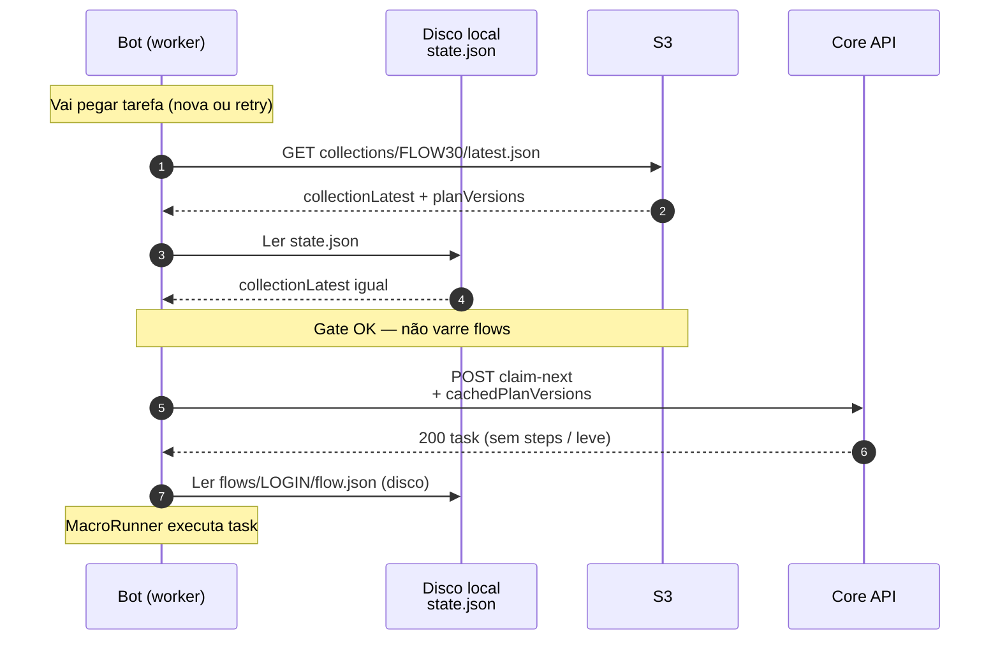
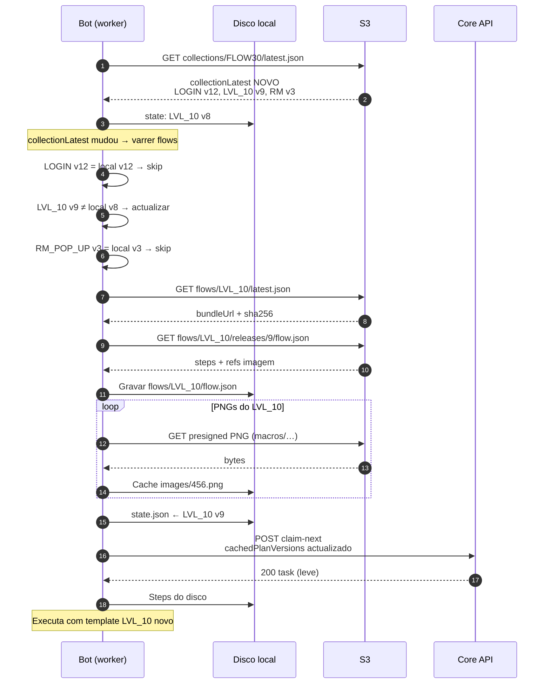
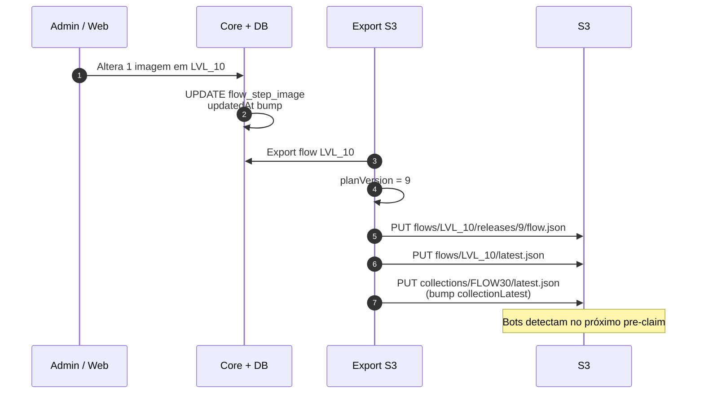

# Flow sync S3 — plano de manifest leve (bot worker)

Documento de desenho: sincronizar **flows** e **imagens** via S3 **fora** do `claim-next`, com update **granular por flow** e verificação **antes de cada tarefa**.

Relacionado: [env-images-s3.md](../infra/docs/env-images-s3.md) (PNG no bucket), [FLOW-SYNC-E-S3.md](../FLOW-SYNC-E-S3.md) (visão transversal), [apk-bot-s3.md](../infra/docs/apk-bot-s3.md) (APK).

---

## Problema

1. Manifest / templates inline no `claim-next` ou no `GET /worker/flow-plan` deixam a fila **lenta** — a task fica parada à espera de JSON pesado (ou Base64).
2. O bypass actual (`cachedPlanVersionsByFlowId`) evita reenviar steps **se** a versão no device coincide com a do Core — mas no cache miss ainda há fetch pesado.
3. Uma alteração numa **única imagem** de um **único flow** não deve forçar re-download da collection inteira.

**Objectivo:** `claim-next` permanece **leve** (task + metadados + versões). Manifest, steps e PNGs sincronizam via **S3 privado**, com o **Core como gatekeeper** (URLs assinadas após validar device), em unidades **por flow**.

---

## Core gatekeeper + S3 privado (prod)

Em produção o bucket **não** expõe `json/bot/*` nem PNGs por GET anónimo. O bot autentica-se com **device API key**; o Core lê o S3 com IAM e devolve URLs assinadas (TTL ~15 min).

| Etapa | Quem | Endpoint / acção |
|-------|------|-------------------|
| Índice collection | Bot → Core | `GET /api/tasks/worker/flow-sync/collections/{key}/latest` |
| Flow latest + bundle | Bot → Core | `GET /api/tasks/worker/flow-sync/flows/{flowKey}/latest` |
| PNGs em batch | Bot → Core | `POST /api/tasks/worker/flow-sync/presign` `{ "keys": ["automation-device-lab/PROD/macros/…"] }` |
| Download blobs | Bot → S3 | GET nas URLs presignadas |
| Tarefa | Bot → Core | `POST claim-next` (leve) |

Build prod: `WORKER_FLOW_SYNC_VIA_CORE=true`, `FLOW_SYNC_COLLECTION_KEY=LOCAL` — **sem** `FLOW_SYNC_MANIFEST_BASE_URL` público.

Legado lab (bucket público): `WORKER_FLOW_SYNC_VIA_CORE=false` + URLs S3 no `BuildConfig`.

---

## Princípios

| Princípio | Descrição |
|-----------|-----------|
| **Collection = índice** | Ficheiro pequeno: lista de flows + `collectionLatest`. |
| **Flow = unidade de versão** | Cada flow tem o seu `latest` e releases imutáveis. |
| **Diff, não monolito** | Só baixa flows cujo `planVersion` diverge. |
| **Sync antes do claim** | Consulta rápida **sempre** antes de `claim-next` (task nova ou retry). |
| **Imagens por referência** | Steps trazem `coreImageId` / `s3Key` — PNG baixado à parte, nunca Base64 no manifest. |
| **Mesma versão no Core e no S3** | `planVersion` publicado no S3 = valor que o Core usa no bypass. |

---

## Modelo mental (exemplo FLOW30)

Collection **FLOW30** com flows: `LOGIN`, `LVL_10`, `RM_POP_UP`.

Alteraste **uma imagem** em `LVL_10` → só o `planVersion` de `LVL_10` muda.

```
S3 (remoto)                         Device (local)
─────────────────                   ─────────────────
FLOW30/latest.json                  sync-state/FLOW30.json
  collectionLatest: "2025-06-18T…"     collectionLatest: "2025-06-17T…"  ← diferente
  flows:                               flows:
    LOGIN    → v12                      LOGIN    → v12  ✓ igual
    LVL_10   → v9                       LVL_10   → v8   ✗ desatualizado
    RM_POP_UP→ v3                       RM_POP_UP→ v3  ✓ igual

→ Bot actualiza APENAS LVL_10 (step.json + PNGs desse flow).
```

---

## Estrutura: collection vs flow (1 manifest por flow)

**Collection** = índice (não tem steps). **Flow** = manifest próprio.

```text
FLOW30  (collection — só catálogo)
│
├── LOGIN      →  flows/LOGIN/releases/12/flow.json     ← manifest só do LOGIN
├── LVL_10     →  flows/LVL_10/releases/9/flow.json     ← manifest só do LVL_10
└── RM_POP_UP  →  flows/RM_POP_UP/releases/3/flow.json  ← manifest só do RM_POP_UP
```

| Pergunta | Resposta |
|----------|----------|
| Onde está o índice da collection? | `collections/FLOW30/latest.json` |
| Onde está o manifest do LOGIN? | `flows/LOGIN/releases/{v}/flow.json` |
| Um ficheiro com todos os flows juntos? | **Não** — cada flow é independente |
| Mudei 1 PNG no LOGIN | Republica só `flows/LOGIN/…` |

---

## Diagrama de sequência

### A) Nada mudou (caminho rápido — ~1 request)

Antes de cada `claim-next`. O bot só confirma que o índice da collection está igual.



### B) 1 flow mudou (LVL_10) — update parcial

Operador alterou uma imagem. Só `LVL_10` diverge; `LOGIN` e `RM_POP_UP` ficam.



### C) Publish no admin (origem da mudança)



---

## Caso de uso: operador corrige template durante retry

**Actores:** Operador, Core, S3, Bot no emulador (collection **FLOW30**).

**Pré-condições**

- Bot tem `FLOW30` sincronizado: LOGIN v12, LVL_10 v8, RM_POP_UP v3.
- Task #501 em execução usa macro `LVL_10`.
- Bot falhou 2× (OCR não encontrou botão) — vai para 3.ª tentativa.

**Fluxo**

| # | Quem | O quê |
|---|------|--------|
| 1 | Operador | Vê falha no log; substitui PNG `03.png` no flow **LVL_10** no admin. |
| 2 | Core | Grava imagem; dispara export → S3 publica **LVL_10 v9**; `collectionLatest` de FLOW30 muda. |
| 3 | Bot | Fecha e reabre app (retry). Antes do claim, corre **syncBeforeClaim**. |
| 4 | Bot | GET `collections/FLOW30/latest.json` → `collectionLatest` diferente. |
| 5 | Bot | Compara flows: LOGIN ok, **LVL_10 v9 ≠ v8**, RM_POP_UP ok. |
| 6 | Bot | Baixa só `flows/LVL_10/releases/9/flow.json` + PNGs novos/alterados. |
| 7 | Bot | `claim-next` com versões actualizadas → Core responde **sem manifest pesado**. |
| 8 | Bot | Reexecuta task #501 com template **LVL_10 v9** → sucesso. |

**Pós-condições**

- `state.json` local: LVL_10 = v9.
- LOGIN e RM_POP_UP **não** foram re-downloaded.
- Nenhum GET `/worker/flow-plan?templates=manifest` na fila crítica.

**Caminho alternativo (nada mudou)**

Se o operador **não** alterou templates entre tentativas: passo 4 devolve `collectionLatest` igual → passos 5–6 omitidos → claim imediato (~1 GET S3).

---

## Layout S3 (atual)

Raiz por **app** + **deploy env** (`LOCAL` | `HMG` | `PROD`). Collection key (ex. `LOCAL`) é **catálogo no BD**, não confundir com deploy env.

```text
s3://BUCKET/automation-device-lab/PROD/
  macros/collections/LOCAL/flows/LOGIN/steps/0/img/0.0.1_xx.png
  json/bot/collections/LOCAL/latest.json
  json/bot/collections/LOCAL/flows/LOGIN/latest.json
  json/bot/collections/LOCAL/flows/LOGIN/releases/{planVersion}/flow.json
```

Variáveis Core: `APP_STORAGE_S3_APP_ROOT`, `APP_STORAGE_S3_DEPLOY_ENV`, `APP_STORAGE_S3_PREFIX=macros`.

Paths legados `img/flows/` e `json/bot/` na raiz do bucket — **não usar**.

---

## Contratos JSON

### 1. Collection `latest` — `collections/FLOW30/latest.json`

Consulta **rápida** (primeiro passo do sync). Se `collectionLatest` igual ao local → **stop** (sem varrer flows).

```json
{
  "collectionKey": "FLOW30",
  "collectionId": 30,
  "collectionLatest": "2025-06-18T14:22:01Z",
  "flows": {
    "LOGIN":    { "planVersion": "12", "latestUrl": "https://…/flows/LOGIN/latest.json" },
    "LVL_10":   { "planVersion": "9",  "latestUrl": "https://…/flows/LVL_10/latest.json" },
    "RM_POP_UP":{ "planVersion": "3",  "latestUrl": "https://…/flows/RM_POP_UP/latest.json" }
  }
}
```

- **`collectionLatest`**: bump quando **qualquer** flow da collection muda (max dos `updatedAt` ou hash agregado). Usado como **gate** — evita comparar N flows se nada mudou globalmente.
- **`flows.*.planVersion`**: versão **por flow** (string estável — timestamp ISO, hash curto, ou incremento).

### 2. Flow `latest` — `flows/LVL_10/latest.json`

Só consultado se o índice da collection indicar divergência **ou** na varredura flow-a-flow.

```json
{
  "flowKey": "LVL_10",
  "flowId": 124,
  "planVersion": "9",
  "bundleUrl": "https://…/flows/LVL_10/releases/9/flow.json",
  "bundleSha256": "abc…",
  "publishedAt": "2025-06-18T14:20:00Z"
}
```

### 3. Flow bundle — `flows/LVL_10/releases/9/flow.json`

Split L3/L4 (alinhado a `assets/worker-flows/steps/{KEY}/step.json`):

```json
{
  "flowKey": "LVL_10",
  "flowId": 124,
  "planVersion": "9",
  "steps": [
    {
      "stepKey": "LVL_10_01",
      "stepNumber": 1,
      "macroKey": "LVL_10",
      "images": [
        {
          "stepImgNumber": 1,
          "coreImageId": 456,
          "s3Key": "automation-device-lab/PROD/macros/collections/LOCAL/flows/LVL_10/steps/3/img/0.0.1_03.png",
          "sha256": "…",
          "workerAction": "CLICK"
        }
      ]
    }
  ]
}
```

---

## Estado local no device

```text
filesDir/worker-sync/
  FLOW30/
    state.json                 ← espelho do índice + versões aplicadas
  flows/
    LOGIN/flow.json
    LVL_10/flow.json
    RM_POP_UP/flow.json
  images/
    456.png                    ← cache por coreImageId ou path hash
```

**`state.json`** (exemplo):

```json
{
  "collectionKey": "FLOW30",
  "collectionLatest": "2025-06-18T14:22:01Z",
  "flows": {
    "LOGIN":     "12",
    "LVL_10":    "9",
    "RM_POP_UP": "3"
  },
  "lastSyncAt": "2025-06-18T14:25:00Z"
}
```

Actualização parcial: apagar e reescrever **só** `flows/LVL_10/` + imagens referenciadas por esse bundle.

---

## Algoritmo de sync (bot)

### Quando correr

**Sempre** imediatamente **antes** de `POST /api/tasks/claim-next`:

- task **nova** (FIFO);
- **retry** da mesma task (até 3 tentativas, fechar/reabrir app);
- opcionalmente no **cold start** da app (warm-up; o pre-claim cobre o resto).

Objectivo: zero execução com manifest desactualizado — evita bugs silenciosos (imagem errada, step antigo).

### Passos

```
syncBeforeClaim(collectionKey | collectionId da task/config)
│
├─ 1. GET collections/{KEY}/latest.json          [1 request pequena]
│     Compare collectionLatest com state.json
│     └─ IGUAL → FIM (~ms, sem rede extra)
│
├─ 2. collectionLatest MUDOU → varrer flows
│     Para cada flowKey no índice:
│       Compare planVersion remoto vs state.flows[flowKey]
│       └─ IGUAL → skip
│       └─ DIFERENTE →
│            GET flows/{KEY}/latest.json         [só flows divergentes]
│            GET bundle flow.json (+ sha256)
│            Gravar flows/{KEY}/flow.json local
│            Prefetch imagens desse flow (s3Key → cache)
│            Actualizar state.flows[flowKey]
│
├─ 3. Actualizar state.collectionLatest
│
└─ 4. claim-next com cachedPlanVersionsByFlowId preenchido do state
```

### Custo de rede (caso típico)

| Cenário | Requests |
|---------|----------|
| Nada mudou | 1 × `collection/latest.json` (~1 KB) |
| 1 flow mudou | 1 × collection + 1 × flow latest + 1 × bundle + N PNGs |
| Collection nova no device | 1 × collection + F flows divergentes |

---

## Integração com `claim-next`

Fluxo actual (simplificado):

```
claim-next + cachedPlanVersionsByFlowId
  → Core omite steps se versão coincide
  → Bot usa steps do disco (WorkerFlowPlanCache / worker-sync)
```

Após este plano:

1. **`syncBeforeClaim`** garante disco alinhado com S3.
2. **`claim-next`** envia mapa `{ flowId → planVersion }` lido de `state.json`.
3. Resposta traz **só task + collection meta** — sem manifest inline.
4. **`MacroRunner`** lê steps de `filesDir/worker-sync/flows/{flowKey}/`.
5. PNG: cache local; fallback `GET /api/flow-step-images/{id}/file` se faltar ficheiro.

---

## APK do bot (camada separada)

Mesma filosofia de versão, ciclo independente:

```text
apk/android/latest.json          → versionCode, downloadUrl
json/bot/collections/…       → manifest flows
```

- **Device Lab** pode instalar/atualizar APK no emulador (Turn On).
- **Bot** pode validar `versionCode` no arranque (futuro).
- Manifest sync **não** depende de reinstall do APK (salvo mudança de schema).

---

## Publish (Core → S3)

**Automático** após bump de versão no BD (`FlowVersioningService` → `FlowMacroS3MirrorService`):

```
1. Admin/Web grava flow (BD)
2. Bump semver (collection / flow / step / image)
3. Após commit TX: Core publica json/bot em automation-device-lab/{ENV}/
4. Bots detectam na próxima syncBeforeClaim (Core lê BD, não S3 como fonte)
```

**Manual** (lab / cutover): `automation-configs-lab/infra-lab/scripts/export-flow-manifest-s3.sh`

**Regra:** `planVersion` no espelho S3 = valor exposto pelo Core em flow-sync / claim bypass.

---

## Evolução necessária no Core (hoje)

Hoje `computePlanContentVersion` é **por collection** (max `updatedAt` global). Para diff fino:

| Hoje | Alvo |
|------|------|
| Um `planVersion` por collection | `planVersion` **por flow** (L2) |
| Cache key `collectionId` no teste | Mapa `flowId → planVersion` em claim |
| `GET flow-plan` manifest pesado | Fallback raro; S3 é fonte primária em prod |

O bot já envia `cachedPlanVersionsByFlowId` — falta Core + export S3 alinharem **por flowId**.

---

## Retry / 3 tentativas

```
Tentativa 1 falhou → fecha app → reabre
  → syncBeforeClaim (collection latest pode ter mudado entretanto)
  → claim-next (mesma task ERROR ou nova)
  → executa com manifest actualizado
```

A consulta pre-claim protege contra:

- deploy de fix de template durante retry;
- race entre operador e worker;
- cache local corrupto (sha256 no bundle detecta).

---

## Checklist de implementação

### Fase 1 — Contrato e publish
- [ ] Definir formato final `collection/latest.json` + `flow/latest.json` + `flow.json`
- [ ] Script export Core → S3 (1 flow ou collection completa)
- [ ] `planVersion` por flow no Core (DB + API)

### Fase 2 — Bot sync
- [ ] `FlowSyncRepository` — GET índice + diff + cache local
- [ ] `syncBeforeClaim()` no pipeline do worker (antes de `CoreTaskRepositoryImpl.claimNext`)
- [ ] Prefetch PNG por flow actualizado
- [ ] `MacroRunner` lê de `worker-sync/` em prod (`WORKER_LOCAL_FLOW_PLAN_ENABLED=false`)

### Fase 3 — Operacional
- [ ] CI: publish S3 após merge de templates
- [ ] Métricas: tempo sync, flows updated, cache hit collection latest
- [ ] Doc operador: “mudei 1 PNG → só LVL_10 republica”

---

## Resumo

```
┌─────────────────────────────────────────────────────────┐
│  ANTES de cada claim-next (sempre)                      │
│    1. collection/latest mudou?  Não → claim leve        │
│    2. Sim → diff por flow → baixa só divergentes        │
│    3. claim-next sem manifest pesado                    │
│    4. execução usa disco + cache PNG                    │
└─────────────────────────────────────────────────────────┘
```

**Collection latest** = portão rápido. **Flow latest** = unidade de download. **Uma imagem alterada** = um flow republicado, um flow actualizado no device.
