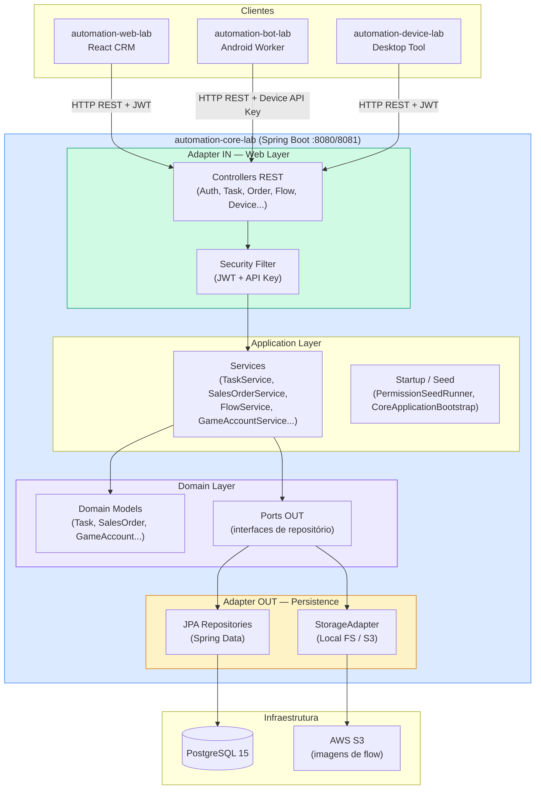
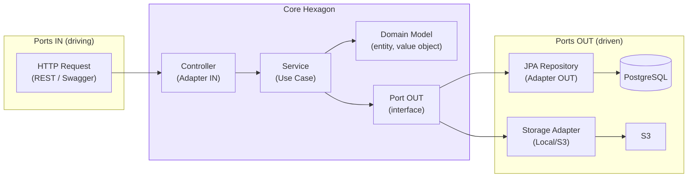
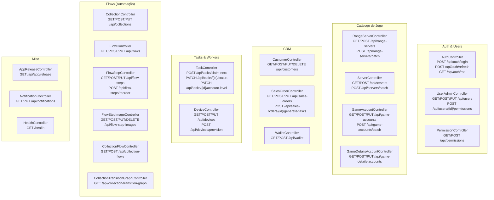
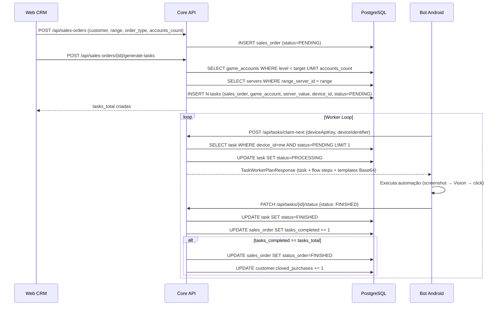
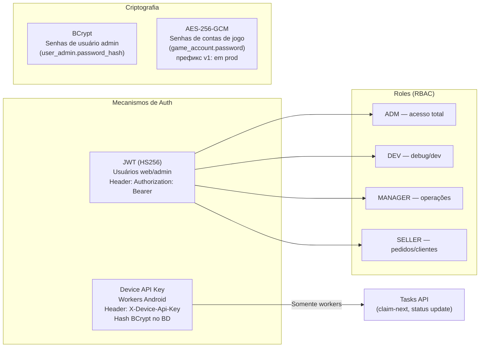

# automation-core-lab — Arquitetura

Backend central da Plataforma DDT. API REST em Spring Boot com arquitetura Hexagonal (Ports & Adapters), responsável por toda a lógica de negócio, orquestração de tasks, gestão de contas/devices/pedidos e persistência em PostgreSQL.

---

## Visão Macro



---

## Arquitetura Hexagonal (Ports & Adapters)



### Pacotes Java

```
com.automation/
├── AutoUpgradeDdtApplication.java          # Entry point
├── bootstrap/
│   └── CoreApplicationBootstrap.java       # Inicialização / seeds
└── core/
    ├── adapter/
    │   ├── in/web/
    │   │   ├── controller/                  # REST Controllers (22 controllers)
    │   │   ├── dto/request/                 # Request DTOs por domínio
    │   │   ├── dto/response/                # Response DTOs
    │   │   └── security/                    # Filtros JWT + API Key
    │   └── out/
    │       ├── persistence/
    │       │   ├── entity/                  # JPA Entities
    │       │   ├── inter/                   # Spring Data JPA Repositories
    │       │   └── adapter/                 # PersistenceAdapters (implementam Ports OUT)
    │       └── storage/                     # StorageAdapter (local/S3)
    ├── application/
    │   ├── config/                          # Spring Beans, Security Config
    │   ├── exception/                       # Exceções de aplicação
    │   ├── input/                           # Ports IN (interfaces dos use cases)
    │   ├── output/                          # Ports OUT (interfaces de persistência)
    │   ├── service/                         # Implementações de use cases
    │   ├── startup/                         # Runners de seed/inicialização
    │   └── util/                            # Utilitários (crypto AES, JWT...)
    ├── domain/
    │   ├── model/                           # Entidades de domínio puras
    │   └── port/out/                        # Ports de saída do domínio
    └── security/                            # Configuração Spring Security
```

---

## Controllers e Endpoints



---

## Fluxo de uma Task: do Pedido à Execução



---

## Segurança



---

## Tecnologias

| Camada | Tecnologia |
|--------|-----------|
| Linguagem | Java 17 |
| Framework | Spring Boot 3.x |
| Segurança | Spring Security + JWT + BCrypt |
| ORM | JPA / Hibernate (Spring Data JPA) |
| Database | PostgreSQL 15 |
| Storage | Local FS (dev) / AWS S3 (prod) |
| Build | Maven |
| API Docs | Swagger UI (`/swagger-ui/index.html`) |
| Deploy | Docker + AWS EC2 |

---

## Portas e Perfis

| Perfil | Porta | DB | Notas |
|--------|-------|----|-------|
| `local` | 8081 | automation_db | dev na máquina, ddl-auto=update |
| `dev` | 8080 | automation_db | docker, ddl-auto=validate |
| `prod` | 8080 | automation_db | EC2, ddl-auto=validate, HTTPS |
| `docker` | 8082 | postgres container | bootstrap.sh local completo |
