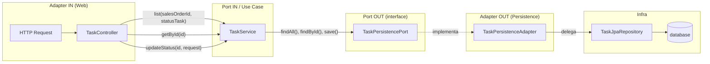
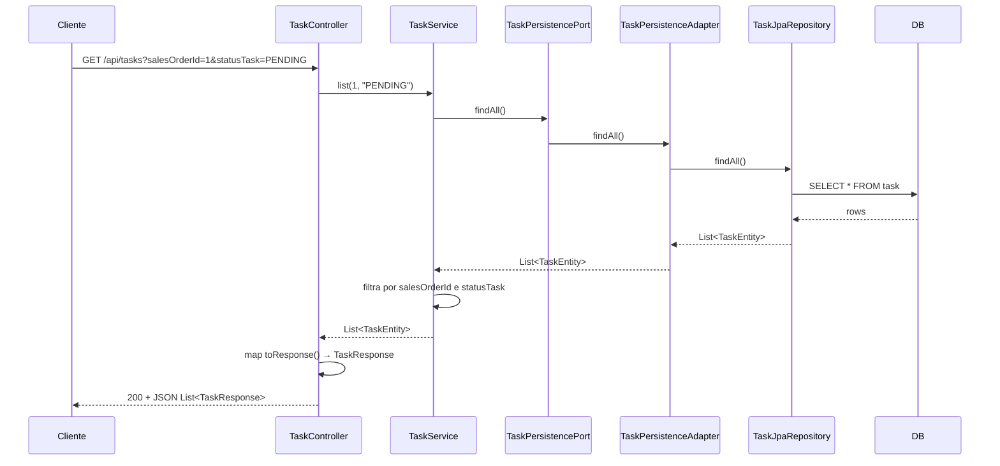

# Fluxo da Task (hexagonal)

## Desenho do fluxo



## Fluxo em sequência (listar tarefas)



## Fluxo em sequência (atualizar status)

```mermaid
sequenceDiagram
    participant Cliente
    participant TaskController
    participant TaskService
    participant TaskPersistencePort
    participant TaskPersistenceAdapter
    participant TaskJpaRepository
    participant DB

    Cliente->>TaskController: PATCH /api/tasks/123/status {"statusTask": "DONE"}
    TaskController->>TaskService: updateStatus(123, request)
    TaskService->>TaskPersistencePort: findById(123)
    TaskPersistencePort->>TaskPersistenceAdapter: findById(123)
    TaskPersistenceAdapter->>TaskJpaRepository: findById(123)
    TaskJpaRepository->>DB: SELECT
    DB-->>TaskJpaRepository: TaskEntity
    TaskJpaRepository-->>TaskPersistenceAdapter: Optional<TaskEntity>
    TaskPersistenceAdapter-->>TaskService: Optional<TaskEntity>
    TaskService->>TaskService: e.setStatusTask("DONE"); save(e)
    TaskService->>TaskPersistencePort: save(e)
    TaskPersistencePort->>TaskPersistenceAdapter: save(e)
    TaskPersistenceAdapter->>TaskJpaRepository: save(e)
    TaskJpaRepository->>DB: UPDATE task
    TaskJpaRepository-->>TaskPersistenceAdapter: TaskEntity
    TaskPersistenceAdapter-->>TaskService: TaskEntity
    TaskService-->>TaskController: Optional<TaskEntity>
    TaskController->>TaskController: toResponse() → TaskResponse
    TaskController-->>Cliente: 200 + JSON TaskResponse
```

## Resumo em camadas

| Camada        | Componente              | Responsabilidade                                      |
|---------------|-------------------------|--------------------------------------------------------|
| **Adapter IN**  | TaskController          | Recebe HTTP, valida DTO, chama use case, devolve JSON. |
| **Port IN**     | TaskService (use case)  | Orquestra: filtros, atualização de status.            |
| **Port OUT**    | TaskPersistencePort     | Interface: findById, findAll, save, countBySalesOrderId. |
| **Adapter OUT** | TaskPersistenceAdapter  | Implementa a port; usa TaskJpaRepository.              |
| **Infra**       | TaskJpaRepository + DB  | Persistência JPA.                                     |

**Direção das dependências:** Controller → Service → Port (interface). O use case não conhece JPA; só a interface. O adapter implementa a interface e usa JPA.
