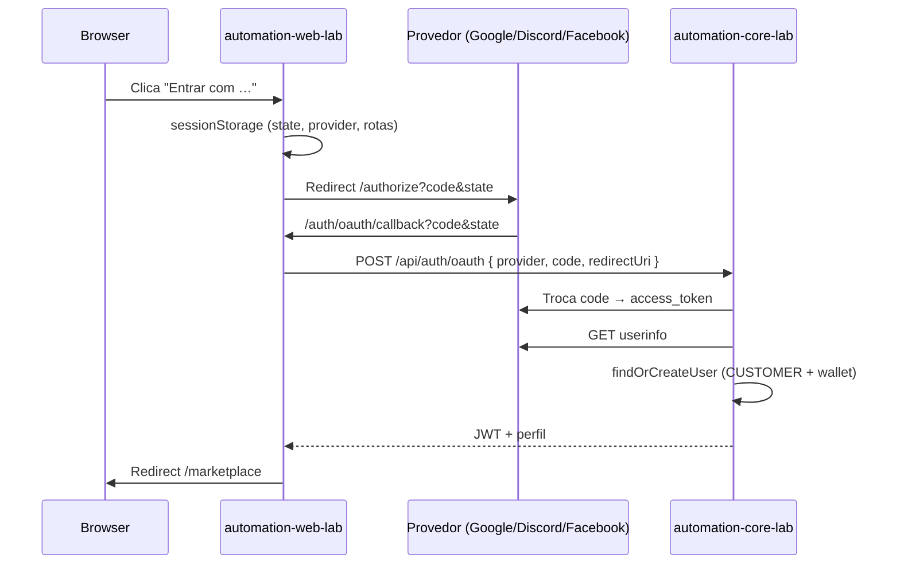

# OAuth — Google, Discord e Facebook

Login social para compradores (MarketLAB). O **frontend** inicia o fluxo no provedor; o **core** troca o `code` por token e cria/vincula o usuário `CUSTOMER`.

**Última atualização:** 2026-06-21

---

## Fluxo



**Redirect URI** (deve ser **idêntica** no provedor, no web e no POST ao core):

| Ambiente | URI |
|----------|-----|
| Local Vite (`npm run dev`) | `http://localhost:5174/auth/oauth/callback` |
| Local Docker (`app-web` :5175) | `http://localhost:5175/auth/oauth/callback` |
| Produção | `https://automation-device-lab.com/auth/oauth/callback` |

Registre **todas** as URIs que for usar no portal do provedor.

---

## Variáveis de ambiente

### Core (`automation-core-lab`)

Secrets **nunca** vão no frontend. Usados em `OAuthService` para trocar o `code`.

| Provedor | Client ID / App ID | Secret |
|----------|-------------------|--------|
| Google | `APP_OAUTH_GOOGLE_CLIENT_ID` | `APP_OAUTH_GOOGLE_CLIENT_SECRET` |
| Discord | `APP_OAUTH_DISCORD_CLIENT_ID` | `APP_OAUTH_DISCORD_CLIENT_SECRET` |
| Facebook | `APP_OAUTH_FACEBOOK_APP_ID` | `APP_OAUTH_FACEBOOK_APP_SECRET` |

**Local** (`mvn spring-boot:run`):

```bash
export APP_OAUTH_DISCORD_CLIENT_ID=...
export APP_OAUTH_DISCORD_CLIENT_SECRET=...
export APP_OAUTH_FACEBOOK_APP_ID=...
export APP_OAUTH_FACEBOOK_APP_SECRET=...
```

**Produção (EC2):** adicionar em `/opt/automation-learn/.env.prod` e redeploy do core:

```bash
./scripts/deploy-service.sh core <host> <key.pem>
```

O `docker-compose.prod.yml` já repassa todas as `APP_OAUTH_*`.

### Web (`automation-web-lab`)

Só o **Client ID / App ID** (público). Secrets ficam só no core.

| Provedor | Variável Vite |
|----------|---------------|
| Google | `VITE_OAUTH_GOOGLE_CLIENT_ID` |
| Discord | `VITE_OAUTH_DISCORD_CLIENT_ID` |
| Facebook | `VITE_OAUTH_FACEBOOK_APP_ID` |
| Redirect | `VITE_OAUTH_REDIRECT_URI` |

**Local:** `automation-web-lab/.env.development`

**Produção:** `automation-web-lab/.env.production` → `npm run build` → deploy web (Vite embute as vars no bundle).

```bash
./scripts/deploy-service.sh web <host> <key.pem>
```

---

## Discord

1. [discord.com/developers/applications](https://discord.com/developers/applications) → **New Application**
2. **OAuth2** → **Redirects** → adicionar as URIs de callback (local + produção)
3. Copiar **Client ID** e **Client Secret** (Reset secret se necessário)
4. Scopes usados pelo web: `identify email`
5. Preencher vars no core e `VITE_OAUTH_DISCORD_CLIENT_ID` no web

**Notas:**

- O e-mail só vem se a conta Discord tiver e-mail **verificado** e o usuário autorizar o scope `email`.
- Sem e-mail, o core cria login `discord_<id>` (comportamento já implementado).
- Em caso de “invalid redirect_uri”, conferir byte a byte a URI no portal vs `VITE_OAUTH_REDIRECT_URI`.

---

## Facebook

1. [developers.facebook.com](https://developers.facebook.com) → **Create App** → tipo **Consumer** (ou equivalente para login)
2. Adicionar produto **Facebook Login** → **Settings**
3. **Valid OAuth Redirect URIs:** mesmas URIs (local + produção)
4. **Settings → Basic:** copiar **App ID** e **App Secret**
5. Preencher `APP_OAUTH_FACEBOOK_*` no core e `VITE_OAUTH_FACEBOOK_APP_ID` no web

**Modo Development (padrão):**

- Só entram usuários com papel no app (Admin, Developer, Tester) em **Roles → Test Users** ou contas adicionadas como testadoras.
- Permissão `email` funciona em dev sem App Review.

**Modo Live (produção pública):**

- **App Review** para permissão `email` (e `public_profile` se exigido).
- **Settings → Basic:** domínios do site (`automation-device-lab.com`) e URL de privacidade (obrigatório para Live).
- Alternar app para **Live** após aprovação.

**Notas:**

- Scopes no web: `email,public_profile`
- Graph API v18.0 (alinhado ao código em `OAuthButtons.tsx` e `OAuthService.java`).

---

## Google (referência — já em produção R04)

1. [console.cloud.google.com](https://console.cloud.google.com) → APIs & Services → Credentials → OAuth 2.0 Client
2. **Authorized redirect URIs:** local + produção
3. Core: `APP_OAUTH_GOOGLE_*` · Web: `VITE_OAUTH_GOOGLE_CLIENT_ID`

---

## Checklist rápido

| # | Item |
|---|------|
| 1 | Redirect URI registrada nos **três** portais (se for usar os três) |
| 2 | Core com `APP_OAUTH_*_SECRET` (local export ou `.env.prod`) |
| 3 | Web com `VITE_OAUTH_*_CLIENT_ID` / `APP_ID` |
| 4 | `VITE_OAUTH_REDIRECT_URI` igual à URI registrada |
| 5 | Rebuild + deploy web após mudar `.env.production` |
| 6 | Restart/redeploy core após mudar secrets |
| 7 | Facebook: testadores em dev, ou app Live + review para produção |

---

## Troubleshooting

| Sintoma | Causa provável |
|---------|----------------|
| Alert "Discord/Facebook OAuth não configurado" | Falta `VITE_OAUTH_*` no `.env.development` ou build prod desatualizado |
| `Login com Discord não está configurado` (API) | Falta `APP_OAUTH_DISCORD_*` no core |
| `oauth_state_mismatch` | Callback em aba diferente, sessionStorage limpo, ou redirect URI errada |
| `invalid redirect_uri` (provedor) | URI não cadastrada ou http vs https / porta diferente |
| Facebook login negado | App em Development e usuário não é testador |
| Discord sem e-mail | Conta sem e-mail verificado — login ainda funciona via `discord_<id>` |
| 404 em `/api/auth/oauth` | Core desatualizado na EC2 — redeploy `core` |

---

## Código de referência

| Camada | Arquivo |
|--------|---------|
| Botões + authorize URL | `automation-web-lab/src/components/OAuthButtons.tsx` |
| Callback | `automation-web-lab/src/pages/OAuthCallback.tsx` |
| API | `POST /api/auth/oauth` — `AuthController` |
| Troca de token + userinfo | `OAuthService.java` |
| Config Spring | `application.yml` → `app.oauth` |

Colunas BD: `user_admin.oauth_provider`, `user_admin.oauth_provider_id` — ver [releases/r04-producao-identidade/DATABASE.md](../releases/r04-producao-identidade/DATABASE.md).
