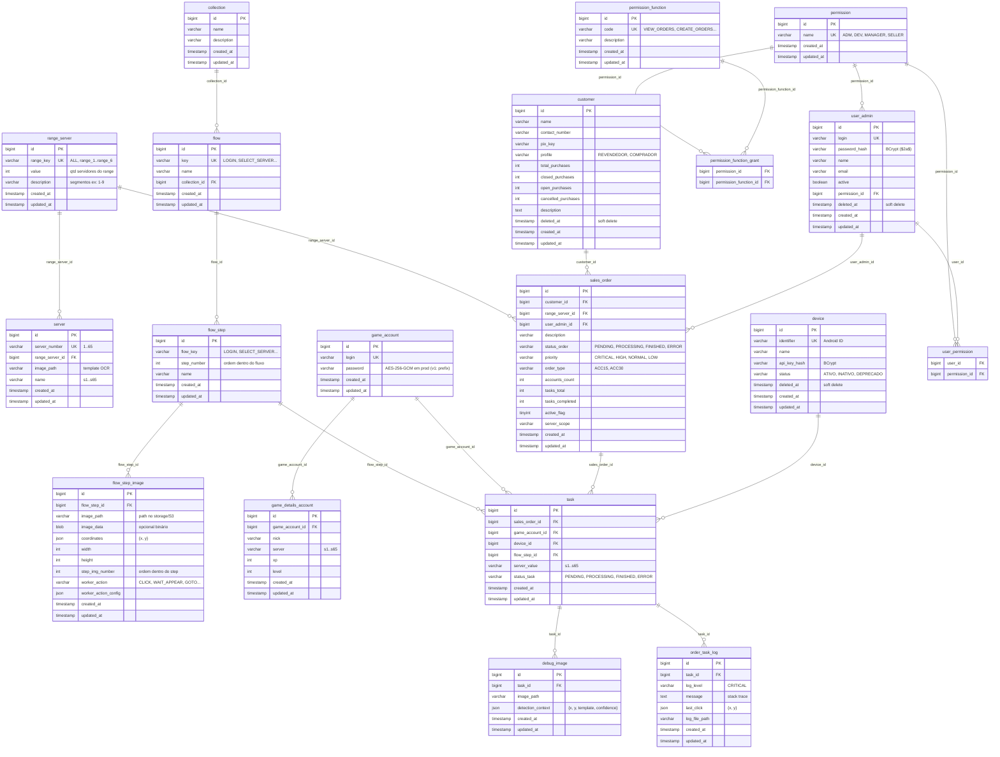
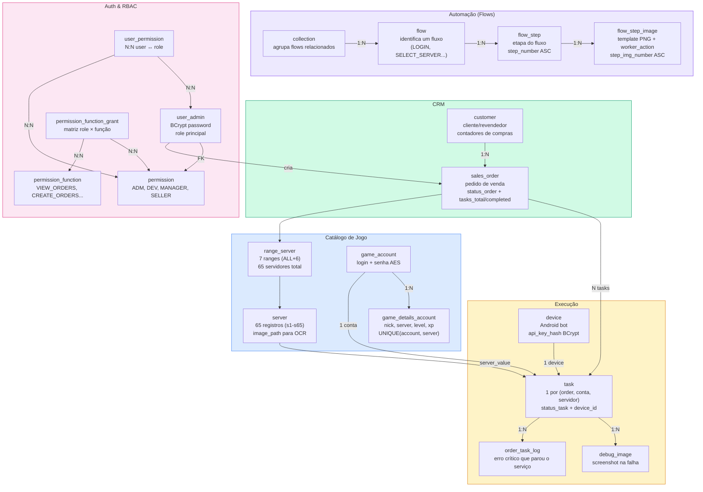
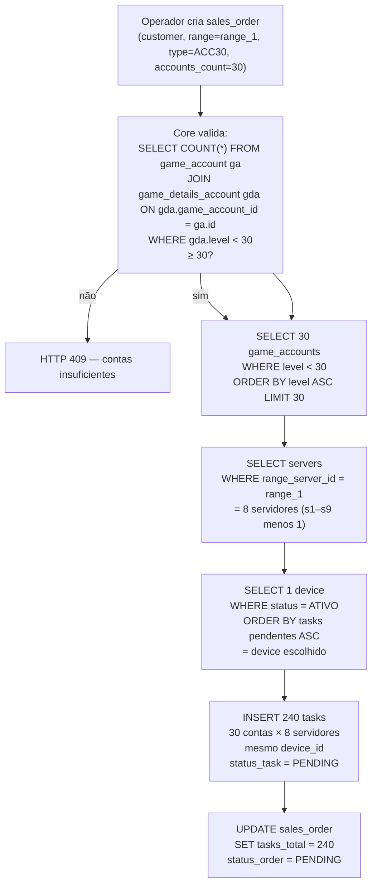
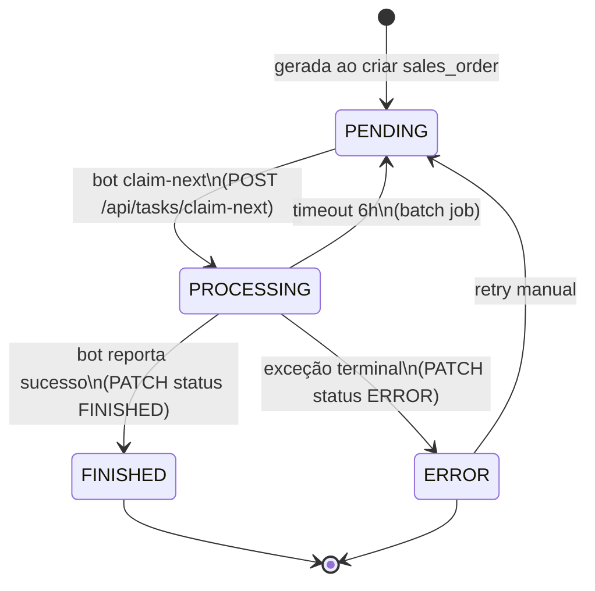
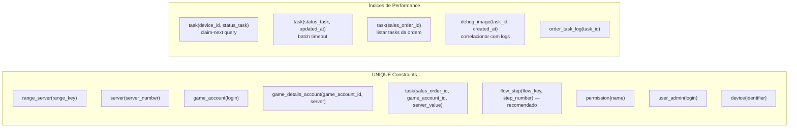

# automation-db-lab — Arquitetura do Banco de Dados

Visão completa do modelo relacional PostgreSQL da plataforma DDT. O schema é **gerado e gerenciado pelo Core** (JPA/Hibernate `ddl-auto`). Este repositório serve como referência de planejamento, DDL de estudo e seeds.

---

## Diagrama ER — Visão Macro



---

## Mapa de Domínios



---

## Fluxo de Geração de Tasks (cenário 30×8)



---

## Ciclo de Status de uma Task



---

## Índices e Constraints Críticos



---

## Tabelas por Módulo

| Módulo | Tabelas |
|--------|---------|
| **Catálogo de Jogo** | `range_server`, `server`, `game_account`, `game_details_account` |
| **Automação (Flows)** | `collection`, `flow`, `flow_step`, `flow_step_image` |
| **CRM** | `customer`, `sales_order` |
| **Execução** | `task`, `device`, `debug_image`, `order_task_log` |
| **Auth/RBAC** | `user_admin`, `permission`, `permission_function`, `permission_function_grant`, `user_permission` |

---

## Segurança dos Dados

| Campo | Mecanismo | Onde |
|-------|-----------|------|
| `user_admin.password_hash` | BCrypt ($2a$) | Postgres |
| `game_account.password` | AES-256-GCM (prefixo `v1:`) em prod; plaintext em dev | Postgres |
| `device.api_key_hash` | BCrypt | Postgres |
| Imagens de templates | Path referenciando S3/local | Postgres (só o path) |

---

## Estrutura do Repositório

```
automation-db-lab/
├── docs/
│   ├── ARCHITECTURE.md        # este arquivo
│   ├── CORE-DATABASE-TABLES.md  # definição canônica das tabelas
│   ├── CORE-DATABASE-DDL.sql  # DDL de referência
│   ├── FLOW-CONTRACT.md       # contrato da tabela flow
│   └── modeling/
│       └── automation-ddt.drawio  # diagrama visual
├── sql/
│   ├── core/
│   │   ├── massa.sql          # dados iniciais (dev)
│   │   ├── init.sql           # script inicial
│   │   ├── schema-only.sql    # apenas DDL
│   │   └── V2-V11__*.sql      # migrations históricas
│   ├── migrations/            # alterações pontuais
│   └── reports/               # queries de relatório (read-only)
└── seeds/
    └── permission-seed.json   # roles/functions (carregado pelo Core ao iniciar)
```

---

## ddl-auto por Ambiente

| Perfil | `ddl-auto` | Efeito |
|--------|------------|--------|
| `local` | `update` | Ajusta schema sem drop |
| `dev` / `prod` / `docker` | `validate` | Só valida; falha se BD ≠ entidades |
| EC2 prod lab | `update` (env override) | Ajusta automaticamente |
