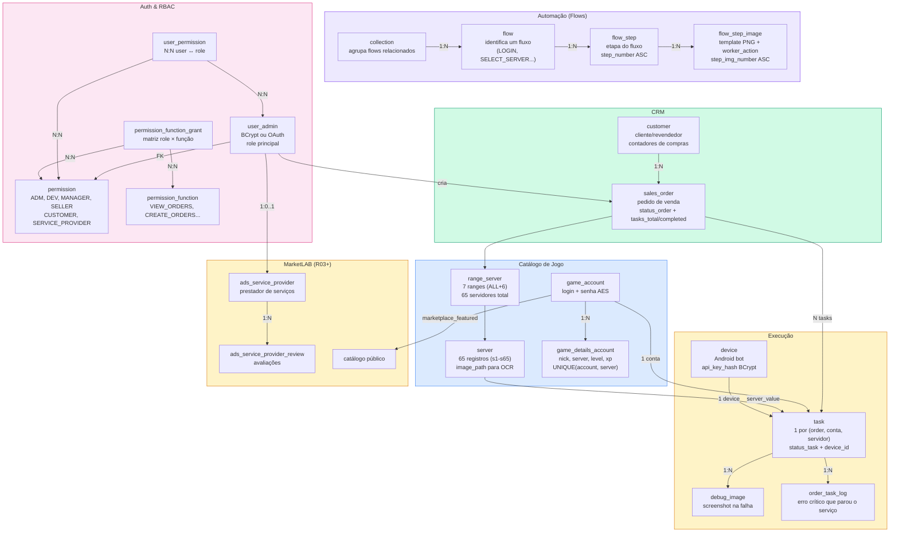
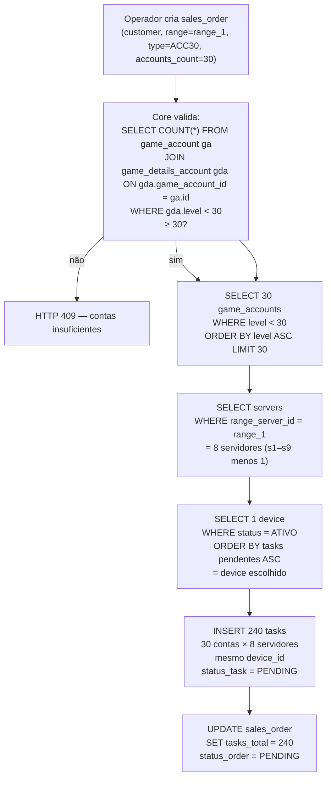
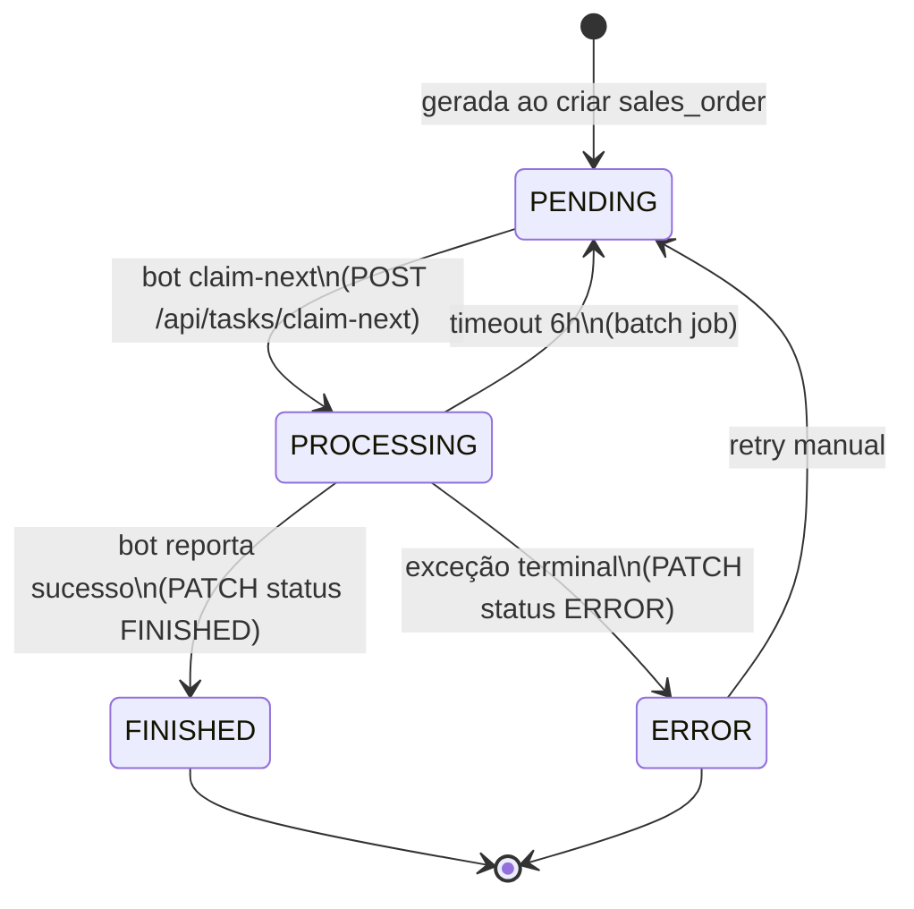
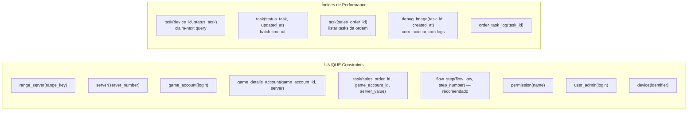

# automation-db-lab — Arquitetura do Banco de Dados

Visão completa do modelo relacional PostgreSQL da plataforma DDT. O schema é **gerado e gerenciado pelo Core** (JPA/Hibernate `ddl-auto`). Este repositório serve como referência de planejamento, DDL de estudo e seeds.

**Histórico por release:** [releases/INDEX.md](../releases/INDEX.md) — deltas em `r03-marketlab/DATABASE.md` e `r04-producao-identidade/DATABASE.md`.

---

## Diagrama ER — Visão Completa

```mermaid
erDiagram
  range_server {
    bigint id PK
    varchar range_key UK
    int value
    varchar description
  }
  server {
    bigint id PK
    varchar server_number UK
    bigint range_server_id FK
    varchar image_path
    varchar name
  }
  collection {
    bigint id PK
    varchar collection_key UK
    varchar name_collection
    varchar default_flow_key
    int display_order
    varchar version
    varchar content_hash
    boolean is_original
  }
  flow {
    bigint id PK
    bigint collection_id FK
    varchar flow_key
    varchar name
    int display_order
    varchar version
    varchar content_hash
  }
  flow_step {
    bigint id PK
    bigint flow_id FK
    int step_number
    varchar step_key
    varchar flow_key
    varchar version
    varchar content_hash
  }
  flow_step_image {
    bigint id PK
    bigint flow_step_id FK
    int step_img_number
    varchar image_path
    varchar worker_action
    varchar effect
    varchar transition_flow_key
    int transition_from_step_number
    varchar version
    varchar content_hash
  }
  game_account {
    bigint id PK
    varchar login UK
    varchar password
    bigint customer_id FK
    bigint sales_order_id FK
    varchar account_status
    varchar game
    boolean draft
    boolean marketplace_featured
    decimal price
    boolean price_on_request
  }
  game_details_account {
    bigint id PK
    bigint game_account_id FK
    varchar nick
    varchar server
    int level
    int xp
  }
  game_account_image {
    bigint id PK
    bigint game_account_id FK
    varchar image_path
    int sort_order
  }
  customer {
    bigint id PK
    varchar name
    varchar profile
    bigint created_by_user_id
    timestamp deleted_at
  }
  sales_order {
    bigint id PK
    bigint customer_id FK
    bigint user_admin_id FK
    bigint range_server_id FK
    varchar status_order
    varchar order_type
    int accounts_count
    int tasks_total
    int tasks_completed
  }
  task {
    bigint id PK
    bigint sales_order_id FK
    bigint game_account_id FK
    bigint collection_id FK
    bigint device_id FK
    varchar server_value
    varchar status_task
  }
  device {
    bigint id PK
    varchar identifier UK
    varchar status
    varchar alias
    bigint user_admin_id FK
    timestamp deleted_at
  }
  debug_image {
    bigint id PK
    bigint task_id FK
    varchar image_path
    json detection_context
  }
  order_task_log {
    bigint id PK
    bigint task_id FK
    varchar log_level
    text message
    varchar log_file_path
  }
  user_admin {
    bigint id PK
    varchar login UK
    varchar password_hash
    varchar email
    boolean email_verified
    bigint permission_id FK
    varchar oauth_provider
    varchar avatar_path
    bigint manager_user_id
    timestamp deleted_at
  }
  permission {
    bigint id PK
    varchar name UK
  }
  permission_function {
    bigint id PK
    varchar code UK
    varchar description
  }
  permission_function_grant {
    bigint permission_id FK
    bigint permission_function_id FK
  }
  user_permission {
    bigint user_id FK
    bigint permission_id FK
  }
  ads_service_provider {
    bigint id PK
    bigint user_id FK
    varchar game_slug
    varchar display_name
    text services_json
    boolean active
    boolean featured
  }
  ads_service_provider_review {
    bigint id PK
    bigint provider_id FK
    bigint reviewer_user_id FK
    int rating
    text comment
  }
  marketplace_listing {
    bigint id PK
    bigint created_by_user_id FK
    varchar game_slug
    decimal price
    boolean draft
    boolean featured
    varchar status
  }
  marketplace_listing_image {
    bigint id PK
    bigint listing_id FK
    varchar image_path
    int sort_order
  }
  marketplace_listing_proposal {
    bigint id PK
    bigint listing_id FK
    bigint buyer_user_id FK
    decimal offered_price
  }
  marketplace_seller_review {
    bigint id PK
    bigint seller_user_id FK
    bigint reviewer_user_id FK
    bigint listing_id
    int rating
    text comment
  }
  wallet_settings {
    bigint id PK
    int price_per_server_cents
    varchar default_range_key
  }
  wallet {
    bigint id PK
    bigint user_id FK_UK
    bigint balance_cents
  }
  wallet_transaction {
    bigint id PK
    bigint wallet_id FK
    varchar type
    bigint amount_cents
    bigint balance_after_cents
    varchar reference_type
    bigint reference_id
  }
  user_notification {
    bigint id PK
    bigint user_id FK
    varchar type
    varchar title
    text body
    json payload
    timestamp read_at
  }
  chat_read_status {
    bigint id PK
    bigint user_id FK
    varchar channel
    bigint context_id
    bigint peer_user_id
    timestamp read_at
  }
  email_confirmation_token {
    bigint id PK
    bigint user_id FK
    varchar token UK
    timestamp expires_at
  }
  password_reset_token {
    bigint id PK
    bigint user_id FK
    varchar token UK
    timestamp expires_at
  }
  site_config {
    varchar config_key PK
    text config_value
  }
  lab_access_request {
    bigint id PK
    varchar lab
    varchar login
    varchar status
    bigint reviewed_by_user_id
    bigint created_user_id
  }

  range_server ||--o{ server : range_server_id
  range_server ||--o{ sales_order : range_server_id
  collection ||--o{ flow : collection_id
  flow ||--o{ flow_step : flow_id
  flow_step ||--o{ flow_step_image : flow_step_id
  collection ||--o{ task : collection_id
  customer ||--o{ sales_order : customer_id
  customer ||--o{ game_account : customer_id
  sales_order ||--o{ task : sales_order_id
  sales_order ||--o{ game_account : sales_order_id
  game_account ||--o{ game_details_account : game_account_id
  game_account ||--o{ game_account_image : game_account_id
  game_account ||--o{ task : game_account_id
  device ||--o{ task : device_id
  task ||--o{ debug_image : task_id
  task ||--o{ order_task_log : task_id
  user_admin ||--o{ sales_order : user_admin_id
  user_admin ||--o{ device : user_admin_id
  user_admin ||--o{ customer : created_by_user_id
  user_admin ||--o{ game_account : created_by_user_id
  user_admin }o--|| permission : permission_id
  user_admin ||--o{ user_permission : user_id
  permission ||--o{ user_permission : permission_id
  permission ||--o{ permission_function_grant : permission_id
  permission_function ||--o{ permission_function_grant : permission_function_id
  user_admin ||--o| ads_service_provider : user_id
  ads_service_provider ||--o{ ads_service_provider_review : provider_id
  user_admin ||--o{ marketplace_listing : created_by_user_id
  marketplace_listing ||--o{ marketplace_listing_image : listing_id
  marketplace_listing ||--o{ marketplace_listing_proposal : listing_id
  user_admin ||--|| wallet : user_id
  wallet ||--o{ wallet_transaction : wallet_id
  user_admin ||--o{ user_notification : user_id
  user_admin ||--o{ chat_read_status : user_id
  user_admin ||--o{ email_confirmation_token : user_id
  user_admin ||--o{ password_reset_token : user_id
```

> **Escopo atual:** 35 tabelas das entidades JPA do Core. Removidas do modelo atual: `flow_transition` (V10) e `marketplace_listing_question` (V28).

> **Releases:** CUSTOMER/SERVICE_PROVIDER e marketplace em [releases/r03-marketlab/DATABASE.md](../releases/r03-marketlab/DATABASE.md); OAuth em [releases/r04-producao-identidade/DATABASE.md](../releases/r04-producao-identidade/DATABASE.md).

---

## Mapa de Domínios



---

## Fluxo de Geração de Tasks (cenário 30×8)



---

## Ciclo de Status de uma Task



---

## Índices e Constraints Críticos



---

## Tabelas por Módulo

| Módulo | Tabelas |
|--------|---------|
| **Catálogo de Jogo** | `range_server`, `server`, `game_account`, `game_details_account`, `game_account_image` |
| **Automação (Flows)** | `collection`, `flow`, `flow_step`, `flow_step_image` |
| **CRM** | `customer`, `sales_order` |
| **Execução** | `task`, `device`, `debug_image`, `order_task_log` |
| **Auth/RBAC** | `user_admin`, `permission`, `permission_function`, `permission_function_grant`, `user_permission` |
| **ProviderLAB** | `ads_service_provider`, `ads_service_provider_review` |
| **MarketLAB** | `marketplace_listing`, `marketplace_listing_image`, `marketplace_listing_proposal`, `marketplace_seller_review` |
| **Wallet** | `wallet_settings`, `wallet`, `wallet_transaction` |
| **Identidade / notificações** | `email_confirmation_token`, `password_reset_token`, `user_notification`, `chat_read_status` |
| **Plataforma** | `site_config`, `lab_access_request` |

---

## Segurança dos Dados

| Campo | Mecanismo | Onde |
|-------|-----------|------|
| `user_admin.password_hash` | BCrypt ($2a$) | Postgres |
| `game_account.password` | AES-256-GCM (prefixo `v1:`) em prod; plaintext em dev | Postgres |
| `device.api_key_hash` | BCrypt | Postgres |
| Imagens de templates | Path referenciando S3/local | Postgres (só o path) |

---

## Estrutura do Repositório

```
automation-docs-lab/db/
├── ARCHITECTURE.md              # este arquivo
├── docs/
│   ├── INDEX.md
│   ├── CORE-DATABASE-TABLES.md  # definição canônica das tabelas
│   ├── CORE-DATABASE-DDL.sql    # DDL de referência
│   ├── FLOW-CONTRACT.md         # contrato L1–L4
│   └── modeling/
│       └── automation-ddt.drawio  # diagrama visual (./generate-ddt-drawio.sh)
automation-db-lab/
├── sql/
│   ├── core/
│   │   ├── massa.sql          # dados iniciais (dev)
│   │   ├── init.sql           # script inicial
│   │   ├── schema-only.sql    # apenas DDL
│   │   └── V2-V30__*.sql      # migrations históricas
│   ├── migrations/            # alterações pontuais
│   └── reports/               # queries de relatório (read-only)
└── seeds/
    └── permission-seed.json   # roles/functions (carregado pelo Core ao iniciar)
```

---

## ddl-auto por Ambiente

| Perfil | `ddl-auto` | Efeito |
|--------|------------|--------|
| `local` | `update` | Ajusta schema sem drop |
| `dev` / `prod` / `docker` | `validate` | Só valida; falha se BD ≠ entidades |
| EC2 prod lab | `update` (env override) | Ajusta automaticamente |
