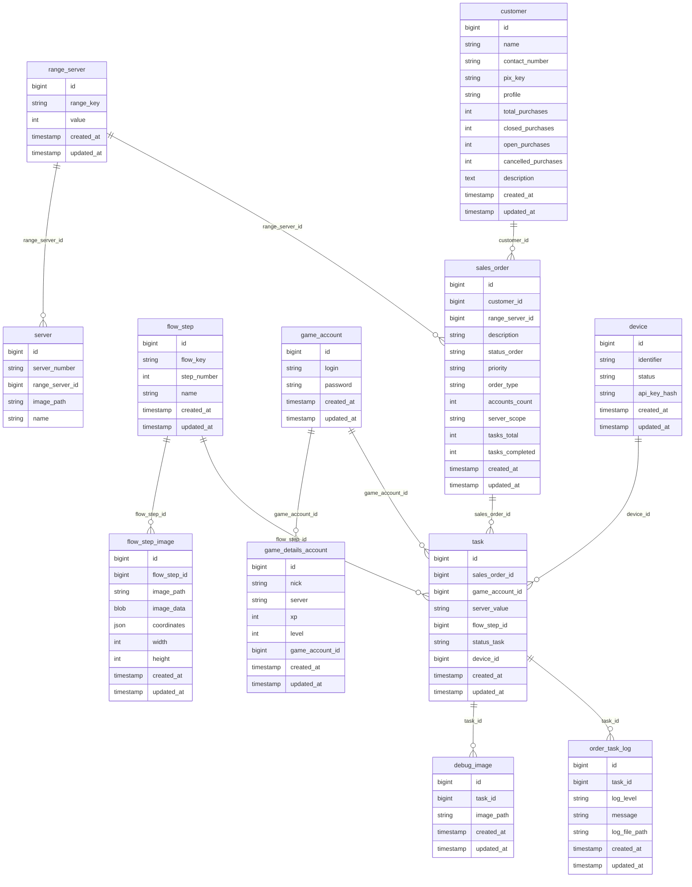

# Core database tables – definition

Schema only. Business rules, API, batch and concurrency come later.

**Implementação:** DDL MySQL em `CORE-DATABASE-DDL.sql`. Fluxo criação de ordem → geração de tasks → device processa em `CORE-FLOW-IMPLEMENTATION.md`.

**Naming convention (English, consistent):**

- **Tables:** singular, `snake_case` (e.g. `sales_order`, `task`, `flow_step`).
- **Columns:** `snake_case`; foreign keys = referenced table singular + `_id` (e.g. `sales_order_id`, `task_id`, `device_id`).
- **Enums/values:** UPPER_SNAKE or PascalCase as needed (e.g. PENDING, CRITICAL, REVENDEDOR).

**Auditoria (futuro):** Campos `created_by` / `updated_by` (id do usuário administrador) serão adicionados quando houver módulo de gestão com usuário e senha de administrador; até lá não há tabela de usuário admin para referenciar.

---

## 1. range_server

Define os ranges de servidores (1–65). Cada linha é um range; os SERVER (1 a 65) referenciam aqui a qual range pertencem. range_3 é composto (18–28 + 56–60); range_6 = 61–65. Escolhido no formulário ao criar o pedido de venda.

**Definição dos ranges (total = 65):**

| range_key | Segmentos        | value (qtd) |
| --------- | ---------------- | ----------- |
| ALL       | 1–65 (total)     | 65          |
| range_1   | 1–9              | 9           |
| range_2   | 10–17            | 8           |
| range_3   | 18–28 **+** 56–60 | 16        |
| range_4   | 29–46            | 18          |
| range_5   | 47–55            | 9           |
| range_6   | 61–65            | 5           |

**Nota:** range_3 é composto por dois segmentos (18–28 e 56–60); 56–60 não formam um range separado. Na tabela `server`, 18–28 e 56–60 têm todos `range_server_id` = range_3; listar servidores do range_3 = `WHERE range_server_id = range_3`.


| Coluna     | Tipo         | Restrições   | Descrição                                                                       |
| ---------- | ------------ | ------------ | ------------------------------------------------------------------------------- |
| id         | BIGINT       | PK, auto     |                                                                                 |
| range_key  | VARCHAR(32)  | NOT NULL, UQ | ALL, range_1, range_2, range_3, range_4, range_5, range_6 (identificador do range; 56–60 já estão em range_3; range_6 = 61–65) |
| value      | INT          | NOT NULL     | Valor numérico (ex.: 65 = ALL; 9 = range_1 = quantidade de servidores no range) |
| description| VARCHAR(256) | NULL         | Descrição dos segmentos (ex.: "1-9", "18-28 + 56-60") para exibição e lógica    |
| created_at | TIMESTAMP    | NOT NULL     | Data/hora de criação                                                            |
| updated_at | TIMESTAMP    | NOT NULL     | Data/hora de atualização                                                        |


O campo **description** guarda a definição dos segmentos em texto (ex.: "1-9", "18-28 + 56-60"). Ao criar o pedido de venda, o form seleciona um RANGE_SERVER. A quantidade de TAREFA geradas vem de RANGE_SERVER.value ou da contagem de SERVER com aquele range_server_id (range_3 já agrupa 18–28 e 56–60 na mesma FK).

---

## 2. server

Um registro por servidor (1 a 65). Armazena o que o bot precisa para **trocar de server**: a **imagem** (template) que mostra a numeração do servidor (lens + OCR). **Cada SERVER pertence a um range** via `range_server_id`. **server_number** é numérico (1 a 65); **name** é o rótulo de exibição (s1, s2, … s65).


| Coluna          | Tipo         | Restrições                     | Descrição                                                                         |
| --------------- | ------------ | ------------------------------ | --------------------------------------------------------------------------------- |
| id              | BIGINT       | PK, auto                       |                                                                                   |
| server_number   | VARCHAR(8)   | NOT NULL, UQ                   | Número do servidor: 1, 2, … 65 (string; total 65 servidores)                       |
| range_server_id | BIGINT       | NOT NULL, FK → range_server.id | Range ao qual este servidor pertence (ex.: 1–9 → range_1; 10–17 → range_2; 18–28 e 56–60 → range_3; 61–65 → range_6) |
| image_path      | VARCHAR(512) | NOT NULL                       | Caminho da imagem/template para lens + OCR (identificar o número do servidor)     |
| name            | VARCHAR(64)  | NULL                           | Rótulo de exibição: s1, s2, … s65                                                 |
| created_at      | TIMESTAMP    | NOT NULL                       | Data/hora de criação                                                              |
| updated_at      | TIMESTAMP    | NOT NULL                       | Data/hora de atualização                                                          |


Exemplos: server_number='1', name='s1' → range_1. server_number='10', name='s10' → range_2. Servidores 18–28 e 56–60 têm range_3 (range composto). No futuro, SERVER pode referenciar flow_step_image em vez de apenas image_path.

---

## 3. flow_step

Etapa de um fluxo do orquestrador. O “fluxo” é identificado por **flow_key** (ex.: LOGIN, SELECT_SERVER); cada linha é uma etapa com **step_number** (1, 2, 3…). Uma única tabela: não há tabela FLOW separada. As imagens (templates) da etapa ficam em flow_step_image. TAREFA.flow_step_id indica em qual etapa está o orquestrador para aquela tarefa; ao encerrar uma etapa, o bot notifica o Core para atualizar flow_step_id.


| Coluna      | Tipo         | Restrições | Descrição                                                    |
| ----------- | ------------ | ---------- | ------------------------------------------------------------ |
| id          | BIGINT       | PK, auto   |                                                              |
| flow_key    | VARCHAR(64)  | NOT NULL   | Chave do fluxo (ex.: LOGIN, SELECT_SERVER); agrupa as etapas |
| step_number | INT          | NOT NULL   | Número da etapa (1, 2, …) dentro do fluxo                    |
| name        | VARCHAR(128) | NULL       | Nome/descrição da etapa                                      |
| created_at  | TIMESTAMP    | NOT NULL   | Data/hora de criação                                         |
| updated_at  | TIMESTAMP    | NOT NULL   | Data/hora de atualização                                     |


Índice sugerido: `(flow_key, step_number)` UQ para buscar etapas em ordem e evitar duplicata.

---

## 4. flow_step_image

Imagens (templates) por etapa do fluxo. Centraliza o armazenamento das imagens usadas pelo bot em cada etapa, em vez de deixar apenas local/mock. Cada registro é uma imagem associada a uma FLOW_STEP (coordenadas, size, bitmap ou path).


| Coluna       | Tipo         | Restrições                  | Descrição                                                                                            |
| ------------ | ------------ | --------------------------- | ---------------------------------------------------------------------------------------------------- |
| id           | BIGINT       | PK, auto                    |                                                                                                      |
| flow_step_id | BIGINT       | NOT NULL, FK → flow_step.id | Etapa do fluxo a que esta imagem pertence                                                            |
| image_path   | VARCHAR(512) | NULL                        | Caminho no storage (recomendado: arquivo em disco/S3; evita BLOB no banco)                           |
| image_data   | BLOB         | NULL                        | Opcional: bitmap/imagem em binário (uso em memória no bot; tende a inflar o DB; preferir image_path) |
| coordinates  | JSON         | NULL                        | Ex.: { "x": 0, "y": 0 } ou região de interesse                                                       |
| width        | INT          | NULL                        | Largura (px)                                                                                         |
| height       | INT          | NULL                        | Altura (px)                                                                                          |
| created_at   | TIMESTAMP    | NOT NULL                    | Data/hora de criação                                                                                 |
| updated_at   | TIMESTAMP    | NOT NULL                    | Data/hora de atualização                                                                             |


**Recomendação:** Preferir image_path (arquivo em storage) e usar image_data só se for essencial guardar o bitmap no banco. O bot hoje mocka imagens localmente; com esta tabela o bot pode buscar imagens por flow_step_id no Core.

---

## 5. game_details_account

Detalhes in-game: nick, server, XP, **level**. **Cada registro pertence a um game_account** (N:1). **UNIQUE(game_account_id, server):** não pode existir duas linhas com o mesmo server para a mesma conta. Task obtém level via game_account → game_details_account.


| Coluna          | Tipo         | Restrições                     | Descrição                                  |
| ----------      | ------------ | ------------------------------ | ------------------------------------------ |
| id              | BIGINT       | PK, auto                       |                                            |
| nick            | VARCHAR(255) | NOT NULL                       | Nick no jogo                               |
| server          | VARCHAR(32)  | NOT NULL                       | Servidor do jogo (ex.: s1, s56 … s65)      |
| xp              | INT          | NULL                           | XP (opcional; pode ser atualizado via OCR) |
| level           | INT          | NULL                           | Nível (opcional; usado para ACC15/ACC30)   |
| game_account_id | BIGINT       | NOT NULL, FK → game_account.id | Conta a que este detalhe pertence          |
| created_at      | TIMESTAMP    | NOT NULL                       | Data/hora de criação                       |
| updated_at      | TIMESTAMP    | NOT NULL                       | Data/hora de atualização                   |


**UNIQUE (game_account_id, server):** não pode haver duas linhas com o mesmo server para a mesma conta. Índice sugerido: `(game_account_id)`, `(game_account_id, server)` UNIQUE.

---

## 6. game_account

Login e senha. **Uma conta pode ter vários game_details_account** (1:N). Usado pela **task**. Conta disponível = existe ao menos um game_details_account com level &lt; alvo (ex.: ACC30). O sistema escolhe N contas ao gerar as tarefas (priorizar por level em game_details_account).


| Coluna                  | Tipo         | Restrições                             | Descrição                                           |
| ----------------------- | ------------ | -------------------------------------- | --------------------------------------------------- |
| id                      | BIGINT       | PK, auto                               |                                                     |
| login                   | VARCHAR(255) | NOT NULL, UQ                           | Obrigatório e único (não repete)                    |
| password                | VARCHAR(255) | NOT NULL                               | **AES-256-GCM** em repouso (`v1:` prefix) se `APP_GAME_ENCRYPTION_KEY` definida; plaintext em dev sem chave |
| created_at              | TIMESTAMP    | NOT NULL                               | Data/hora de criação                                |
| updated_at              | TIMESTAMP    | NOT NULL                               | Data/hora de atualização                            |


UNIQUE em `login`. Uma conta pode ter vários game_details_account (1:N); em game_details_account, UNIQUE(game_account_id, server).

---

## 7. customer

Cliente que faz o pedido (quem compra/revende). Identificação do pedido é feita via PEDIDO_DE_VENDA.customer_id. Contadores de compras podem ser mantidos aqui (atualizados quando sales_order.status_order muda) ou, no futuro, derivados de uma tabela PURCHASE/ORDER com customer_id.


| Coluna              | Tipo         | Restrições          | Descrição                                 |
| ------------------- | ------------ | ------------------- | ----------------------------------------- |
| id                  | BIGINT       | PK, auto            |                                           |
| name                | VARCHAR(255) | NOT NULL            | Nome do cliente                           |
| contact_number      | VARCHAR(20)  | NULL                | Número para contato (com DDD)             |
| pix_key             | VARCHAR(255) | NULL                | Chave PIX                                 |
| profile             | VARCHAR(32)  | NOT NULL            | Perfil: REVENDEDOR, COMPRADOR (ou outros) |
| total_purchases     | INT          | NOT NULL, DEFAULT 0 | Número total de compras (pedidos)         |
| closed_purchases    | INT          | NOT NULL, DEFAULT 0 | Número de compras fechadas                |
| open_purchases      | INT          | NOT NULL, DEFAULT 0 | Número de compras abertas                 |
| cancelled_purchases | INT          | NOT NULL, DEFAULT 0 | Número de compras canceladas              |
| description         | TEXT         | NULL                | Descrição do cliente                      |
| deleted_at          | TIMESTAMP    | NULL                | Soft delete: preenchido quando o registro é “excluído” (filtrar WHERE deleted_at IS NULL) |
| created_at          | TIMESTAMP    | NOT NULL            | Data/hora de criação                      |
| updated_at          | TIMESTAMP    | NOT NULL            | Data/hora de atualização                  |


**Contadores:** Podem ser atualizados pela aplicação ao mudar status_order da sales_order (ex.: FINISHED → incrementa closed_purchases). Opcionalmente, uma tabela PURCHASE com customer_id permitiria derivar esses números por consulta.

---

## 8. sales_order

Ordem de venda solicitada pelo cliente. **user_admin_id** = representante que criou a ordem; **created_at** = data/hora de criação (auditoria). **Não tem device_id nem game_account_id**: a ordem só traz customer, range (range_server_id), order_type (ACC15/ACC30), etc. Ao criar a ordem, o sistema escolhe **um device** e gera **N tarefas** (uma por servidor do range); **todas as tarefas da mesma ordem têm o mesmo device_id** (ex.: 30×8 = 240 tarefas = 1 device; device processa uma task de cada vez). Cada tarefa recebe um **game_account** (conta com level < alvo, ex.: s1 level < 30 = disponível para ACC30). status_order atualizado quando as tarefas forem finalizadas. Ao gerar a ordem: **priorizar** contas com level < alvo no montante pedido (ex.: 30 contas para 30×8). Validar: haver pelo menos X game_accounts com level < 15 ou 30 (X = quantidade de contas da ordem) com game_details_account.level < 15 ou 30 conforme order_type (não precisa flag “disponível”).


| Coluna          | Tipo         | Restrições                     | Descrição                                                                             |
| --------------- | ------------ | ------------------------------ | ------------------------------------------------------------------------------------- |
| id              | BIGINT       | PK, auto                       |                                                                                       |
| customer_id     | BIGINT       | NOT NULL, FK → customer.id     | Cliente que fez o pedido (quem solicitou a ordem)                                     |
| user_admin_id   | BIGINT       | NULL, FK → user_admin.id       | Representante (user_admin) que criou a ordem. Relação: 1 ordem → 1 user_admin; 1 user_admin → N ordens. Pode ser o mesmo que o cliente. |
| range_server_id | BIGINT       | NOT NULL, FK → range_server.id | Definido no form; define escopo e quantidade de tarefas (ex.: range s1–s9 → 8 tarefas) |
| description     | VARCHAR(512) | NULL                           | Descrição do pedido                                                                   |
| status_order    | VARCHAR(20)  | NOT NULL                       | PENDING, PROCESSING, FINISHED, ERROR, INVALID (atualizado conforme as tarefas)        |
| active_flag     | TINYINT      | NOT NULL, DEFAULT 0            | 0 = disponível para devices pegarem tarefas, 1 = em processamento                     |
| priority        | VARCHAR(20)  | NOT NULL                       | CRITICAL, HIGH, NORMAL, LOW                                                           |
| order_type      | VARCHAR(10)  | NOT NULL                       | ACC15, ACC30                                                                          |
| accounts_count  | INT          | NOT NULL                       | Quantidade de contas (ex.: 30); tasks_total = accounts_count × (servidores do range)  |
| server_scope    | VARCHAR(32)  | NULL                           | Opcional: ALL, range_1, range_2, range_3, range_4, range_5, range_6, s1 … s65 (exibição) |
| tasks_total     | INT          | NOT NULL                       | Total de tarefas (ex.: 30×8=240 para “30 contas, cada uma com 8”); exibição "X/Y"    |
| tasks_completed | INT          | NOT NULL, DEFAULT 0            | Quantas tarefas já finalizaram; progresso ex.: 0/240, 120/240, 240/240                |
| created_at      | TIMESTAMP    | NOT NULL                       | **Data/hora de criação** da ordem                                                     |
| updated_at      | TIMESTAMP    | NOT NULL                       | Data/hora de atualização                                                              |


---

## 9. task

Tarefa gerada a partir da ordem de venda: uma linha por **(game_account, server_value)** dentro da ordem. Ex.: ordem “30 contas, lvl 30, cada uma com 8” → 30 × 8 = **240 linhas** em task. Cada tarefa tem **game_account_id** + **server_value** + **device_id** (todas da mesma ordem = mesmo device). O device processa **uma task de cada vez**. UNIQUE(sales_order_id, game_account_id, server_value): não repete (conta, servidor) na mesma ordem. game_accounts priorizados por level < alvo ao gerar a ordem. flow_step_id = etapa atual; bot notifica Core ao encerrar step.


| Coluna          | Tipo        | Restrições                   | Descrição                                                                                       |
| --------------- | ----------- | ---------------------------- | ----------------------------------------------------------------------------------------------- |
| id              | BIGINT      | PK, auto                     |                                                                                                 |
| sales_order_id   | BIGINT      | NOT NULL, FK → sales_order.id | Ordem ao qual esta tarefa pertence                                                              |
| game_account_id | BIGINT      | NOT NULL, FK → game_account.id | Conta do jogo que executa esta tarefa (login, level em game_details_account)                 |
| server_value    | VARCHAR(32) | NOT NULL                     | s1…s65. UNIQUE(sales_order_id, game_account_id, server_value): uma tarefa por (ordem, conta, servidor)      |
| flow_step_id    | BIGINT      | NULL                         | FK → flow_step.id; etapa atual do fluxo para esta tarefa                                        |
| status_task   | VARCHAR(20) | NOT NULL                     | PENDING, PROCESSING, FINISHED, ERROR (em PROCESSING não atribui outro device)                  |
| device_id     | BIGINT      | NOT NULL                    | FK → device.id; atribuído na criação das tarefas: as 8 tarefas da mesma ordem = mesmo device   |
| created_at    | TIMESTAMP   | NOT NULL                     | Data/hora de criação                                                                            |
| updated_at    | TIMESTAMP   | NOT NULL                     | Data/hora de atualização (usado pelo batch de timeout)                                          |


Índices sugeridos: `(sales_order_id)`, `(sales_order_id, game_account_id, server_value)` UNIQUE, `(device_id, status_task)`, `(status_task, updated_at)` para o batch. Regra: device_id atribuído na criação; todas as tasks da mesma ordem = mesmo device; device processa uma task de cada vez.

---

## 10. debug_image

**O que é:** Cada vez que o Vision (ou o bot) detecta algo na tela e faz um click, pode gerar uma **imagem de debug**: um screenshot com retângulos/coordenadas desenhados (onde achou o template, onde clicou, confidence). Essa imagem é salva (path no storage) e um registro é criado aqui, ligado à **task** que está sendo executada. Não tem `sales_order_id` nem `device_id`: o pedido vem de `task.sales_order_id` e o device de `task.device_id` (JOIN task). **Para que serve:** Quando der erro ou comportamento estranho, você consegue ver exatamente “o que o bot estava vendo” naquele momento (a imagem) em vez de só a mensagem de erro. Para erros críticos em order_task_log, correlacione por task_id e created_at (ambas tabelas já estão na task).


| Coluna            | Tipo         | Restrições             | Descrição                                                    |
| ----------------- | ------------ | ---------------------- | ------------------------------------------------------------ |
| id                | BIGINT       | PK, auto               |                                                              |
| task_id           | BIGINT       | NOT NULL, FK → task.id | Task em que a imagem foi gerada; pedido e device via task    |
| image_path        | VARCHAR(512) | NOT NULL               | Path no storage (recomendado) ou ref; evitar blob na tabela  |
| detection_context | JSON         | NULL                   | Coordenadas (x, y), template, confidence                     |
| created_at        | TIMESTAMP    | NOT NULL               | Data/hora de criação                                         |
| updated_at        | TIMESTAMP    | NOT NULL               | Data/hora de atualização                                     |


Índices sugeridos: `(task_id, created_at)`. Para imagens de um pedido: filtrar por `task.sales_order_id`.

---

## 11. order_task_log

**O que é:** Registro de **erro crítico** (exceção que fez o serviço parar) durante o processamento de uma **task**. Só entra aqui falha em nível de exception que interrompeu o fluxo. **Para que serve:** Saber em qual task parou; o device vem de `task.device_id` (JOIN task). Guardar mensagem (stack trace ou resumo), último click (x, y) e o **arquivo de log gerado** (path). Não tem FK para `debug_image`: log e imagens já estão ligados à mesma **task**; para correlacionar “última tela” usa-se `task_id` + `created_at` (buscar `debug_image` da mesma task por timestamp).


| Coluna        | Tipo         | Restrições             | Descrição                                                  |
| ------------- | ------------ | ---------------------- | ---------------------------------------------------------- |
| id            | BIGINT       | PK, auto               |                                                            |
| task_id       | BIGINT       | NOT NULL, FK → task.id | Tarefa em que o serviço parou; pedido e device via task     |
| log_level     | VARCHAR(20)  | NOT NULL               | CRITICAL (exceção que parou o serviço)                     |
| message       | TEXT         | NULL                   | Stack trace ou resumo da exceção                           |
| last_click    | JSON         | NULL                   | { "x": 123, "y": 456 }                                     |
| log_file_path | VARCHAR(512) | NULL                   | Caminho do arquivo de log gerado (ex.: no storage)         |
| created_at    | TIMESTAMP    | NOT NULL               | Data/hora de criação                                       |
| updated_at    | TIMESTAMP    | NOT NULL               | Data/hora de atualização                                   |


Índices sugeridos: `(task_id)`, `(task_id, created_at)`. Para listar logs de um pedido: filtrar por `task.sales_order_id`. Para “última tela” na hora do erro: buscar `debug_image` pela mesma `task_id` e `created_at` próximo.

---

## 12. device

Cadastro de devices. **id** (PK) é usado por task.device_id (cada tarefa pode ser processada por um device; múltiplos devices processam tarefas diferentes). **identifier** é o valor externo (ex.: Android ID). PEDIDO_DE_VENDA não tem device_id; devices pegam tarefas disponíveis (GET próxima tarefa).


| Coluna       | Tipo         | Restrições   | Descrição                                                                                 |
| ------------ | ------------ | ------------ | ----------------------------------------------------------------------------------------- |
| id           | BIGINT       | PK, auto     | **Este id é a FK em task.device_id** (não há coluna “device_id” como FK na DEVICE; só id) |
| identifier   | VARCHAR(64)  | NOT NULL, UQ | Identificador externo do device (ex.: Android ID)                                         |
| name         | VARCHAR(128) | NULL         | Nome legível                                                                              |
| api_key_hash | VARCHAR(255) | NULL         | Hash do API key (não guardar em claro)                                                    |
| status       | VARCHAR(20)  | NOT NULL     | ATIVO, INATIVO, DEPRECADO. Só devices ATIVO podem pegar tarefas (GET próxima tarefa).     |
| deleted_at  | TIMESTAMP    | NULL         | Soft delete: preenchido quando o device é “excluído” (filtrar WHERE deleted_at IS NULL)   |
| created_at   | TIMESTAMP    | NOT NULL     |                                                                                           |
| updated_at   | TIMESTAMP    | NOT NULL     |                                                                                           |


---

## 13. user (tabela: user_admin)

Usuários que acessam o sistema (gestão, admin, etc.). Cada usuário tem uma **permissão principal** via **permission_id** (FK → permission) e pode ter **várias permissões** adicionais via tabela de junção **user_permission**. Usado para login e controle de acesso (auditoria created_by/updated_by no futuro).

**Implementação:** Nome físico da tabela = **user_admin**.


| Coluna         | Tipo         | Restrições   | Descrição                                                                 |
| -------------- | ------------ | ------------ | ------------------------------------------------------------------------- |
| id             | BIGINT       | PK, auto     |                                                                            |
| login          | VARCHAR(255) | NOT NULL, UQ | Login (e-mail ou nome de usuário) para acesso                             |
| password_hash  | VARCHAR(255) | NOT NULL     | **BCrypt** (`$2a$` / `$2b$`); SHA-256 legado aceito no login e re-hash automático |
| name           | VARCHAR(128) | NULL         | Nome legível                                                              |
| email          | VARCHAR(255) | NULL         | E-mail (pode ser igual ao login)                                          |
| active         | BOOLEAN      | NOT NULL     | true = pode acessar; false = desativado                                  |
| permission_id  | BIGINT       | NULL, FK → permission.id | Permissão principal do usuário (admin, dev, revendedor, cliente) |
| deleted_at     | TIMESTAMP    | NULL         | Soft delete: filtrar WHERE deleted_at IS NULL                             |
| created_at     | TIMESTAMP    | NOT NULL     | Data/hora de criação                                                      |
| updated_at     | TIMESTAMP    | NOT NULL     | Data/hora de atualização                                                   |


---

## 14. permission (role)

Roles/papéis do sistema. **IDs fixos (scripts):** id 1 = **ADM**, id 2 = **DEV**, id 3 = **MANAGER**, id 4 = **SELLER**. Consultar sempre da tabela; não usar JSON. Cada role tem N **funções** (permission_function) via **permission_function_grant**. Vinculada a **user_admin** por **permission_id** e por **user_permission** (N:N).


| Coluna     | Tipo         | Restrições | Descrição                    |
| ---------- | ------------ | ---------- | ---------------------------- |
| id         | BIGINT       | PK, auto   |                              |
| name       | VARCHAR(64)  | NOT NULL, UQ | Nome: ADM, DEV, MANAGER, SELLER |
| created_at | TIMESTAMP    | NOT NULL   | Data/hora de criação         |
| updated_at | TIMESTAMP    | NOT NULL   | Data/hora de atualização      |


---

## 14b. permission_function

Funções/capacidades do sistema (ex.: VIEW_ORDERS, CREATE_CUSTOMERS). Definidas e consultadas na tabela; não usar JSON. Seed pelo **PermissionSeedRunner** no startup.


| Coluna      | Tipo         | Restrições | Descrição                    |
| ----------- | ------------ | ---------- | ---------------------------- |
| id          | BIGINT       | PK, auto   |                              |
| code        | VARCHAR(64)  | NOT NULL, UQ | Código: VIEW_ORDERS, VIEW_CUSTOMERS, CREATE_CUSTOMERS, CREATE_ORDERS, VIEW_TASKS, CREATE_TASKS, EDIT_FLOW, EDIT_CUSTOMERS, EDIT_ORDERS, EDIT_USER, VIEW_USER, CREATE_USER |
| description | VARCHAR(255) | NULL       | Descrição opcional           |
| created_at  | TIMESTAMP    | NOT NULL   | Data/hora de criação         |
| updated_at  | TIMESTAMP    | NOT NULL   | Data/hora de atualização      |


---

## 14c. permission_function_grant

Matriz role × função: qual role tem qual função. UNIQUE(permission_id, permission_function_id). Permite listar em colunas (uma coluna por função, 1/0 por role).


| Coluna               | Tipo   | Restrições                      | Descrição          |
| -------------------- | ------ | ------------------------------- | ------------------ |
| permission_id        | BIGINT | NOT NULL, FK → permission.id    | Role               |
| permission_function_id | BIGINT | NOT NULL, FK → permission_function.id | Função          |


---

## 15. user_permission

Tabela de junção **user** (user_admin) ↔ **permission** (N:N). Um user tem N permissions; uma permission pode estar em N users.


| Coluna        | Tipo      | Restrições                      | Descrição          |
| ------------- | --------- | ------------------------------- | ------------------ |
| user_id       | BIGINT    | NOT NULL, FK → user_admin.id    | Usuário            |
| permission_id | BIGINT    | NOT NULL, FK → permission.id    | Permissão          |


**UNIQUE (user_id, permission_id)** para não repetir a mesma permissão para o mesmo usuário.

---

## Relationship summary

All tables have **created_at** and **updated_at** (TIMESTAMP NOT NULL) unless noted.

```
range_server
  (range_key ALL, range_1, … + value; defines how many task rows per sales_order; created_at, updated_at)

server
  (65 rows: server_number s1–s65, image_path; each server belongs to a range)
  └── range_server_id → range_server.id

flow_step
  (flow_key + step_number = step of flow; e.g. LOGIN + 1, LOGIN + 2; created_at, updated_at)
  └── flow_step_image (flow_step_id)
  └── task (flow_step_id = current step)

flow_step_image
  (templates per step: flow_step_id, image_path or image_data, coordinates, width, height)

game_details_account
  (in-game character: nick, server, xp, level; created_at, updated_at)

game_account
  (login único, password AES-GCM em prod; uma conta pode ter N game_details_account)
  └── game_details_account (game_account_id) 1:N, UNIQUE(game_account_id, server)

customer
  (name, contact, pix, profile REVENDEDOR/COMPRADOR, purchase counters, description)
  └── sales_order (customer_id)

sales_order
  (no device_id, no game_account_id; status_order; tasks_total/tasks_completed = progress 0/8; ao criar, escolhe 1 device e gera N tasks com mesmo device_id)
  └── customer_id → customer.id
  └── range_server_id → range_server.id
  └── task (sales_order_id)

task
  (sales_order + game_account + server_value + device_id; device_id atribuído na criação; todas as tasks da mesma ordem = mesmo device; status_task PROCESSING = não troca device)
  └── game_account_id → game_account.id
  └── flow_step_id → flow_step.id
  └── device_id → device.id (NOT NULL; definido ao gerar as tasks)
  └── debug_image (task_id)
  └── order_task_log (task_id)

debug_image
  (só task_id; pedido via task.sales_order_id; correlacionar com order_task_log por task_id + created_at)

order_task_log
  (erros críticos que pararam o serviço; task_id obrigatório; log_file_path; sem FK para debug_image)

device
  (id = PK; identifier = external id; status ACTIVE | INACTIVE | DEPRECATED)
  └── task (device_id)

user (tabela user_admin)
  (login, password_hash, name, email, active; usuários que acessam o sistema)
  └── user_permission (user_id, permission_id) N:N

permission (role)
  (name = ADM, DEV, MANAGER, SELLER)
  └── permission_function_grant (permission_id, permission_function_id) N:N
  └── user_permission (permission_id, user_id) N:N

permission_function
  (code = VIEW_ORDERS, VIEW_CUSTOMERS, CREATE_CUSTOMERS, …)
  └── permission_function_grant (permission_function_id) N:N

permission_function_grant
  (permission_id, permission_function_id) UNIQUE; matriz role × função

user_permission
  (user_id, permission_id) UNIQUE; junção user ↔ permission (role)
```

---

## ER diagram (Mermaid)

View on GitHub, VS Code (Mermaid extension), or [mermaid.live](https://mermaid.live):




**Legend:** `||--o{` = one row on the left can have many on the right. sales_order spawns N tasks; at creation, one device is chosen and all N tasks get the same device_id. status_order (sales_order), status_task (task). **game_account** 1:N **game_details_account** (game_account_id em game_details_account); UNIQUE(game_account_id, server). game_account "available" = exists game_details_account with level < target (no flag).

---

## Next steps (after closing the schema)

1. Set initial `range_server` rows (ALL=65, range_1=9, range_2=8, range_3=16, range_4=18, range_5=9, range_6=5). Populate `server` with 65 rows (server_number 1–65, name s1–s65, range_server_id: 1–9→range_1, 10–17→range_2, 18–28 e 56–60→range_3, 29–46→range_4, 47–55→range_5, 61–65→range_6, image_path).
2. Define `flow_step` per flow: flow_key (e.g. LOGIN, SELECT_SERVER) + step_number (1, 2, …). Populate `flow_step_image` with templates per step; bot fetches images by flow_step_id from Core instead of local mock.
3. Populate `game_account` (login único, password); em seguida `game_details_account` (nick, server, level, **game_account_id**). Em game_details_account vale **UNIQUE(game_account_id, server)** — não repetir o mesmo server para a mesma conta; uma conta pode ter vários detalhes (um por servidor).
4. Register `customer`; when creating `sales_order`, set customer_id and description.
5. Rules to generate `task` rows when creating `sales_order`: **Cenário “30 contas, lvl 30, cada uma com 8”:** tasks_total = 30×8 = 240. **Validar** pelo menos 30 game_accounts com game_details_account.level < 30. **Priorizar** contas com level abaixo do alvo (ex.: ordenar por level ASC e pegar as 30 primeiras). Escolher **um** device; criar 240 tarefas: para cada um dos 30 game_accounts × 8 server_values (do range), uma task com (sales_order_id, game_account_id, server_value) único; todas com o **mesmo** device_id. O device processa uma task de cada vez. Ao terminar uma task, incrementar `sales_order.tasks_completed`. UNIQUE(sales_order_id, game_account_id, server_value).
6. Update counters on `customer` when `sales_order.status_order` changes; optionally a `purchase` table with customer_id to derive counts.
7. Device consulta tarefas atribuídas a ele (task.device_id = me; status_task PENDING/PROCESSING). Timeout batch: tasks em PROCESSING há > 6h → reenfileirar (status_task PENDING, device_id? ou manter e lógica de retry).
8. Timeout batch (e.g. 6h; update `task` and `sales_order`).
9. API and Bot/Vision integration. When a flow step ends, bot notifies Core to update `task.flow_step_id`.

This doc is **tables only**; the rest is in CORE-REQUESTS-STRATEGY and CORE-MODEL-REVIEW. Para DDL e fluxo: `CORE-DATABASE-DDL.sql`, `CORE-FLOW-IMPLEMENTATION.md`.

---

## Review: overall, gaps, types

**Overall:** sales_order (status_order; no device/game_account) spawns N tasks; at creation one device is chosen and all N tasks get the same device_id; each task has game_account (level < target = available) + server_value + device_id. status_task PROCESSING = no other device assigned. debug_image/order_task_log scoped to task. Naming consistent (English, snake_case). Good base for implementation.

**What might be missing (optional):**

- **UNIQUE on task:** `(sales_order_id, game_account_id, server_value)` — one task per (order, account, server); allows e.g. 30 accounts × 8 servers = 240 tasks per order.
- **UNIQUE on flow_step:** `(flow_key, step_number)` to avoid duplicate step numbers per flow.
- **Audit:** created_by/updated_by only when admin management (user/password) exists; see note above.
- **Soft delete:** `deleted_at` (TIMESTAMP NULL) added in customer and device; use WHERE deleted_at IS NULL in queries.
- **Timezone:** If you care about timezone for created_at/updated_at, document whether TIMESTAMP is stored in UTC and how the app converts.

**Types – corrections and suggestions:**


| Table / column                          | Current                 | Suggestion                                   | Reason                                                                                                                                                           |
| --------------------------------------- | ----------------------- | -------------------------------------------- | ---------------------------------------------------------------------------------------------------------------------------------------------------------------- |
| All PKs / FKs                           | BIGINT                  | Keep                                         | Standard.                                                                                                                                                        |
| status_order, status_task, log_level, profile, order_type | VARCHAR(20–32) | Keep | Enough for enum-like values. |
| message (order_task_log)                | TEXT                    | Keep                                         | Stack traces can be long.                                                                                                                                        |
| description (customer), message         | TEXT                    | Keep                                         | Variable length.                                                                                                                                                 |
| TIMESTAMP                               | created_at, updated_at  | OK                                           | If DB is MySQL and you need dates outside 1970–2038 or TZ storage, consider DATETIME.                                                                            |
| active_flag (sales_order)                | TINYINT                 | OK                                           | Or BOOLEAN where supported.                                                                                                                                      |
| contact_number                          | VARCHAR(20)             | OK                                           | DDD + number fits.                                                                                                                                               |
| image_path, log_file_path               | VARCHAR(512)            | OK                                           | Paths can be long.                                                                                                                                               |
| JSON (detection_context, last_click)    | JSON                    | OK                                           | MySQL 5.7+ / PostgreSQL.                                                                                                                                         |
| flow_step                               | (flow_key, step_number) | Add **UNIQUE**                               | Avoid duplicate step numbers per flow.                                                                                                                           |
| task                                    | —                       | Add **UNIQUE (sales_order_id, game_account_id, server_value)** | One task per (order, account, server); supports 30×8=240 tasks per order.                          |


**Summary:** Types are correct. debug_image and order_task_log do not have device_id; device is obtained via task (JOIN task). Add UNIQUE on task (sales_order_id, game_account_id, server_value) and on flow_step (flow_key, step_number) in DDL. Cenário 30×8: sales_order.accounts_count=30, range=8 → 240 tasks, mesmo device, priorizar contas level < alvo.

---

## Gaps e melhorias do fluxo (30×8)

**A estrutura atende o cenário.** Pontos a fechar na implementação:

| Gap / melhoria | Descrição |
|----------------|-----------|
| **Obter server_values do range** | Ao gerar as tasks, a lista de servidores (ex.: s1–s8) vem de `SELECT server_number FROM server WHERE range_server_id = ?` (ou `range_server.value` para a quantidade). Garantir que `server` está populada para o range escolhido. |
| **Ordem de processamento no device** | Device processa uma task de cada vez. Definir critério: ex. `ORDER BY id ASC` ou por (game_account_id, server_value) para processar conta por conta. Recomendação: `ORDER BY id` ou `ORDER BY game_account_id, server_value`. |
| **Atualizar status_order ao completar** | Quando `tasks_completed = tasks_total`, atualizar `sales_order.status_order` para FINISHED (e `active_flag = 0`); atualizar contadores em `customer`. Fazer em transação ao marcar a última task como FINISHED. |
| **Escolha do device na criação** | Ao criar a ordem, como escolher o device? Ex.: device com menos tasks em PROCESSING, ou round-robin, ou device informado no form. Definir política (ex.: `ORDER BY (SELECT COUNT(*) FROM task WHERE device_id = device.id AND status_task IN ('PENDING','PROCESSING')) ASC LIMIT 1`). |
| **Timeout 6h** | Task em PROCESSING há > 6h: atualizar `status_task` para PENDING; manter ou limpar `device_id`? Recomendação: manter device_id e permitir retry pelo mesmo device; ou limpar device_id para outro device poder pegar. Documentar na regra de negócio. |
| **Priorização de contas** | “Priorizar contas level < 30 no montante de 30”: ex. `SELECT * FROM game_account ga JOIN game_details_account gda ON gda.game_account_id = ga.id WHERE gda.level < 30 ORDER BY gda.level ASC LIMIT 30`. Garantir que não se escolha a mesma conta em duas ordens simultâneas (ex.: conta em task PROCESSING). |
| **active_flag na sales_order** | Usar ao listar “ordens disponíveis” para devices? Se sim, ao atribuir device às tasks, marcar `active_flag = 1`; ao finalizar a ordem, `active_flag = 0`. |