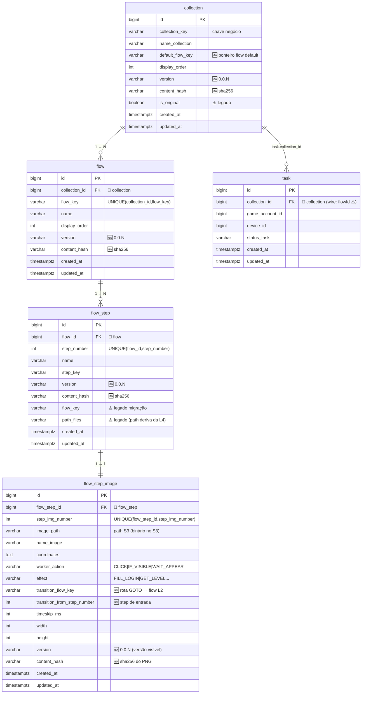

# Flow DB — visão geral (pós-V10)

Diagrama do banco depois da migration de referência [`sql/core/V10__flow_versioning_transition.sql`](../../../automation-db-lab/sql/core/V10__flow_versioning_transition.sql).
Contrato dos campos: [`FLOW-CONTRACT.md`](FLOW-CONTRACT.md).

**Legenda:** 🆕 nova coluna (V10) · ⚠️ legado (sai/renomeia) · 🔗 FK

---

## ER — hierarquia L1–L4

---

## O que mudou no V10

| Tabela | 🆕 Adicionado | 🔴 Removido |
|--------|---------------|-------------|
| `collection` | `version`, `content_hash`, `default_flow_key` | — |
| `flow` | `version`, `content_hash` | — |
| `flow_step` | `version`, `content_hash` | — |
| `flow_step_image` | `version`, `content_hash`, `transition_flow_key`, `transition_from_step_number` | — |
| `flow_transition` | — | **tabela inteira** (rota virou coluna na L4) |

---

## Notas de modelagem

- **1:1 step ↔ imagem:** cada `flow_step` tem exatamente um `flow_step_image` (UNIQUE em `step_img_number`).
- **Versão = coluna, não tabela de revisão:** o DB guarda só a **versão atual**. O **histórico de binários vive no S3** (`0.0.1_x.png`, `0.0.2_x.png`). Revert = `UPDATE version` de volta + `DELETE` do PNG rejeitado no S3.
- **transition = dado, sem tabela própria:** a rota GOTO é interpretada pelo código do bot, mas persiste como coluna na imagem onde dispara.
- **`content_hash`:** complementa a versão visível — acelera o delta-sync e garante integridade no upload. `version` = rótulo humano; `content_hash` = fingerprint da máquina (sha256 do PNG / JSON canônico).
- **`updated_at` ↔ `current_*.json.updatedAt`:** toda linha tem `updated_at`; o ponteiro `current_*.json` espelha esse timestamp para saber **quando** virou a versão atual (forward ou revert).
- **Legados (⚠️):** `is_original`, `flow_step.flow_key`, `path_files`, e o alias `task.flowId`(=`collection_id`) seguem por compatibilidade; migrar depois.

*Reflete V10 + FLOW-CONTRACT — Jun 2026.*
