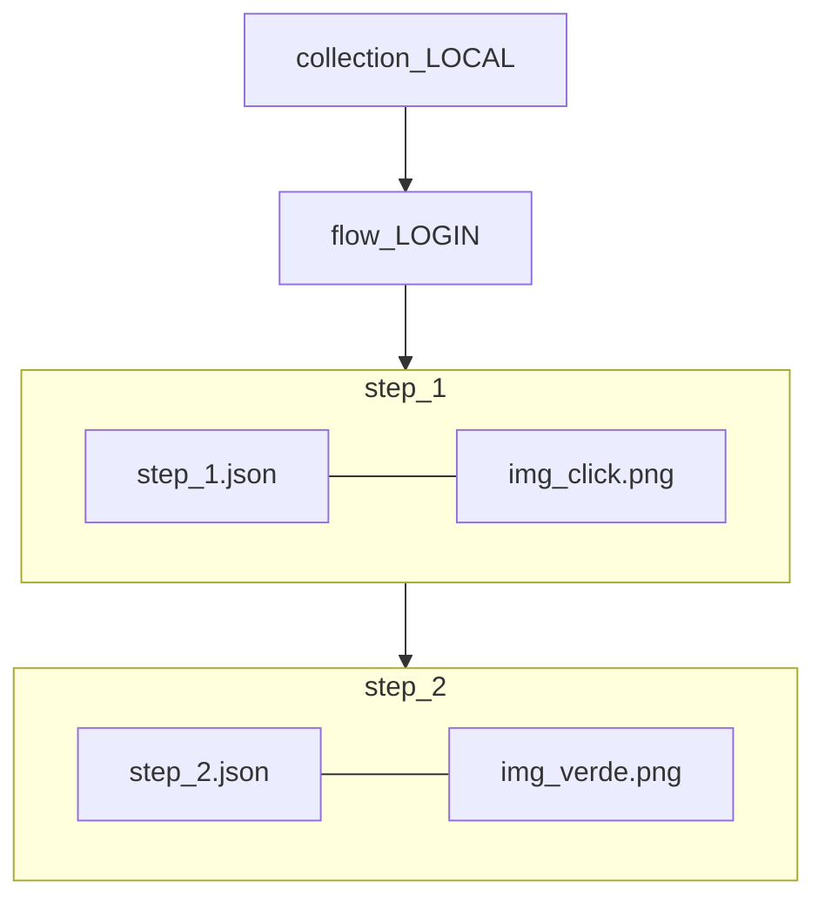
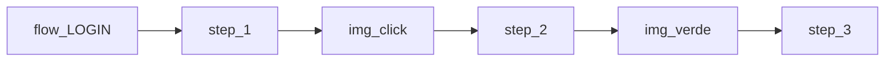

# Flow metadata — alinhamento DB × Core × Bot

Estudo detalhado. Resumo: [`FLOW-PLAN.md`](FLOW-PLAN.md).

**POC metadata (estrutura acordada):** `automation-bot-lab/app/src/main/assets/metadata/` — ver também `metadata/README.md`.

**Estado:** hierarquia L1–L4 **alinhada**; contrato JSON wire (claim, Web API) **pendente** em [`FLOW-CONTRACT.md`](FLOW-CONTRACT.md) (a criar).

---

## 1. Hierarquia canónica (acordada)

```text
L1  COLLECTION  →  L2  FLOW  →  L3  STEP  →  L4  IMG
```

| Nível | O que é | Exemplo LOCAL |
|-------|---------|----------------|
| **L1 Collection** | Catálogo / ambiente | `LOCAL` — Guias DDT |
| **L2 Flow** | Macro / pipeline | `LOGIN` — Login + entrar no jogo |
| **L3 Step** | Checkpoint na sequência vision | `step_1` → `step_2` … cada um com **uma** img |
| **L4 Img** | PNG dentro do step | `img_click.png`, `img_verde.png` |

Uma collection tem **vários flows**. Um flow tem **vários steps** em sequência. **Cada step contém uma img** (1:1) — não img em paralelo ao próximo step.



**Runtime (ordem de execução):**



**Banco (1:1):** cada `flow_step` (L3) → uma `flow_step_image` (L4). Legado errado: um `flow_step` com N imagens num array.

**Erros anteriores (corrigidos):**

- Tratar `LOGIN` / `LVL` como L3 — **errado**; são **L2 Flow**.
- `flow_default` como pipeline — **não** usado.
- `flowKeys: [LOGIN, LVL_0]` em `LOCAL.json` legado — na verdade lista de **flows L2**, naming antigo misturado com steps.

**Task** → `collection_id` (L1). Worker executa um **flow** (L2) percorrendo **steps** (L3) com **imgs** (L4).

---

## 2. Nomenclatura e pastas (metadata POC)

Prefixo na **pasta** indica o nível — **não** pastas `l1/l2/l3/l4`. O **ficheiro** = `{versão}-{nome}.json`; a versão ativa fica num `current_<nível>.json`.

Pasta-pai (`collections/`, `flows/`, `steps/`, `img/`) diz o tipo — **sem** prefixo repetido.

| Nível | Pasta | Ficheiro entidade | Ponteiro ativo |
|-------|-------|-------------------|----------------|
| L1 | `collections/FLOW30/` | `0.0.1-FLOW30.json` | `current_collection.json` |
| L2 | `…/flows/LOGIN/` | `0.0.1-LOGIN.json` | `current_flow.json` |
| L3 | `…/steps/5/` | `0.0.1-5.json` | `current_step.json` |
| L4 | `…/steps/5/img/` | `0.0.1_04.png` | `current_img.json` |

- **L4 = a pasta `img/` + o ficheiro PNG** (não só `steps/N/`).
- Versão no nome do ficheiro → listar pasta dá a versão sem abrir.
- `current_<nível>.json` resolve o "ativo" (após revert, o maior número não é o atual).

**ID estável (sync / claim):** `{collectionKey}/{flowKey}/{stepNumber}` — ex. `LOCAL/LOGIN/5`.

### Árvore POC

```text
metadata/collections/
  LOCAL/
    current_collection.json
    0.0.1-LOCAL.json
    flows/
      LOGIN/
        current_flow.json
        0.0.1-LOGIN.json
        steps/
          5/
            current_step.json
            0.0.1-5.json
            img/
              current_img.json
              0.0.1_04.png
          6/ …
      LVL/
      RM_POP/
```

---

## 3. Mapa mental ↔ banco (PostgreSQL)

Nomes de tabela JPA **não** mudam; o **modelo mental** mapeia assim:

### 3.1 Path / ficheiro ↔ tabela

| Nível | Path metadata | Ficheiro | Tabela DB | Origem da chave |
|-------|---------------|----------|-----------|-----------------|
| L1 | `collections/FLOW30/` | `0.0.1-FLOW30.json` | `collection` | pasta sob `collections/` → `collection_key` |
| L2 | `…/flows/LOGIN/` | `0.0.1-LOGIN.json` | `flow` | pasta sob `flows/` → `flow_key`; FK `collection_id` |
| L3 | `…/steps/5/` | `0.0.1-5.json` | `flow_step` | pasta sob `steps/` → `step_number`; FK `flow_id` |
| L4 | `…/steps/5/img/` + PNG | `0.0.1_04.png` | `flow_step_image` | `file` → `image_path`; FK `flow_step_id` |

### 3.2 Campos JSON ↔ colunas

| JSON | Nível | Coluna DB |
|------|-------|-----------|
| `collectionKey` | L1 | `collection.collection_key` |
| `name` (collection) | L1 | `collection.name_collection` |
| `defaultFlowKey` / `flowOrder` | L1 | UX/ordem → `flow.display_order` |
| `flowKey` | L2 | `flow.flow_key` |
| `name` (flow) | L2 | `flow.name` |
| `name` (step) | L3 | `flow_step.name` |
| `workerAction` | L4 | `flow_step_image.worker_action` |
| `effect` | L4 | `flow_step_image.effect` |
| `transition.flowKey` | L4 | rota (sem `flow_transition`) |
| `imgFile` / `file` | L4 | `flow_step_image.image_path` |
| `timeskipMs` | L4 | `flow_step_image.timeskip_ms` |

### 3.3 Versão / current ↔ DB

| Metadata | DB |
|----------|-----|
| nome `0.0.1-…` / `0.0.1_….png` | `current_version` na linha |
| `current_<nível>.json` → `version` | versão ativa = `current_version` |
| ficheiros antigos (`0.0.1`, `0.0.2`) | `flow_step_image_revision` (version, content_hash, storage_path) |

**Desenho:** 4 tabelas L1–L4. **Sem `flow_transition`** — rota em metadados (`transition`).

**Legado DB/código a limpar:**

- `flow_step.flow_key` redundante (parent é `flow_id`).
- Wire/bot `macroKey` = na verdade **flow_key** L2.
- Um `step.json` legado = flow L2 + todos os L3 + L4 num blob.

Migração hierarquia: `sql/core/V2__collection_flow_hierarchy.sql`.

---

## 4. Metadados L3 (step) — três campos

Campos no `step_N.json` (vision + side effects + rota a outro **flow**):

| Campo | Função | Exemplos |
|-------|--------|----------|
| `workerAction` | Vision / click | `CLICK`, `IF_VISIBLE`, `WAIT_APPEAR` |
| `effect` | Imperativo Kotlin | `FILL_LOGIN`, `GET_LEVEL` |
| `transition` | Salto a outro flow L2 | `{ "flowKey": "LVL", "fromStepNumber": 1 }` |

### Exemplo (L3)

```json
{
  "collectionKey": "LOCAL",
  "flowKey": "LOGIN",
  "stepNumber": 5,
  "name": "Tutorial inicial 1/2",
  "version": "0.0.1",
  "workerAction": "IF_VISIBLE",
  "transition": { "flowKey": "LVL" },
  "imgFile": "0.0.1_04.png"
}
```

- `transition.flowKey` — **flow L2** destino (`LVL`, `RM_POP`), não `toFlowKey`.
- `fromStepNumber` — opcional; entrada no flow destino (equiv. `GOTO:RM_POP:1` legado).

**Compat:** `effect: "GOTO:…"` legado → normalizar a `transition`.

### Runtime bot (hoje vs alvo)

```text
Hoje:  MacroRunner + SessionEngine + macroKey (nome errado, é flow_key L2)
Alvo:  mesmo pipeline; wire/metadata usam flow_key + step_number
```

`GET_LEVEL` / `GET_ROLE_GRADE` calculam flow destino em código — não vão em `transition` estática.

### Grafo Web

Arestas entre **flows L2** derivadas de `transition` nos steps L3. Sem tabela `flow_transition`.

### Catálogo `worker_effect` (proposta)

Tabela/seed só documentação + UI + lint; dispatch continua em `FlowEffectRegistry`.

---

## 5. Core — Worker Plan (wire HTTP) — **pendente alinhar**

Código actual ([`TaskWorkerPlanCollectionDto`](../../automation-core-lab/src/main/java/com/automation/core/adapter/in/web/dto/response/worker/TaskWorkerPlanCollectionDto.java)) ainda reflete confusão L2/L3 e inclui `transitions[]`.

**Alvo (a fechar em FLOW-CONTRACT):**

- Collection → flows L2 → steps L3 → img L4
- `transition` no step L3; sem `flow_transition` no wire
- Claim com versões por step/img

---

## 6. Versionamento

### Princípios (acordados)

| Princípio | Detalhe |
|-----------|---------|
| Versão legível | Patch auto `0.0.1` → `0.0.2` — humano consulta, máquina incrementa |
| Hash | `content_hash` no upload — complemento |
| DB | `current_version` na linha L4 (+ revision history) |
| S3 | Histórico — não apagar PNG antigos; revert = apontar versão anterior |
| Claim | Bot manda versão; Core responde delta |

**Log alvo:**

```text
LOCAL/LOGIN/step_5: 0.0.2 → 0.0.3
```

### S3 path (acordado)

```text
img/flows/imgs/{collection_key}/{flow_key}/step_{n}/0.0.3_04.png
```

Exemplo:

```text
LOCAL/LOGIN/step_0/0.0.1_00.png
LOCAL/LOGIN/step_6/0.0.1_popup-request.png
LOCAL/LVL/step_1/0.0.1_04.png
```

**Rejeitado:** pastas `v1/`, `v2/` por revisão. Versão no **prefixo do ficheiro**.

### Claim (alvo)

```json
{
  "cachedVersions": {
    "LOCAL/LOGIN/step_5": "0.0.2"
  }
}
```

Core compara com DB — não abre S3 em massa no claim.

---

## 7. Fontes de verdade

| Fonte | Hoje | Alvo |
|-------|------|------|
| Metadata POC | `metadata/collections/…` | fonte canónica em estudo |
| Core claim | Worker Plan v2 legado | contrato alinhado L1–L4 |
| S3 sync | `latest.json` monolítico | paths §6 + catálogos |
| APK | `worker-flows/` monolítico | migrar / gerar de metadata |

### Gaps `worker-flows/` legado

- `collections/LOCAL.json` — `flowKeys` = flows L2 OK no naming, mas sem L3/L4 separados
- `steps/LOGIN/step.json` — um arquivo com L2+L3+L4
- `macroKey`, `LOGIN_01`, `effect: GOTO`

---

## 8. Mapa migração legado → alvo

| Legado | Alvo |
|--------|------|
| `steps/LOGIN/step.json` | `flow_LOGIN/step_N/step_N.json` + PNG |
| `macroKey` | `flowKey` (L2) |
| `stepKey: LOGIN_01` | `stepNumber` dentro de `flow_LOGIN` |
| `effect: GOTO:LVL_0` | `transition: { "flowKey": "LVL" }` |
| `flow_transition` tabela | **remover** — não no desenho |
| `flow_default` | **não usar** |
| Web grafo errado | flows L2 = LOGIN/LVL; steps = sequência img |

---

## 9. Fases

### Fase 0 — Estudo

- [x] Hierarquia L1–L4 alinhada
- [x] POC metadata `collection_LOCAL/` (LOGIN, LVL, RM_POP)
- [x] Separar worker_action / effect / transition no L3
- [ ] Contrato JSON completo (`FLOW-CONTRACT.md`)
- [ ] `CORE-DATABASE-TABLES.md`

### Fase 1 — Contrato + wire

- `step_N.json` schema estável; `transition` no Core/bot
- Compat GOTO legado

### Fase 2 — Versionamento + claim delta

### Fase 3 — Web grafo + editor (flows L2, steps L3)

### Fase 4 — Deprecar `worker-flows/` monolítico

---

## 10. Decisões

### Fechadas

1. L1 Collection → L2 Flow (`LOGIN`) → L3 Step (`step_0…`) → L4 Img (PNG).
2. L3: `workerAction` + `effect` + `transition` (destino = **flow** L2).
3. Sem `flow_transition` no desenho.
4. Metadata naming: `collection_*`, `flow_*`, `step_*`, PNG versionado.
5. Versão `0.0.N` automática + hash; S3 `0.0.N_ficheiro.png` no step.
6. Grafo Web: flows L2 ligados por `transition` nos steps.

### Em aberto

1. Contrato wire claim/request (FLOW-CONTRACT).
2. Um `flow_step` DB = um L3 step com um L4 img — confirmar 1:1 no seed.
3. `step_number` 0-based no LOGIN — alinhar DB?
4. `task.flowId` = `collection_id` (legado API).

---

## 11. Referências

| Repo | Ficheiro |
|------|----------|
| POC | `automation-bot-lab/app/src/main/assets/metadata/` |
| Core | `TaskWorkerPlanService.java`, DTOs `TaskWorkerPlan*` |
| Bot | `MacroRunner.kt`, `SessionEngine.kt`, `FlowEffectRegistry.kt` |
| DB | `V2__collection_flow_hierarchy.sql` |

---

*Última actualização: hierarquia L1–L4 alinhada com metadata POC LOCAL.*
