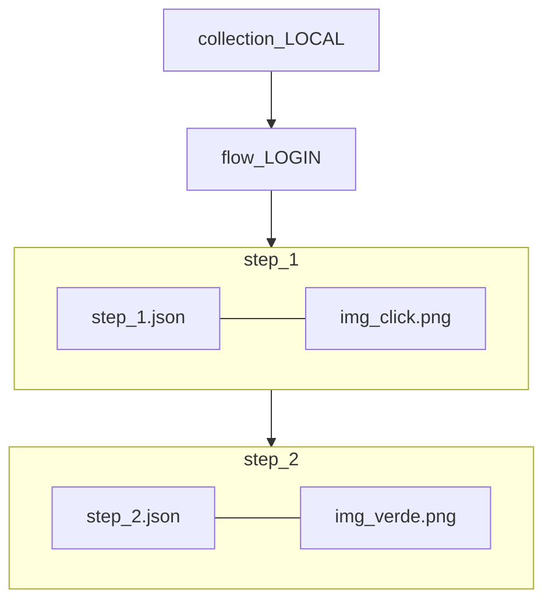
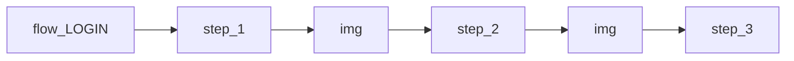

# Flow — plano conciso (DB × Core × Bot × S3)

Detalhes: [`FLOW-METADATA-ALIGNMENT.md`](FLOW-METADATA-ALIGNMENT.md). POC: `automation-bot-lab/app/src/main/assets/metadata/`.

---

## 1. Hierarquia (acordada)

```text
L1  COLLECTION   LOCAL, FLOW30
L2  FLOW         LOGIN, LVL, RM_POP
L3  STEP         step_1 → step_2 → step_3 …   (sequência vision)
L4  IMG          uma PNG **dentro** de cada step (step_1 → img_click, step_2 → img_verde)
```

**Estrutura (contenção):** cada step tem **uma** img abaixo — não img em paralelo ao próximo step.



**Runtime:** percorre step_1 (vision na img) → step_2 (vision na img) → …



| Nível | Chave | Exemplo |
|-------|-------|---------|
| L1 | `collection_key` | `LOCAL`, `FLOW30` |
| L2 | `flow_key` | `LOGIN`, `LVL`, `RM_POP` |
| L3 | `step_number` | `0`, `1`, `2` … |
| L4 | ficheiro PNG | `0.0.1_00.png` |

**GOTO** (`transition.flowKey`) salta a outro **flow L2**, não a outro step.

**Sem** `flow_transition` no desenho. **Sem** `flow_default`.

---

## 2. Metadata POC (pastas)

```text
collections/
  LOCAL/
    current_collection.json        → versão ativa da collection
    0.0.1-LOCAL.json
    flows/
      LOGIN/
        current_flow.json
        0.0.1-LOGIN.json
        steps/
          5/
            current_step.json
            0.0.1-5.json
            img/
              current_img.json     → { "version": "0.0.1", "file": "0.0.1_04.png" }
              0.0.1_04.png
```

- Pasta-pai diz o nível (`collections/`, `flows/`, `steps/`, `img/`) — **sem** prefixo repetido.
- Ficheiro = `{versão}-{nome}.json`; **L4 = `img/` + PNG**.
- `current_<nível>.json` = ponteiro ao ativo (revert = só muda o ponteiro).

---

## 3. L3 step — campos

| Campo | Função |
|-------|--------|
| `workerAction` | Vision / click |
| `effect` | Imperativo (`FILL_LOGIN`, `GET_LEVEL`) |
| `transition` | `{ "flowKey": "LVL", "fromStepNumber": 1 }` |

---

## 4. Versionamento

- Patch auto `0.0.1` → `0.0.2` (humano consulta; máquina incrementa)
- `content_hash` complementar no upload
- S3: `…/flow_LOGIN/step_5/0.0.3_04.png`
- Claim: cache por `{flowKey}/step_{n}` → versão

---

## 5. Revert (sobrepõe + apaga lixo)

Revert **não** é uma nova versão para a frente — é um **UPDATE** que volta o ponteiro e **descarta** a versão rejeitada. File (S3) e DB têm de ficar **alinhados** no mesmo passo (transação lógica): se um apaga, o outro apaga.

```text
estado:  current = 0.0.2   (errada)
revert ⤵
1. current_img: 0.0.2 → 0.0.1   (UPDATE, sobrepõe)
2. S3:  DELETE 0.0.2_x.png        (lixo, não volta a usar)
3. DB:  remove revisão 0.0.2      (file ↔ db alinhados)
4. Bot: tenho 0.0.2 ≠ current 0.0.1 → re-baixa 0.0.1
```

**Regra de histórico:**

| Caso | Versão anterior |
|------|-----------------|
| Superada **forward** (`0.0.1 → 0.0.2`) | **fica** (pode-se reverter pra ela) |
| **Revertida** (rejeitada) | **apaga** em S3 **e** DB |

- Sem "redo" do que foi revertido — apagou, foi.
- File e DB são **espelho**: nenhuma versão existe num só lado. Log/auditoria regista `imgKey xpto: 0.0.2 → 0.0.1 (revert)`.

---

## 6. Mapa DB ↔ modelo

| Mental | Tabela |
|--------|--------|
| L1 Collection | `collection` |
| L2 Flow | `flow` |
| L3 Step | `flow_step` | 1 → **1** `flow_step_image` |
| L4 Img | `flow_step_image` | PNG + metadados vision na linha L4 |

---

## 7. Legado

| Antigo | Certo |
|--------|-------|
| `flowKeys: [LOGIN]` na collection | flows L2 |
| `steps/LOGIN/step.json` monolítico | `flow_LOGIN/step_N/` |
| `macroKey` | `flow_key` (L2) |
| `LOGIN_01` | `step_number` + flow LOGIN |

---

*Alinhado com metadata POC LOCAL — Jun 2026.*
