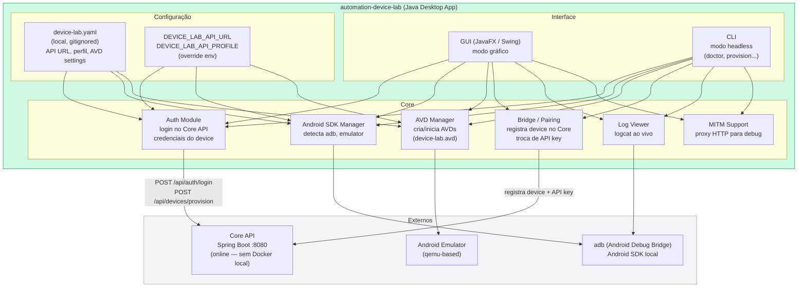
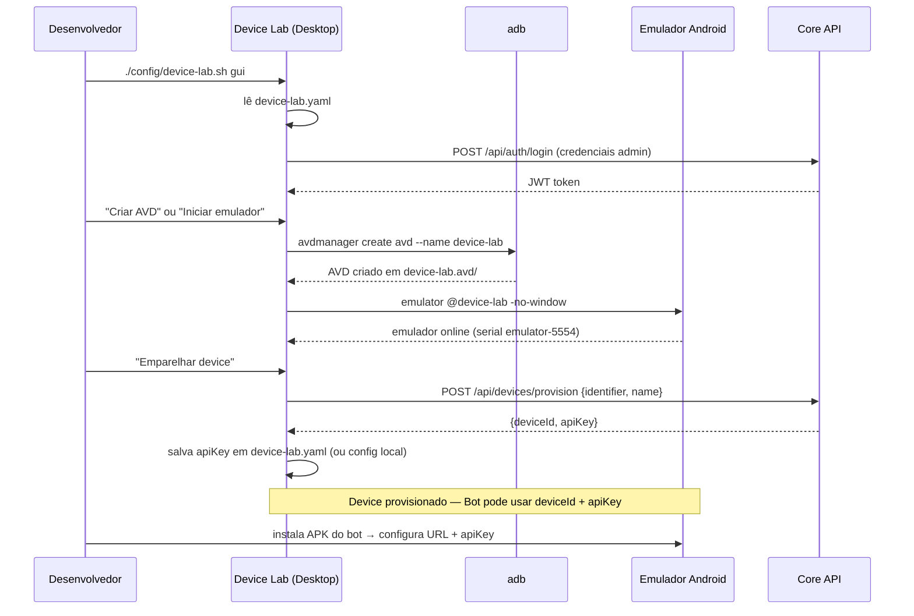
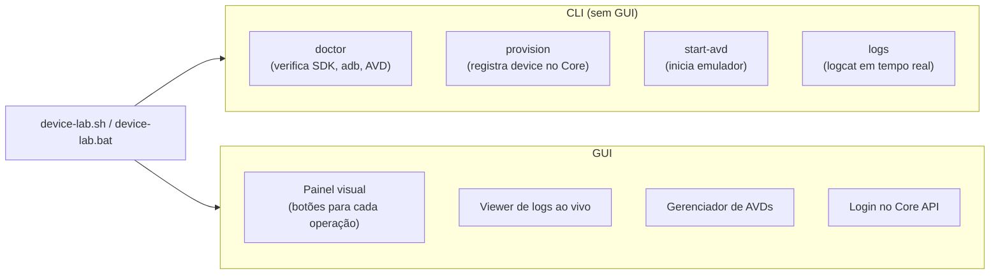
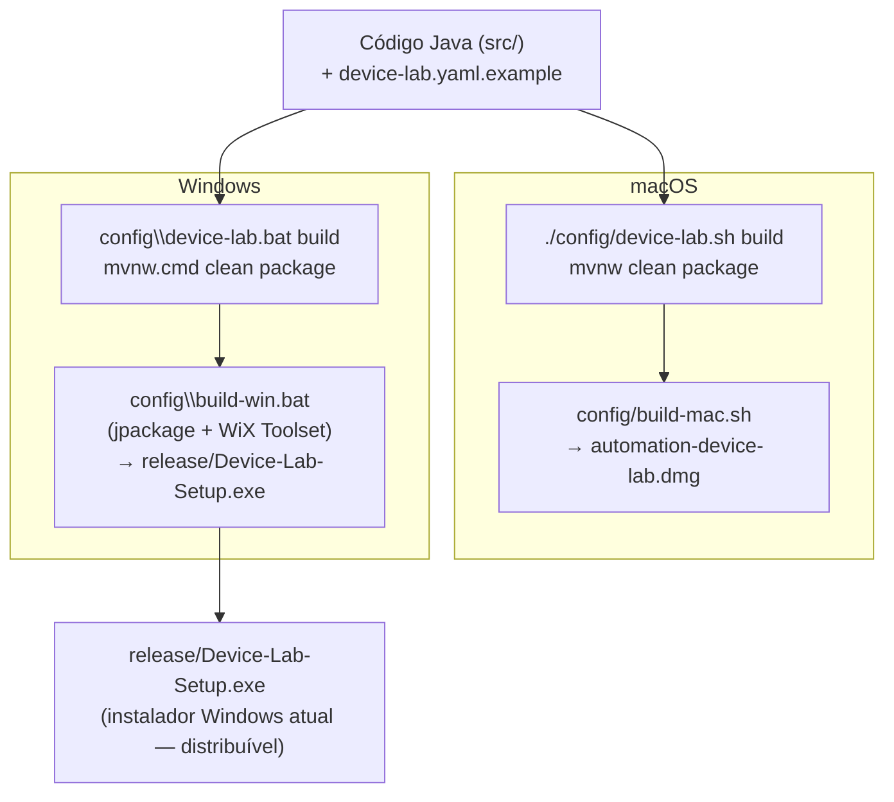

# automation-device-lab — Arquitetura

Ferramenta desktop **local** (Java + GUI) para gerenciar o laboratório de dispositivos Android da plataforma DDT. Controla AVDs (emuladores), autentica e emparelha bots, captura logs e gerencia o SDK Android — sem subir infraestrutura Docker.

---

## Visão Macro



---

## Fluxo de Provisionamento de Device



---

## Modo de Uso (CLI vs GUI)



---

## Build e Distribuição



---

## Configuração (device-lab.yaml)

```yaml
# device-lab.yaml (gitignored — copiar de device-lab.yaml.example)
api:
  url: http://localhost:8082/api    # Core API URL
  profile: local                    # local | prod

device:
  identifier: device-android-001    # ID único do device
  name: "Emulador Lab 1"

avd:
  name: device-lab                  # nome do AVD
  sdk: 33                           # Android SDK version
  abi: x86_64

mitm:
  enabled: false
  port: 8888
```

Override via env: `DEVICE_LAB_API_URL=http://prod-server/api` ou `DEVICE_LAB_API_PROFILE=prod`.

---

## Estrutura do Repositório

```
automation-device-lab/
├── src/main/java/com/automation/devicelab/   # código Java
├── pom.xml                                    # build Maven
├── mvnw.cmd / mvnw                            # Maven wrapper
├── device-lab.yaml.example                   # template de config
├── device-lab.yaml                           # config local (gitignored)
├── config/
│   ├── device-lab.sh     # entry point Mac/Linux (gui/cli)
│   ├── device-lab.bat    # entry point Windows
│   ├── build-mac.sh      # gera .dmg
│   ├── build-win.bat     # gera .exe (Windows)
│   └── build-win.ps1     # alternativa PowerShell
├── packaging/
│   └── icons/            # ícones do app desktop
└── release/
    ├── Device-Lab-Setup.exe  # instalador Windows atual
    ├── README.md
    └── deprecado/            # scripts e builds antigos (ver LEGACY.md)
```

---

## Integração com Core API

| Operação | Endpoint | Auth |
|----------|----------|------|
| Login admin | `POST /api/auth/login` | — |
| Provisionar device | `POST /api/devices/provision` | JWT admin |
| Listar devices | `GET /api/devices` | JWT admin |
| Verificar saúde | `GET /health` | — |

---

## Tecnologias

| Item | Tecnologia |
|------|-----------|
| Linguagem | Java 17 |
| Build | Maven (mvnw) |
| UI | JavaFX ou Swing |
| Distribuição Windows | jpackage + WiX Toolset (`Device-Lab-Setup.exe`) |
| Distribuição macOS | jpackage (`.dmg`) |
| Config | YAML (device-lab.yaml) |
| Android | adb (Android Debug Bridge) |
