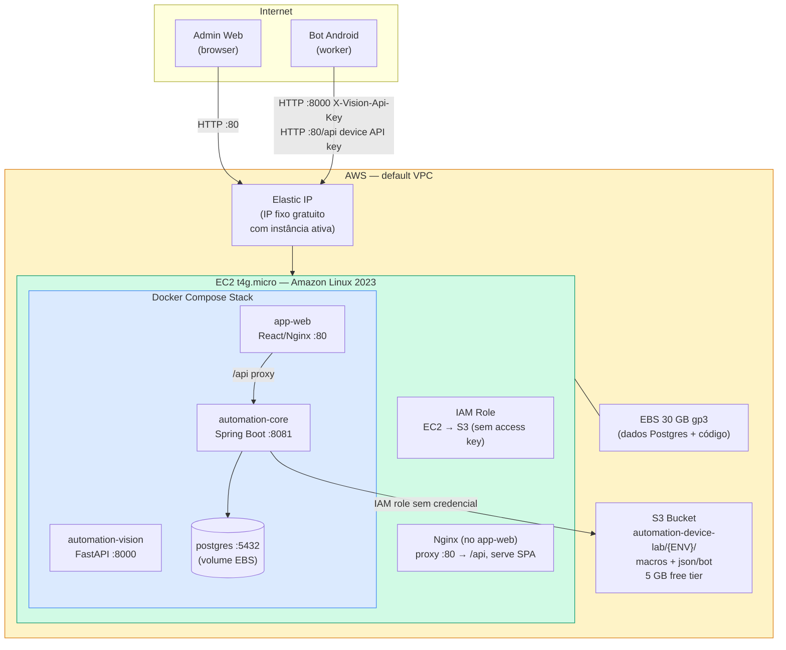
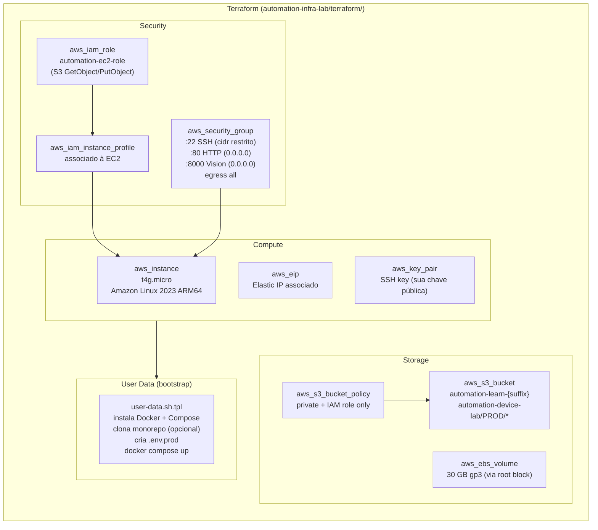
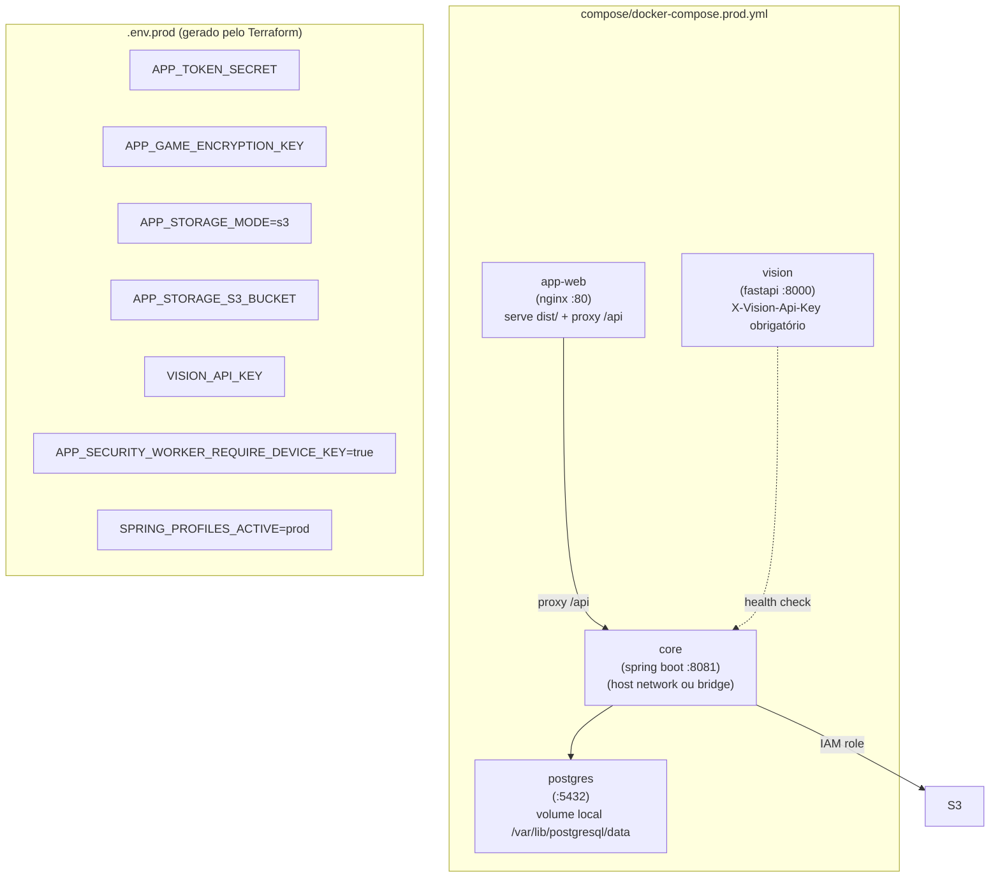
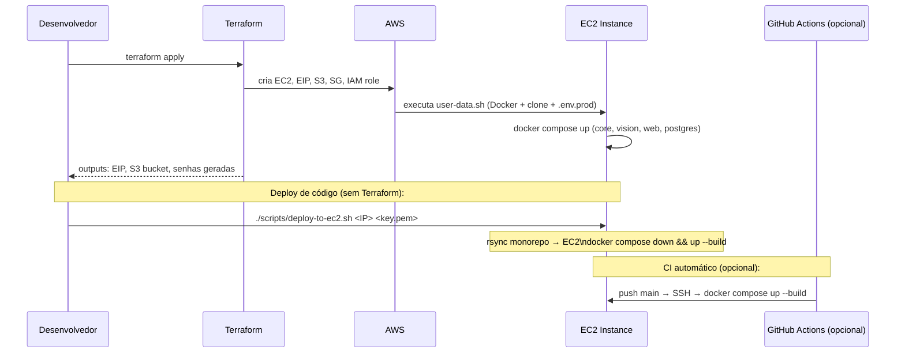
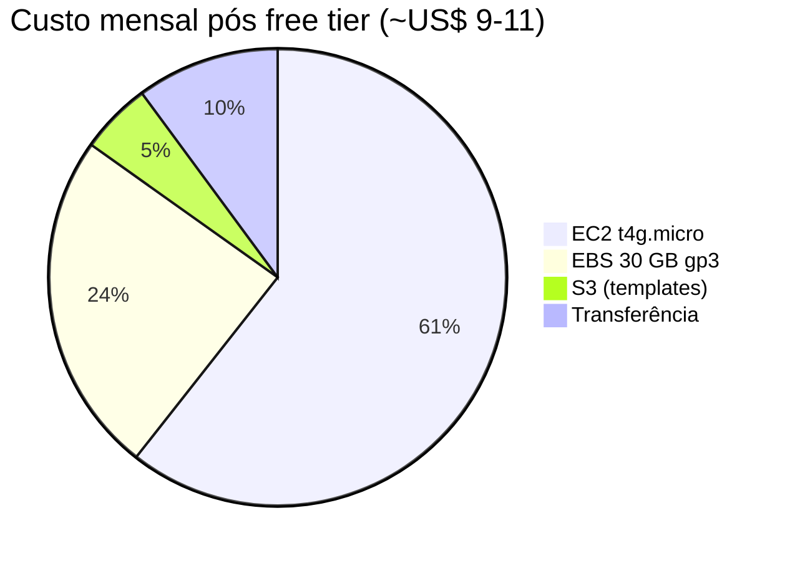
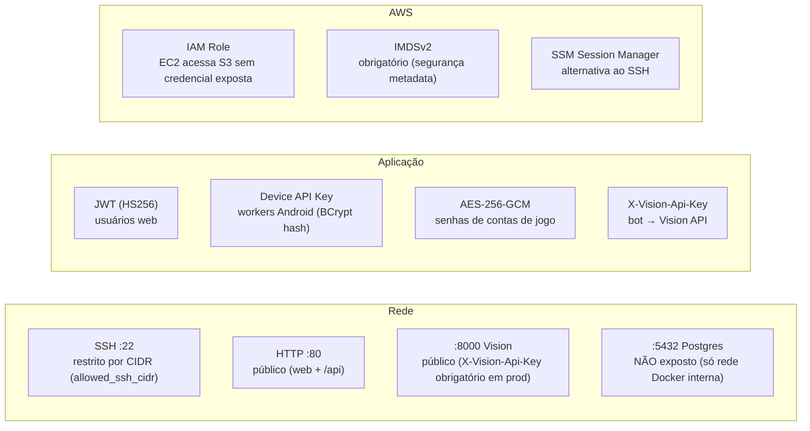

# automation-infra-lab — Arquitetura

Infraestrutura AWS de **baixo custo** para a plataforma DDT. Terraform provisiona uma EC2 única rodando o mesmo `docker-compose` do ambiente local, com S3 para imagens e Elastic IP para acesso fixo dos bots.

---

## Topologia AWS



---

## Terraform — Recursos Provisionados



---

## Stack Docker em Produção



---

## Fluxo de Deploy



---

## Estimativa de Custo



| Recurso | Free tier (12 meses) | Pós free tier |
|---------|----------------------|---------------|
| EC2 t4g.micro | ~US$ 0 | ~US$ 6/mês |
| EBS 30 GB gp3 | ~US$ 0 | ~US$ 2,4/mês |
| S3 (templates PNGs) | ~US$ 0 | < US$ 1/mês |
| Elastic IP | grátis se EC2 rodando | grátis se EC2 rodando |
| **Total** | **~US$ 0** | **~US$ 9–10/mês** |

---

## Segurança



---

## Estrutura do Repositório

```
automation-infra-lab/
├── compose/
│   └── docker-compose.prod.yml  # Stack prod com paths *-lab
├── scripts/
│   └── deploy-to-ec2.sh         # rsync + restart containers
├── terraform/
│   ├── main.tf                  # EC2, EIP, S3, SG, IAM
│   ├── variables.tf             # ssh_key_name, allowed_ssh_cidr, etc.
│   ├── terraform.tfvars.example # template de config
│   ├── outputs.tf               # EIP, S3 bucket name, senhas
│   ├── iam-policy.terraform-lab.json # policy IAM mínima para terraform-lab
│   └── templates/
│       └── user-data.sh.tpl     # bootstrap da EC2 (Docker + .env.prod)
└── docs/
    ├── ARCHITECTURE.md          # este arquivo
    ├── GITHUB-DEPLOY.md         # CI/CD GitHub Actions
    ├── DATABASE-REVIEW.md       # operações no BD em prod
    ├── DOMAIN-SETUP.md          # domínio + HTTPS (certbot)
    └── env-images-s3.md         # configuração de storage S3
```

---

## O que não usamos (decisão de custo)

| Serviço AWS | Custo evitado | Alternativa |
|-------------|---------------|-------------|
| RDS PostgreSQL | ~US$ 15+/mês | Postgres no Docker (volume EBS) |
| NAT Gateway | ~US$ 32/mês | default VPC (acesso direto via EIP) |
| ALB (Load Balancer) | ~US$ 16+/mês | Nginx no app-web faz proxy |
| ECS Fargate / EKS | variável | docker-compose na EC2 |
| Multi-AZ / HA | variável | lab single-AZ |
