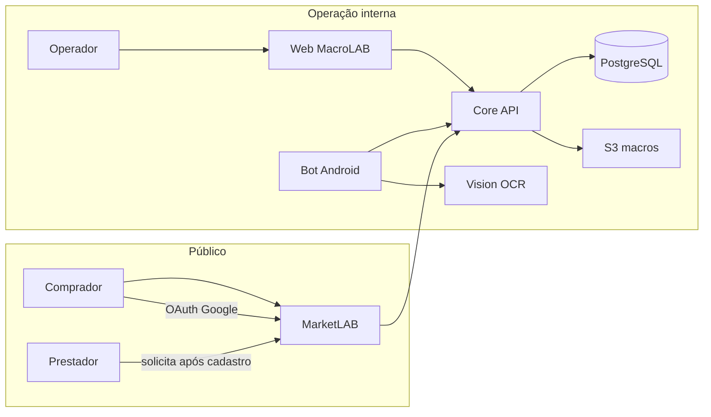

# Visão do produto — Plataforma DDT / automation-learn

**Última atualização:** 2026-06-21  
**Release de referência:** [R04 — Produção e identidade](../releases/r04-producao-identidade/README.md)

---

## O que somos

Uma plataforma que combina **automação Android em escala** (bots em dispositivos reais) com **operação comercial** (CRM, pedidos, catálogo) e, desde R03, um **marketplace público** (MarketLAB) para compradores e prestadores de serviços do ecossistema do jogo.

O operador interno usa o **MacroLAB** (CRM): pedidos, flows, devices, contas. O público externo usa o **MarketLAB**: navegar catálogo, comprar, conversar e solicitar perfil de prestador de serviços.

---

## Personas

| Persona | Onde entra | O que pode fazer |
|---------|------------|------------------|
| **Administrador / Dev / Manager** | MacroLAB (`/`) | CRM completo, flows, devices, usuários internos |
| **Vendedor (SELLER)** | MacroLAB | Pedidos e clientes do seu escopo |
| **Comprador (CUSTOMER)** | MarketLAB (`/marketplace`) | Cadastro público, catálogo, compras; **sem** acesso ao MacroLAB |
| **Prestador de serviços (SERVICE_PROVIDER)** | MarketLAB → solicitação em Serviços | Perfil público, anúncios, avaliações (após aprovação) |
| **Bot Android** | APK + API Key | Claim de tasks, execução de flows, OCR |
| **Device Lab (desktop)** | Ferramenta local | Provisionar e emparelhar devices com o Core |

---

## Princípios

1. **BD como fonte da verdade** — flows, steps e imagens versionados no PostgreSQL; S3 é espelho por ambiente (LOCAL / HMG / PROD).
2. **Custo controlado** — lab em EC2 free tier; serviços stateless em Docker Compose.
3. **Separação Macro vs Market** — RBAC e rotas impedem comprador de acessar CRM.
4. **Evolução por release** — cada entrega documentada em [releases/INDEX.md](../releases/INDEX.md).

---

## Jornada simplificada (hoje)

---

## Horizonte (não comprometido por release)

- OAuth Discord e Facebook (após Google estável em produção)
- Relevância de flows / fluxo ORIGINAL em produção ([core/FLOW-RELEVANCIA-E-ORIGINAL-PROPOSAL.md](../core/FLOW-RELEVANCIA-E-ORIGINAL-PROPOSAL.md))
- Escalar workers além de um único host lab
- Auditoria `created_by` / `updated_by` em entidades críticas

---

## Onde ler mais

| Tópico | Documento |
|--------|-----------|
| Proposta e escopo por módulo | [PROPOSAL.md](PROPOSAL.md) |
| Arquitetura técnica atual | [ARCHITECTURE.md](../ARCHITECTURE.md) |
| Histórico por release | [releases/INDEX.md](../releases/INDEX.md) |
| Modelo de dados | [db/ARCHITECTURE.md](../db/ARCHITECTURE.md) |
