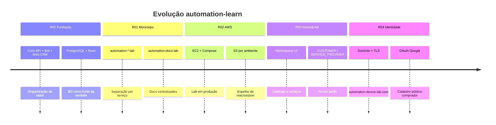

# Histórico de releases — Plataforma DDT / automation-learn

Documentação organizada por **release** para registrar a evolução do sistema: arquitetura, banco, produto e operação.

**Última release documentada:** [R04 — Produção e identidade](r04-producao-identidade/README.md) (2026-06)

---

## Linha do tempo

| Release | Período | Tema | Resumo |
|---------|---------|------|--------|
| [R00](r00-fundacao/README.md) | 2025 — início 2026 | Fundação | Core Spring, Bot Android, CRM web, PostgreSQL, flows e tasks |
| [R01](r01-monorepo-labs/README.md) | 2026-06 | Monorepo labs | `automation-*-lab`, configs centralizados, docs em `automation-docs-lab` |
| [R02](r02-aws-lab/README.md) | 2026-06 | AWS Lab | EC2 t4g.micro, Docker Compose prod, S3, sync BD → Core → S3 |
| [R03](r03-marketlab/README.md) | 2026-06 | MarketLAB | Marketplace público, comprador/prestador, catálogo, carteira |
| [R04](r04-producao-identidade/README.md) | 2026-06 | Produção | Domínio `automation-device-lab.com`, HTTPS, OAuth Google, RBAC marketplace |

---

## Como usar esta pasta

1. **Entender o produto hoje** → [product/VISION.md](../product/VISION.md) e [product/PROPOSAL.md](../product/PROPOSAL.md)
2. **Arquitetura atual (sempre a mais recente)** → [ARCHITECTURE.md](../ARCHITECTURE.md) e [db/ARCHITECTURE.md](../db/ARCHITECTURE.md)
3. **O que mudou numa release** → pasta `rXX-*/CHANGELOG.md` e `ARCHITECTURE.md` (snapshot da época)
4. **Nova release** → copiar [TEMPLATE.md](TEMPLATE.md) para `r05-.../`

---

## Diagrama — evolução dos módulos

---

## Documentos transversais (não versionados por release)

| Documento | Uso |
|-----------|-----|
| [FLOW-SYNC-E-S3.md](../FLOW-SYNC-E-S3.md) | Fluxo BD → Core → S3 → Bot |
| [TECH-STORIES.md](../TECH-STORIES.md) | Histórias técnicas e stack (legado detalhado) |
| [REPOSITORIES-OVERVIEW.md](../REPOSITORIES-OVERVIEW.md) | Mapa dos repositórios |
| [LEGACY.md](../LEGACY.md) | Docs substituídos ou históricos |

---

## Índices por sistema (código)

| Sistema | Índice |
|---------|--------|
| Core | [core/INDEX.md](../core/INDEX.md) |
| Bot | [bot/INDEX.md](../bot/INDEX.md) |
| Web | [web/INDEX.md](../web/INDEX.md) |
| Infra | [infra/INDEX.md](../infra/INDEX.md) |
| DB | [db/docs/INDEX.md](../db/docs/INDEX.md) |
