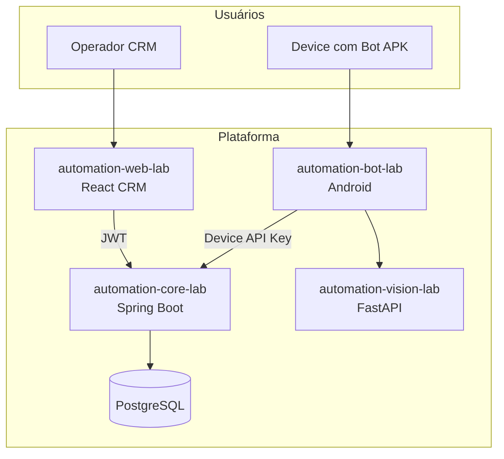

# Arquitetura — R00 (fundação)

Snapshot ao fim da fase fundacional. Componentes principais sem AWS nem marketplace.

## Domínios de dados (R00)

- **Catálogo:** `range_server`, `server`, `game_account`, `game_details_account`
- **Automação:** `flow_step`, `flow_step_image` (+ evolução para `flow`, `collection`)
- **CRM:** `customer`, `sales_order`
- **Execução:** `task`, `device`, `debug_image`, `order_task_log`
- **Auth:** `user_admin`, `permission`, `permission_function`, grants

## Fluxo ponta a ponta

Operador cria pedido → Core gera tasks → Bot faz claim → executa steps → atualiza status no Core.

Documentação detalhada de sequência: seção "Fluxo Principal" em [../../ARCHITECTURE.md](../../ARCHITECTURE.md).
