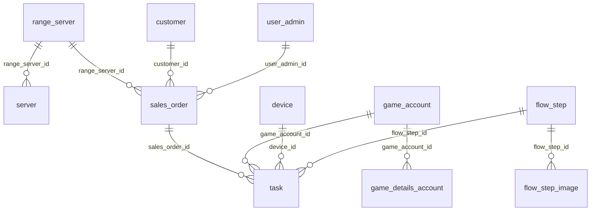

# Banco de dados — R00 (baseline)

Referência canônica atualizada: [../../db/ARCHITECTURE.md](../../db/ARCHITECTURE.md).

## Tabelas introduzidas

| Grupo | Tabelas |
|-------|---------|
| Catálogo | `range_server`, `server`, `game_account`, `game_details_account` |
| Flows | `flow_step`, `flow_step_image` |
| CRM | `customer`, `sales_order` |
| Execução | `task`, `device`, `debug_image`, `order_task_log` |
| Auth | `user_admin`, `permission`, `permission_function`, `permission_function_grant`, `user_permission` |

## Permissões (R00)

`ADM`, `DEV`, `MANAGER`, `SELLER` — sem perfis de marketplace.

## Diagrama ER (subset R00)

