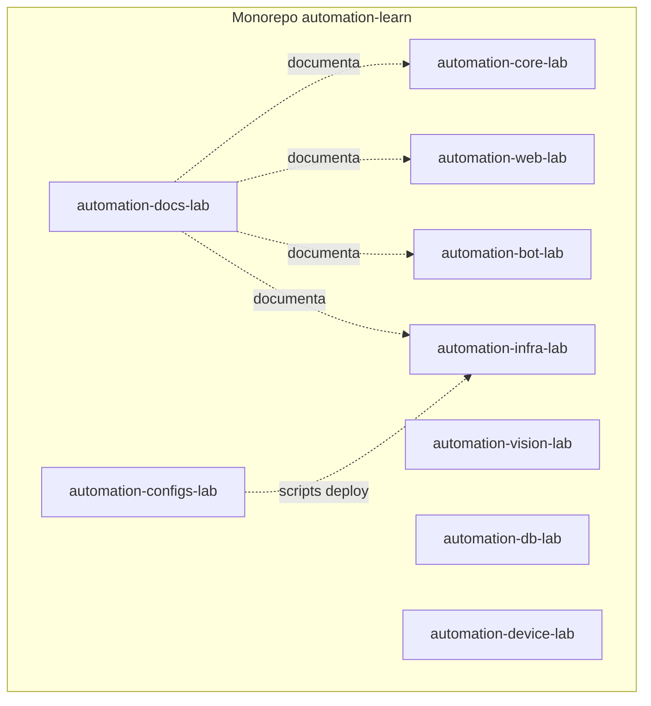

# Arquitetura — R01 (monorepo)

Organização de repositórios; runtime igual a R00.

## Convenções estabelecidas

- Um índice `INDEX.md` por área em `automation-docs-lab`
- Scripts operacionais em `automation-configs-lab/infra-lab/scripts/`
- DDL e seeds em `automation-db-lab`
