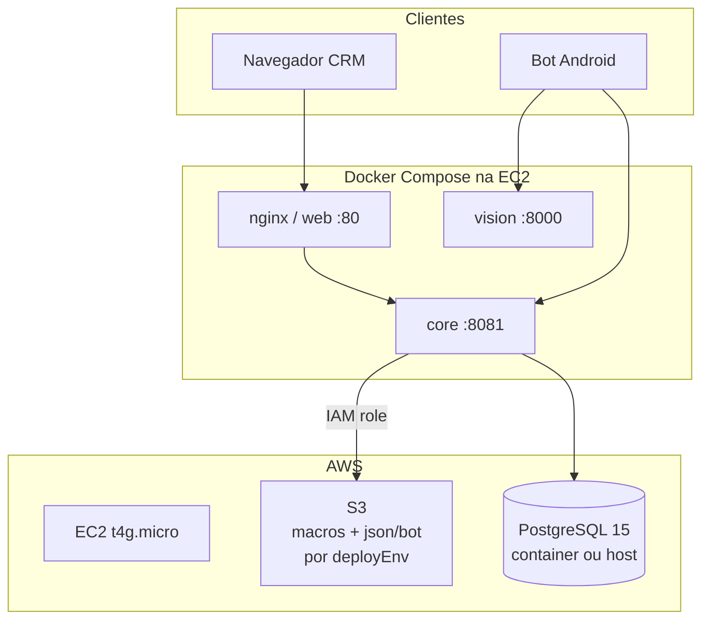

# Arquitetura — R02 (AWS Lab)

## Ambientes de deploy (S3)

| Env | Uso |
|-----|-----|
| LOCAL | Desenvolvimento |
| HMG | Homologação |
| PROD | Lab EC2 |

Path pattern documentado em [FLOW-SYNC-E-S3.md](../../FLOW-SYNC-E-S3.md).

## Infra como código

- `automation-infra-lab` — Terraform, compose templates
- `automation-configs-lab/infra-lab/scripts/` — operação diária
