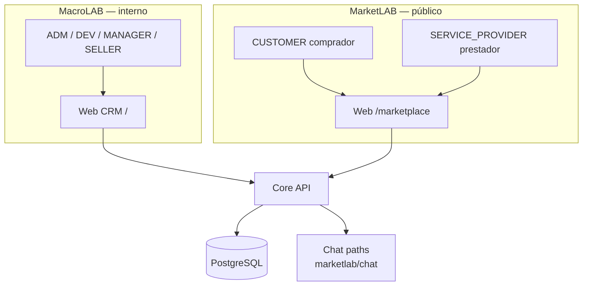

# Arquitetura — R03 (MarketLAB)

## Separação de acesso

| Perfil | MacroLAB | MarketLAB |
|--------|:--------:|:---------:|
| ADM, DEV, MANAGER, SELLER | ✓ | opcional |
| CUSTOMER | ✗ | ✓ |
| SERVICE_PROVIDER | ✗ | ✓ (+ perfil prestador após aprovação) |

## Fluxo prestador de serviços

1. Cadastro público como **comprador** (CUSTOMER)
2. Navega em **Serviços** e solicita tornar-se prestador
3. Após aprovação → perfil `SERVICE_PROVIDER` + registro em `ads_service_provider`
