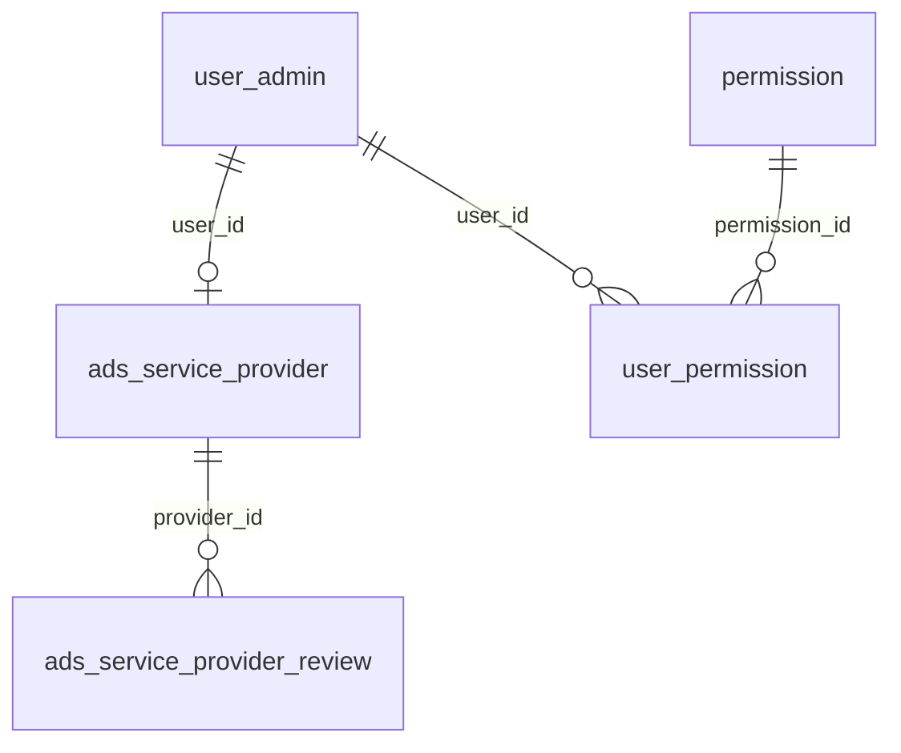

# Banco de dados — R03 (MarketLAB)

Delta sobre R00/R01. Diagrama completo atual: [../../db/ARCHITECTURE.md](../../db/ARCHITECTURE.md).

## Novas / alteradas

### `permission`

| name | Uso |
|------|-----|
| CUSTOMER | Comprador marketplace |
| SERVICE_PROVIDER | Prestador de serviços |

### `game_account`

| Coluna | Tipo | Descrição |
|--------|------|-----------|
| marketplace_featured | boolean | Destaque no catálogo público |

### `ads_service_provider`

| Coluna | Descrição |
|--------|-----------|
| user_id | FK lógica → user_admin |
| game_slug | Jogo do anúncio |
| display_name, whatsapp, bio | Perfil público |
| services_json | Lista de serviços oferecidos |
| price_from_cents, rating, review_count | Métricas |
| featured, active, banned | Moderação |

### `ads_service_provider_review`

Avaliações de prestadores (ligadas a `ads_service_provider`).

## Diagrama ER (delta marketplace)

## Wallet

Tabela de carteira associada ao usuário (criação no cadastro marketplace) — ver entidades em `automation-core-lab`.
