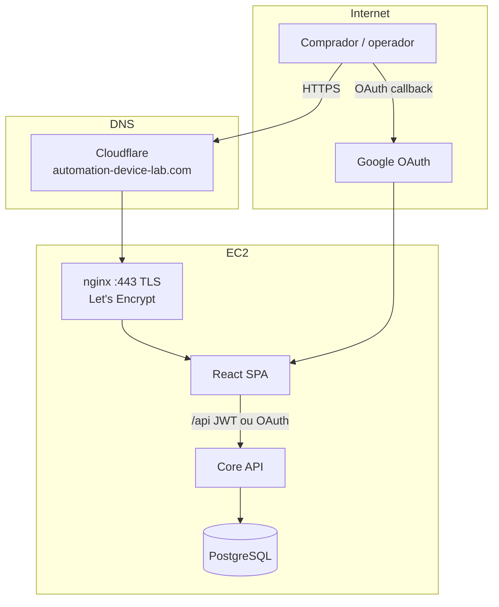

# Arquitetura — R04 (produção e identidade)

## Auth — dois caminhos

| Caminho | Quem | Mecanismo |
|---------|------|-----------|
| Senha + JWT | Operadores internos | Login MacroLAB |
| OAuth Google | Compradores (produção) | Callback → token → perfil CUSTOMER default |

## Colunas OAuth em `user_admin`

- `oauth_provider` — ex.: `google`
- `oauth_provider_id` — ID estável no provedor

Usuários só-OAuth podem não ter `password_hash` tradicional (conforme implementação do serviço de auth).

## Compose prod (trecho relevante)

- Portas 80 (redirect) e 443
- Volume `/etc/letsencrypt`
- `APP_DOMAIN`, `APP_ALLOWED_ORIGINS`

Ver `automation-infra-lab/compose/docker-compose.prod.yml`.
