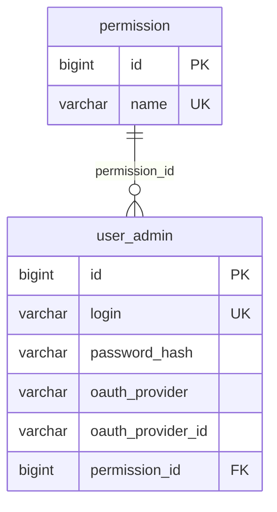

# Banco de dados — R04 (identidade)

Delta sobre R03.

## `user_admin` — OAuth

| Coluna | Tipo | Descrição |
|--------|------|-----------|
| oauth_provider | varchar(32) | `google`, `discord`, `facebook` (futuro) |
| oauth_provider_id | varchar(255) | ID do usuário no provedor |

Índice lógico sugerido: `(oauth_provider, oauth_provider_id)` único quando ambos preenchidos.

## Permissões em produção

Garantir registros:

```sql
-- referência: automation-db-lab/seeds/permission-seed.json
CUSTOMER
SERVICE_PROVIDER
```

## Sem novas tabelas de negócio

R04 reutiliza schema R03; mudança é principalmente **dados** (seeds) e **uso** das colunas OAuth.

## Diagrama auth atualizado


