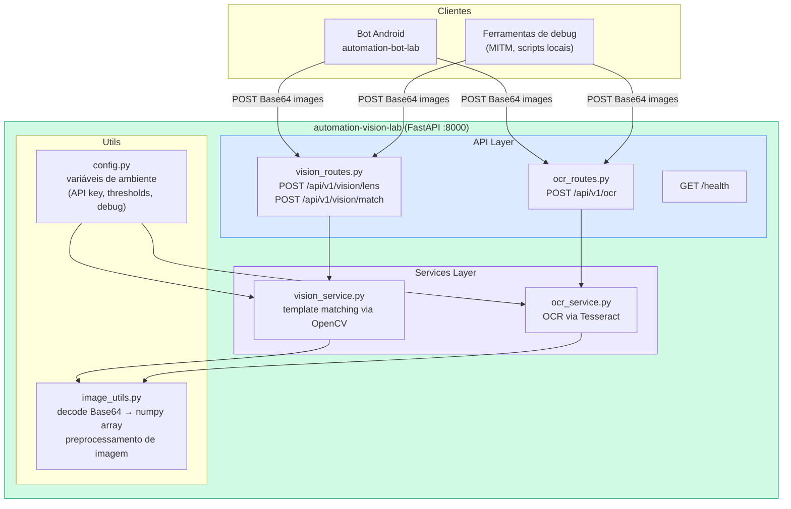
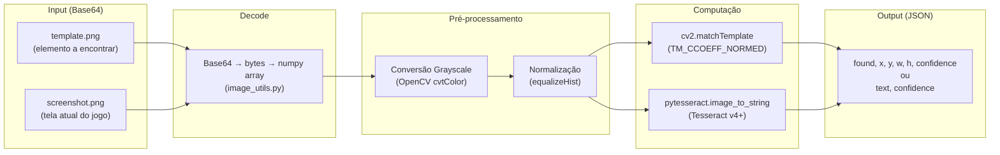
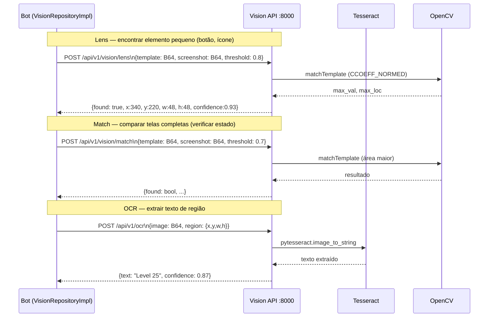
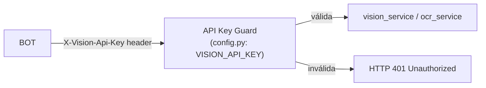

# automation-vision-lab — Arquitetura

Serviço de **OCR e visão computacional** da plataforma DDT. Recebe screenshots e templates do bot Android, executa template matching (OpenCV) e OCR (Tesseract), e retorna coordenadas e texto para o bot automatizar a UI do jogo.

---

## Visão Macro



---

## Endpoints e Contratos

```mermaid
graph LR
    subgraph lens["POST /api/v1/vision/lens"]
        LI["Request:\n{template: base64,\n screenshot: base64,\n threshold: float}"]
        LO["Response:\n{found: bool,\n x: int, y: int,\n w: int, h: int,\n confidence: float}"]
        LI -->|OpenCV matchTemplate| LO
    end

    subgraph match["POST /api/v1/vision/match"]
        MI["Request:\n{template: base64,\n screenshot: base64,\n threshold: float}"]
        MO["Response:\n{found: bool,\n x: int, y: int,\n w: int, h: int,\n confidence: float}"]
        MI -->|OpenCV matchTemplate\n(escala grande)| MO
    end

    subgraph ocr["POST /api/v1/ocr"]
        OI["Request:\n{image: base64,\n region?: {x,y,w,h}}"]
        OO["Response:\n{text: string,\n confidence: float}"]
        OI -->|Tesseract OCR| OO
    end

    subgraph health["GET /health"]
        HO["Response: {status: ok}"]
    end
```

---

## Pipeline de Processamento



---

## Integração no Ecossistema



---

## Segurança em Produção



Em `dev/local`: sem autenticação (key vazia = bypass).  
Em `prod`: variável `VISION_API_KEY` obrigatória (EC2 `.env.prod`).

---

## Estrutura de Arquivos

```
automation-vision-lab/
├── src/
│   ├── main.py              # FastAPI app + startup
│   ├── config.py            # Env vars (API_KEY, DEBUG, thresholds)
│   ├── image_utils.py       # Base64 decode, numpy conversion
│   ├── http_errors.py       # Exceções HTTP customizadas
│   ├── api/
│   │   ├── vision_routes.py # /lens + /match
│   │   └── ocr_routes.py    # /ocr
│   └── services/
│       ├── vision_service.py # OpenCV matchTemplate
│       └── ocr_service.py    # Tesseract wrapper
├── Dockerfile               # imagem da plataforma
├── requirements.txt         # dependências Python
├── application.properties   # config local referência
└── scripts/                 # setup.sh, start/stop helpers
```

---

## Tecnologias

| Item | Tecnologia |
|------|-----------|
| Linguagem | Python 3.10+ |
| Framework | FastAPI + Uvicorn |
| Visão | OpenCV (cv2) |
| OCR | Tesseract 4+ via pytesseract |
| Processamento | NumPy |
| Deploy | Docker (serviço `vision` no compose) |
| Porta | 8000 |

---

## Configuração por Ambiente

| Variável | Local | Prod |
|----------|-------|------|
| `VISION_API_KEY` | vazio (sem auth) | secret gerado pelo Terraform |
| `APP_ENVIRONMENT` | `local` | `prod` |
| URL no bot emulador | `http://10.0.2.2:8000` | `http://<EC2-IP>:8000` |
| URL no bot físico | `http://<IP-da-máquina>:8000` | `http://<EC2-IP>:8000` |
