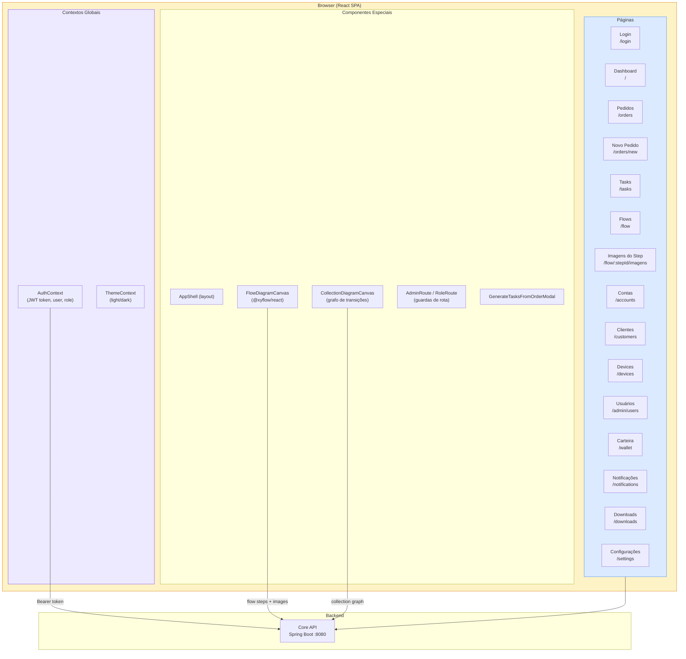
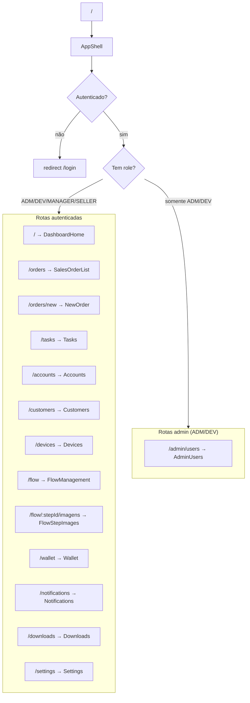
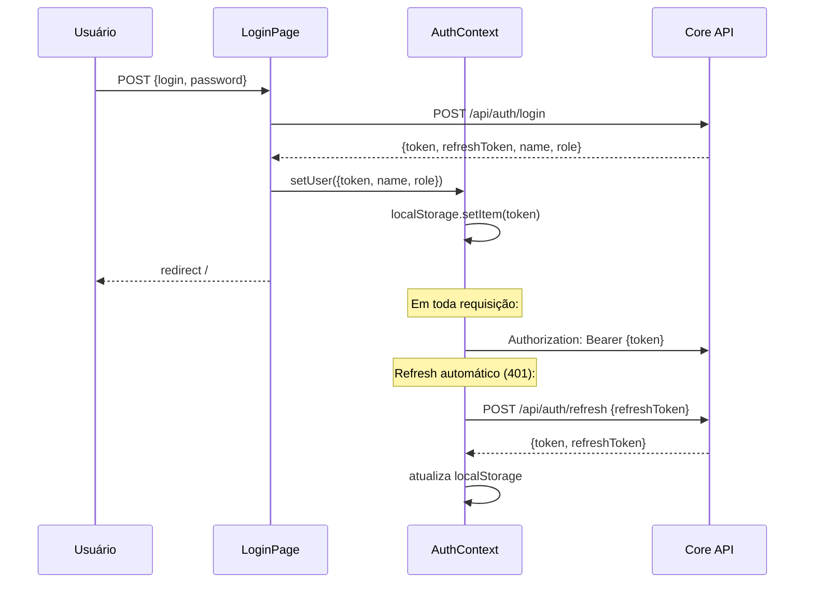
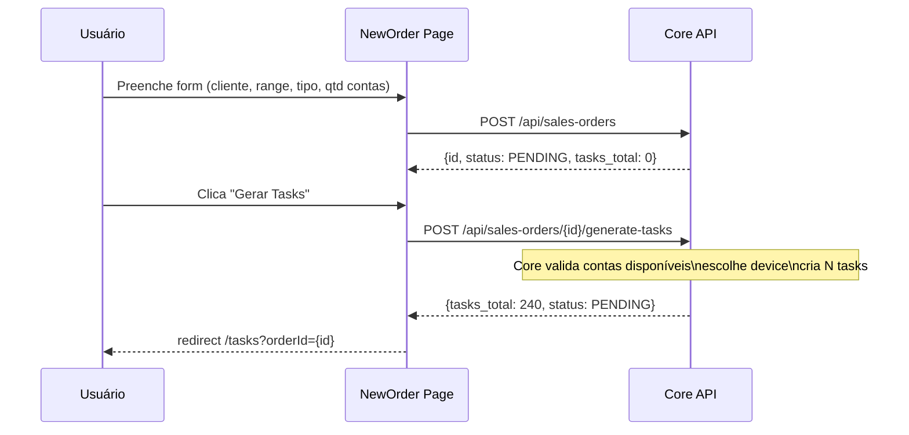
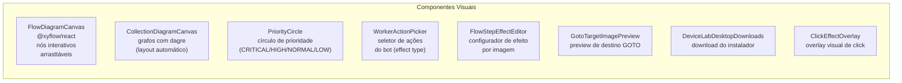

# automation-web-lab — Arquitetura

Dashboard CRM React para administração da plataforma DDT. Interface para criar pedidos de venda, gerenciar fluxos de automação, monitorar devices/workers, controlar contas de jogo e acompanhar execução de tasks em tempo real.

---

## Visão Macro



---

## Roteamento e Proteção



---

## Fluxo de Autenticação



---

## Módulo de Flows (Automação)

```mermaid
graph TB
    subgraph flow_module["Módulo de Flows — /flow"]
        direction TB

        subgraph data["Dados carregados no mount (loadAll)"]
            COLL["Collections\nGET /api/collections"]
            FLOWS_D["Flows\nGET /api/flows"]
            STEPS["Flow Steps\nGET /api/flow-steps"]
            IMGS["Flow Step Images\nGET /api/flow-step-images"]
        end

        subgraph views["Modos de visualização"]
            LIST_VIEW["Modo Lista\n(tabela de imagens)"]
            DIAGRAM_VIEW["Modo Diagrama\n(cards + chips por step)"]
            FLOW_CANVAS2["FlowDiagramCanvas\n(@xyflow/react)\nnós = steps\narestas = ordem"]
            COLL_DIAG["CollectionDiagramCanvas\n(grafo dagre de transições)"]
        end

        subgraph images_page["Página de Imagens /flow/:stepId/imagens"]
            IMG_TABLE["Tabela completa de imagens"]
            IMG_DIAG["Diagrama com previews"]
            DND["Drag-and-Drop (reorder step_img_number)"]
            UPLOAD["Upload de PNG → Core → S3/local"]
            EFFECT["FlowStepEffectEditor\n(ação: CLICK, WAIT_APPEAR,\nGOTO, IF_VISIBLE, OCR...)"]
        end
    end

    COLL & FLOWS_D & STEPS & IMGS --> LIST_VIEW & DIAGRAM_VIEW & FLOW_CANVAS2 & COLL_DIAG
    IMGS --> IMG_TABLE & IMG_DIAG & DND
    UPLOAD -->|POST /api/flow-step-images| IMG_TABLE
    EFFECT -->|PUT /api/flow-step-images/{id}| IMG_TABLE
```

---

## Criação de Pedido e Geração de Tasks



---

## Componentes de UI Notáveis



---

## Estrutura de Arquivos

```
automation-web-lab/
├── src/
│   ├── main.tsx             # Entry point React
│   ├── App.tsx              # Router + providers
│   ├── context/
│   │   ├── AuthContext.tsx  # Auth global (JWT, role, login/logout)
│   │   └── ThemeContext.tsx # Tema dark/light
│   ├── components/          # 15+ componentes reutilizáveis
│   │   ├── AppShell.tsx     # Layout principal (nav, sidebar)
│   │   ├── FlowDiagramCanvas.tsx      # Diagrama @xyflow
│   │   ├── CollectionDiagramCanvas.tsx # Grafo dagre
│   │   ├── AdminRoute.tsx   # Guarda de rota admin
│   │   └── ...
│   └── pages/               # 14 páginas
│       ├── DashboardHome/   # Dashboard /
│       ├── SalesOrderList/  # Pedidos /orders
│       ├── NewOrder/        # Novo pedido /orders/new
│       ├── Tasks/           # Tasks /tasks
│       ├── FlowManagement/  # Flows /flow
│       ├── FlowStepImages/  # Imagens /flow/:id/imagens
│       ├── Accounts/        # Contas /accounts
│       ├── Customers/       # Clientes /customers
│       ├── Devices/         # Devices /devices
│       ├── AdminUsers/      # Usuários /admin/users
│       ├── Wallet/          # Carteira /wallet
│       ├── Notifications/   # Notificações /notifications
│       ├── Downloads/       # Downloads /downloads
│       └── Settings/        # Configurações /settings
├── public/                  # Assets estáticos
├── dist/                    # Build (nginx serve)
├── index.html               # Template HTML
├── vite.config.ts           # Build config (proxy /api → Core)
├── nginx.conf.template      # Nginx prod (serve SPA + proxy)
└── Dockerfile               # Build + nginx
```

---

## Tecnologias

| Item | Tecnologia |
|------|-----------|
| Linguagem | TypeScript |
| Framework | React 18 |
| Build | Vite |
| Roteamento | React Router DOM v6 |
| Diagrama de Flows | @xyflow/react v12 + dagre |
| Ícones | lucide-react |
| CSS | Tailwind CSS |
| Deploy | Docker + Nginx (serve SPA + proxy `/api`) |
| Porta prod | 80 (Nginx) / 5175 (dev Vite) |

---

## Proxy de API (Vite dev / Nginx prod)

**Dev** (`vite.config.ts`): `/api` → `http://localhost:8082` (Core no docker)

**Prod** (`nginx.conf`):
```nginx
location /api {
    proxy_pass http://core:8081;
}
location / {
    try_files $uri $uri/ /index.html;
}
```
